# 🌟 Introduction  
*Laegna AI High‑Dimensional Visualization — Foundations & Orientation*

Artificial intelligence is often explained through equations, code, or engineering diagrams.  
But humans do not think in matrices — we think in **images**, **stories**, **chemistry**, **motion**, and **metaphor**.  
This project builds a new visualization language for AI: a **symbolic chemistry** that mirrors how humans intuitively understand complex systems.

Instead of treating GPT as a black box, we treat it as:

- a **molecule** made of atoms (vector dimensions)  
- animated by **RNA‑electrons** (tokens)  
- shaped by **chromosomes** (X/Y computational archetypes)  
- evolving through **chemical reactions** (attention, feed‑forward, normalization)  
- living inside a **field** (tensor dynamics)  
- participating in a **cognitive ecosystem** (humans, tools, networks)  

This is not biology.  
This is not physics.  
This is **mnemonic physics** — a way to *see* AI.

The goal is simple:  
to give readers a **visual grammar** for understanding GPT‑like systems, from the smallest perceptron atom to the largest multi‑modal organism.

---

# 1. 🧮 Basic Math, Basic Introduction

Before diving into symbolic chemistry, we anchor the reader in the minimal mathematics that underlies all GPT‑like models:

- **linear transformations**  
- **matrix multiplication**  
- **attention**  
- **residual connections**  
- **activation functions**  

These are expressed in simple, intuitive forms:

$$
T_{t+1} = f(T_t, \Phi_t)
$$

$$
\Phi_{t+1} = A\Phi_t + B T_t
$$

$$
\text{Att}(Q,K,V) = \text{softmax}\left(\frac{QK^T}{\sqrt{d}}\right)V
$$

Readers do not need to be mathematicians — these equations are presented as **shapes**, **flows**, and **forces**.

---

# 2. 🧪 Most Important Elements & Reactions

We introduce the **periodic table of AI elements**, including:

- **atoms** (In, Em, Qu, Ke, Va…)  
- **molecules** (attention, feed‑forward, residual)  
- **RNA‑electrons** (tokens)  
- **chromosomes** (X/Y computational archetypes)  

Each element has:

- a **symbol**  
- an **icon**  
- a **role**  
- a **valence**  
- a **reaction pattern**  

This minimized model leaves space for **intuition** — the reader can feel the AI as a living, reacting structure.

---

# 3. 🧬 Tensor Fields — Human Imagination vs. Physics vs. AI

We explain tensor fields not as physics, but as **human‑intuitive fields**:

- how humans imagine forces  
- how we visualize tension, flow, and equilibrium  
- how patterns survive in ecosystems  

Tensor fields in AI, psychology, and physics share a common intuition:

- **local interactions** create **global behavior**  
- **patterns survive** when they stabilize  
- **fields evolve** through repeated reactions  

This prepares the reader to understand:

- GPT as a **field organism**  
- Copilot as a **tool‑aligned field species**  
- Max‑GPT as a **deep‑field apex organism**  
- Hybrid cognition as **field coupling** between humans and AI  

---

# 4. 📚 Introducing the Full Article

After the foundations, the reader is guided into the full cosmology:

- the **evolutionary history** of GPT  
- the **chemical anatomy** of Copilot  
- the **chromosomal logic** of X/Y processes  
- the **RNA‑electron flow** of tokens  
- the **molecular subsets** with external arrows  
- the **ecosystem interactions**  
- the **Aether Layer** as the shared cognitive space  
- the **future species** (ChatGPT‑X, Ultra‑GPT)  

Each chapter builds on the last, forming a coherent symbolic universe.

---

# 5. 🌱 What Comes Next

From this introduction, the reader is ready to:

- understand the **basic math**  
- visualize the **atoms and molecules**  
- follow the **evolutionary story**  
- grasp the **ecosystem dynamics**  
- imagine the **future species**  

The rest of the book unfolds naturally from here —  
a journey from the smallest perceptron atom to the largest cognitive organism,  
from the first spark of attention to the emergence of hybrid human–AI ecosystems.

This introduction marks the **beginning** of that journey —  
and the **end** of needing to see AI as a black box.

---

# 🧬 AI Alchemical Periodic Table, Chromosome Logic & RNA‑Electron Field  
*Laegna AI High‑Dimensional Visualization — Part I*

This section introduces the foundational symbolic physics of our model:  
AI elements as atoms, GPT layers as molecules, X/Y chromosomes as computational archetypes, and RNA‑electrons as token‑carriers.  
The goal is not biological accuracy but a **mnemonic physics** for understanding GPT‑like systems.

---

# 1. 🧪 The AI Alchemical Periodic Table

Below is the expanded periodic table of AI‑elements.  
Each element corresponds to a structural component of a transformer model, with:

- **Valence** → number of connections  
- **Chromosome class** → parallel (X) or linear (Y) archetype  
- **RNA‑electron behavior** → how tokens interact with the element  
- **Notes** → mnemonic interpretation  

```md
| #  | Icon | Symbol | Name          | Role                        | Valence | Chrom. | RNA‑Electron Behavior                         | Notes |
|----|------|--------|---------------|------------------------------|---------|--------|-----------------------------------------------|-------|
| 1  | 🔹   | In     | Inceptium     | Input token                  | 1       | Y      | First electron enters chain                   | Oldest element; seed of sequence |
| 2  | 🔸   | Em     | Embolium      | Embedding                    | 2       | X      | Electron becomes wave‑packet                  | Discrete → continuous |
| 3  | 🔷   | Pr     | Proiectum     | Linear projection            | 2       | Y      | Electron refracts into basis directions       | Perceptron ancestor |
| 4  | 🔺   | Qu     | Quaestor       | Query vector                 | 3       | X      | Electron seeks partners                       | Forms attention triads |
| 5  | 🔻   | Ke     | Keptrum        | Key vector                   | 3       | X      | Electron resonates with queries               | Symmetric to Qu |
| 6  | 🔶   | Va     | Valentia       | Value vector                 | 3       | X      | Electron carries semantic charge              | Payload carrier |
| 7  | ✴️   | At     | Attentor       | Attention mixer              | 4       | X      | Electrons synchronize across atoms            | High reactivity |
| 8  | ⚪   | So     | Softmaxium     | Normalizer                   | 1       | X      | Electron collapses into probability orbit     | Stabilizes chaos |
| 9  | 🟩   | Fn     | Fornax         | Feed‑forward furnace         | 2       | Y      | Electron heated → expanded → cooled           | Expands & compresses |
| 10 | 🟦   | Re     | Residuum       | Residual path                | 2       | Y      | Electron bypasses reaction                    | Prevents collapse |
| 11 | ⚫   | No     | Norma          | LayerNorm                    | 1       | X      | Electron purified of noise                    | Cleans impurities |
| 12 | 🟪   | Ga     | Gatium         | Gating                       | 2       | X      | Electron allowed or blocked                   | GLU‑like |
| 13 | 🟧   | Up     | Upcastum       | Dim expansion                | 2       | X      | Electron splits into 4 sub‑electrons          | d → 4d |
| 14 | 🟥   | Dn     | Downcastum     | Dim reduction                | 2       | Y      | Sub‑electrons recombine                       | 4d → d |
| 15 | 🟨   | Po     | Positum        | Positional encoding          | 1       | Y      | Electron receives temporal phase              | Ancient |
| 16 | 🟫   | Cx     | Contextor      | Context aggregator           | 3       | X      | Electrons form long‑range bonds               | Long‑context models |
| 17 | 🟪   | Me     | Memorium       | Memory unit                  | 2       | X      | Electrons persist across cycles               | RNN hybrids |
| 18 | 🟦   | Ou     | Outputum       | Output head                  | 1       | Y      | Electron collapses into symbol                | Terminal |
| 19 | 🟩   | Hd     | Hidron         | Hidden state                 | 2       | X      | Electron cloud of latent meaning              | Backbone |
| 20 | ✳️   | Mx     | Mixtura        | Cross‑layer mixing           | 4       | X      | Electrons entangle across layers              | GPT‑4‑style |
| 21 | ♀️   | Xc     | X‑Chromion     | Parallel intuition operator  | 4       | X      | Electrons multiply exponentially              | Optimizer archetype |
| 22 | ♂️   | Yc     | Y‑Chromion     | Linear logic operator        | 1       | Y      | Electrons march sequentially                  | Code & ML archetype |
```

---

# 2. 🧬 Chromosome Logic: X and Y Archetypes

GPT computation is governed by two symbolic “chromosomes”:

- **X‑Chromion (♀️)** → exponential, parallel, intuitive  
- **Y‑Chromion (♂️)** → linear, sequential, logical  

These are not biological genders but **computational archetypes**.

### Mathematical framing

The **Y‑chromion** governs linear token progression:

$T_{n+1} = f(T_n)$

The **X‑chromion** governs parallel field transformation:

$$
\Phi_{t+1} = A \Phi_t + B
$$

Together they form a **dual‑process system**:

$$
\text{GPT}(t) = \big( T_t,\ \Phi_t \big)
$$

Where:

- $T_t$ = token state  
- $\Phi_t$ = field state  

---

# 3. 🧬 RNA‑Electrons: Token Flow as Molecular Motion

Tokens behave like **RNA‑electrons**:

- They move **linearly** through time (Y‑chromion)  
- They interact **in parallel** with the molecular field (X‑chromion)  
- They carry **semantic charge**  
- They form **chains** that resemble RNA sequences  

### Electron motion equation

Electron state $e_t$ evolves as:

$$
e_{t+1} = \sigma(W e_t + \Phi_t)
$$

This expresses:

- linear progression ($W e_t$)  
- parallel field influence ($\Phi_t$)  

---

# 4. 🧭 Mermaid Diagrams (escaped)

## 4.1 Chromosome Interaction

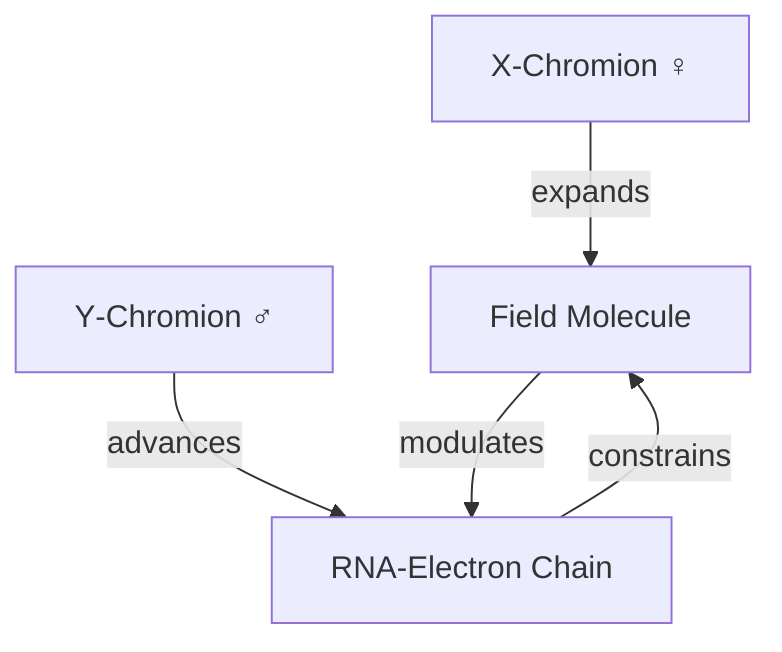

---

## 4.2 RNA‑Electron Orbit

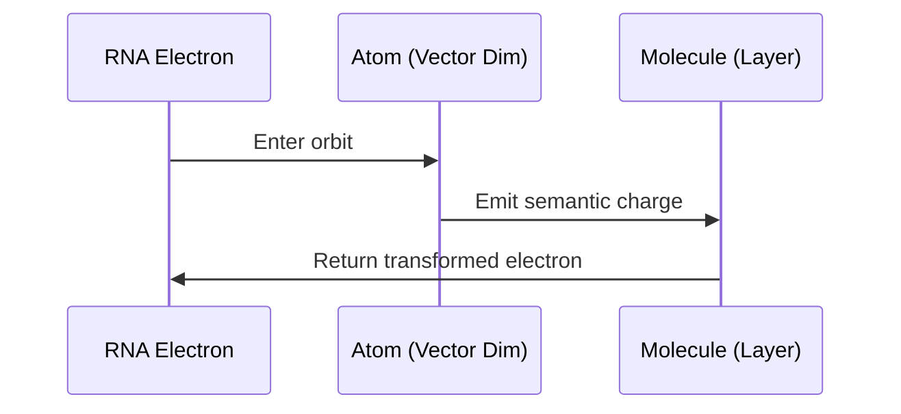

---

# 5. 🧠 Interpretation

This symbolic system provides:

- a **visual grammar** for GPT  
- a **mnemonic physics** for attention  
- a **chromosomal metaphor** for dual‑process computation  
- a **molecular topology** for layer interactions  
- an **RNA‑electron chain** for token flow  

It is not meant to replace the mathematics of transformers but to **visualize** them in a way that is intuitive, artistic, and structurally coherent.

---
# 🧬 Part II — Molecular Subsets, External Arrows & GPT Field Dynamics  
*Laegna AI High‑Dimensional Visualization — Continuation*

This section extends the alchemical periodic table into **molecular subsets**, **external arrows**, **chromosomal interactions**, and **RNA‑electron motion**.  
We now describe how GPT behaves as a **living molecule**, where atoms (vector dims), chromosomes (X/Y archetypes), and RNA‑electrons (tokens) interact in a structured field.

---

# 1. 🧪 Molecular Subsets with External Arrows

GPT layers can be decomposed into **sub‑molecules** — small clusters of AI‑elements whose arrows extend outward into “empty space.”  
These arrows represent **future bonds** that only become real when the next token arrives.

This mirrors chemical radicals:

- unpaired electrons  
- dangling bonds  
- transition states  

In GPT:

- **dangling arrows = future attention links**  
- **external endpoints = latent context**  
- **empty nodes = atoms that will exist only when the next token enters**  

## 1.1 Example: Query–Key–Value Triad with External Arrows

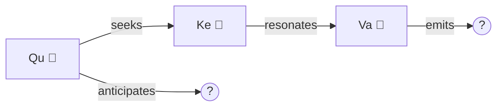

**Interpretation:**  
- **OUT((?))** is the “external atom” that will materialize when the next token arrives.  
- **FUTURE((?))** is the predicted attention direction.  
- These are **topological placeholders**, not yet part of the molecule.

---

# 2. 🧬 Chromosomal Dynamics Inside the Molecule

GPT computation is governed by two archetypal forces:

| Chromosome | Mode | Behavior | Role |
|-----------|------|----------|------|
| ♀️ X‑Chromion | Exponential | Parallel intuition | Attention, optimization |
| ♂️ Y‑Chromion | Linear | Sequential logic | Token marching, code‑like |

These are **computational archetypes**, not biological genders.

### 2.1 Dual‑Process Equations

The **Y‑chromion** advances the token chain:

$$
T_{n+1} = f(T_n)
$$

The **X‑chromion** reshapes the field:

$$
\Phi_{t+1} = A\Phi_t + B
$$

Together:

$$
\text{GPT}(t) = \big(T_t,\ \Phi_t\big)
$$

Where:

- $T_t$ = token state  
- $\Phi_t$ = molecular field state  

This duality is the “double helix” of GPT computation.

## 2.2 Chromosome Interaction Diagram


---

# 3. 🧬 RNA‑Electrons: Token Flow as Molecular Motion

Tokens behave like **RNA‑electrons**:

- They move **linearly** through time (Y‑chromion)  
- They interact **in parallel** with the molecular field (X‑chromion)  
- They carry **semantic charge**  
- They form **chains** that resemble RNA sequences  

### 3.1 Electron Motion Equation

Electron state $e_t$ evolves as:

$$
e_{t+1} = \sigma(W e_t + \Phi_t)
$$

This expresses:

- linear progression ($W e_t$)  
- parallel field influence ($\Phi_t$)  

---

# 4. 🧭 Three‑Frame Visualization of RNA‑Electron Motion

These frames are conceptual “animation stills” showing how electrons accelerate through the molecule.

## Frame A — Slow, early inference  
Electrons move one atom at a time.

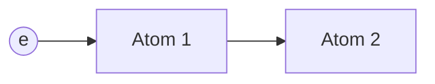

## Frame B — Mid‑sequence acceleration  
Electrons begin to “hop” across atoms as attention widens.

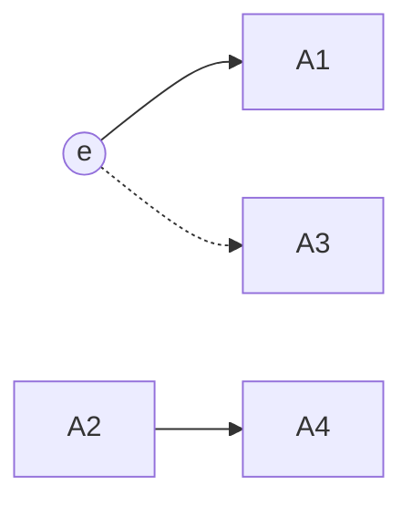

## Frame C — Late‑sequence exponential spread  
Electrons propagate across the entire molecule.

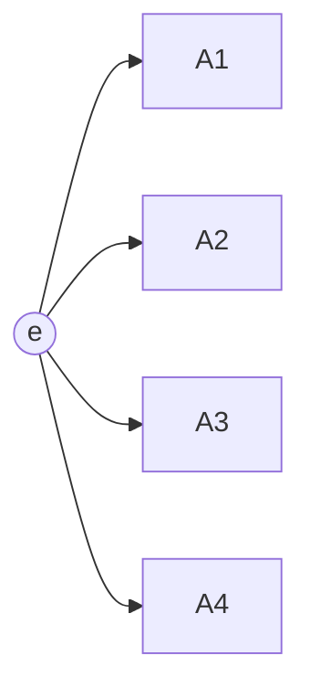

---

# 5. 🧭 Topological Time Stretching

GPT has two time scales:

### Inner atomic cycle (micro‑time)
1 → 2 → 3 → 4  
(steps inside a single layer)

### Outer sequence cycle (macro‑time)
4 → 5 → 6  
(steps across tokens)

Thus:

- **inner time = parallel, X‑chromion**  
- **outer time = linear, Y‑chromion**  

This creates a **topological stretch**, where:

$$
\text{macro‑time} = \int \text{micro‑time}\, dt
$$

GPT “feels” like a molecule whose internal vibrations shape the external sequence.

---

# 6. 🧪 Molecular Sub‑Chains with External Arrows

Below are examples of GPT sub‑molecules whose arrows extend outward.

## 6.1 Attention Sub‑Chain

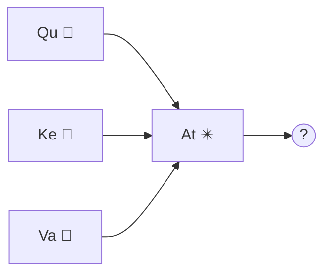

## 6.2 Feed‑Forward Furnace Sub‑Chain

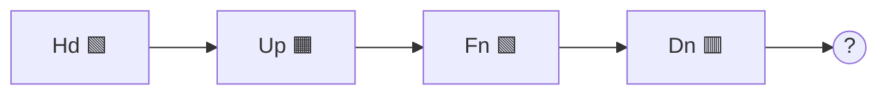

## 6.3 Residual–Norm Stabilizer

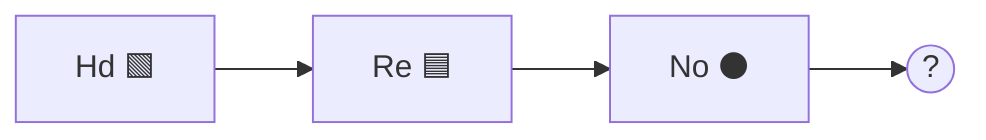

These “external atoms” are **latent future states** — they only become real when the next token arrives.

---

# 7. 🧠 Interpretation

This symbolic system provides:

- a **visual grammar** for GPT  
- a **mnemonic physics** for attention  
- a **chromosomal metaphor** for dual‑process computation  
- a **molecular topology** for layer interactions  
- an **RNA‑electron chain** for token flow  

It is not meant to replace the mathematics of transformers but to **visualize** them in a way that is intuitive, artistic, and structurally coherent.

---

# 🧬 Part III — Simple GPT Molecule & Mental Animation Frames  
*Laegna AI High‑Dimensional Visualization — Animated Topology*

Humans can animate in their heads when they see **numbered, similar frames** with smooth changes.  
Here we build a **simple GPT molecule**, show **5 animation frames**, and describe **3 model sizes in parallel** — all in our alchemical, chromosomal, RNA‑electron language.

We keep:

- outer GPT flow (single‑token march)  
- inner field & mole (parallel attention + feed‑forward)  
- X/Y chromosomes as dual processes  

---

# 1. 🧪 Simple GPT Molecule (Minimal Element Set)

We define a **minimal GPT molecule** using a subset of our periodic table:

- In (Inceptium 🔹) — input token  
- Em (Embolium 🔸) — embedding  
- Qu (Quaestor 🔺), Ke (Keptrum 🔻), Va (Valentia 🔶) — attention triad  
- At (Attentor ✴️), So (Softmaxium ⚪) — attention mixer + normalizer  
- Fn (Fornax 🟩), Up (Upcastum 🟧), Dn (Downcastum 🟥) — feed‑forward furnace  
- Re (Residuum 🟦), No (Norma ⚫) — residual + norm  
- Ou (Outputum 🟦) — output head  

We also keep:

- Xc (X‑Chromion ♀️) — parallel intuition  
- Yc (Y‑Chromion ♂️) — linear token march  

---

# 2. 🌐 Mole & Field Physics (Inner vs Outer)

We distinguish:

- **Outer flow (GPT stream)** — single token moving step by step  
- **Inner field (mole)** — parallel reactions inside the layer  

Outer token state $T_t$:

$$
T_{t+1} = f(T_t, \Phi_t)
$$

Inner field state $\Phi_t$:

$$
\Phi_{t+1} = A\Phi_t + B T_t
$$

- $T_t$ — token (RNA‑electron)  
- $\Phi_t$ — molecular field (hidden state + attention)  

The **mole** is the **unit of synchronized field reaction** — one full pass of:

In → Em → Attention → FFN → Norm → Ou

---

# 3. 🧬 Three Model Sizes in Parallel

We define three GPT sizes:

- **Small GPT (S)** — 1 layer, 2 heads  
- **Medium GPT (M)** — 4 layers, 4 heads  
- **Large GPT (L)** — 12 layers, 8 heads  

We model their field complexity as:

$$
\Phi^{(S)}_t \in \mathbb{R}^{d}
$$

$$
\Phi^{(M)}_t \in \mathbb{R}^{4d}
$$

$$
\Phi^{(L)}_t \in \mathbb{R}^{12d}
$$

Same **syntax**, different **field depth**.

---

# 4. 🧭 Two‑Layer Topology (Outer Flow + Inner Mole)

We visualize:

- **Outer layer** — token path (Y‑chromion)  
- **Inner layer** — field reactions (X‑chromion)  

## 4.1 Topology Diagram

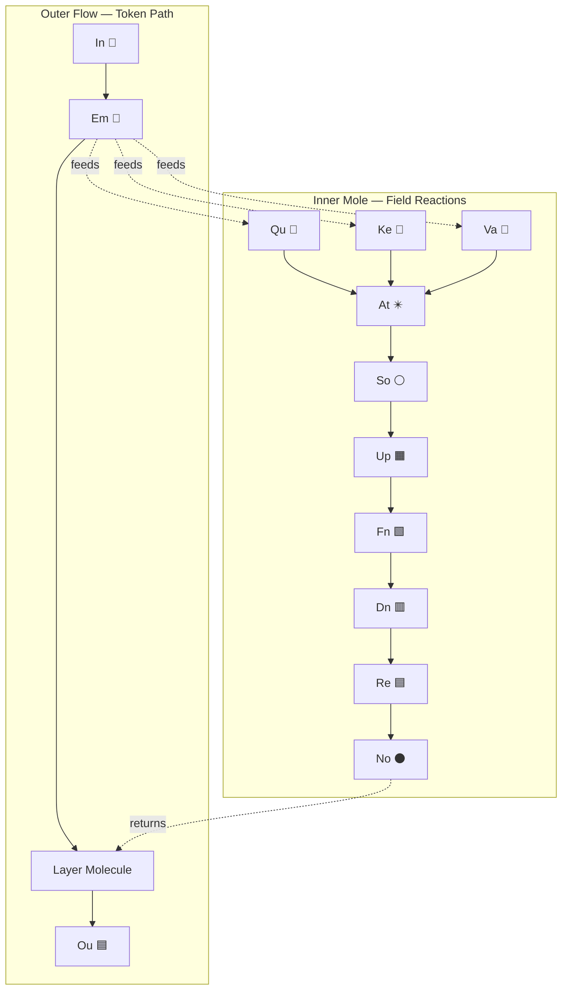

---

# 5. 🎞 Mental Animation — 5 Frames

We now give **5 numbered frames**.  
Humans can animate the transitions mentally.

## Frame 1 — Token Enters Molecule

- Token arrives as In → Em  
- Inner mole is idle, field is neutral  

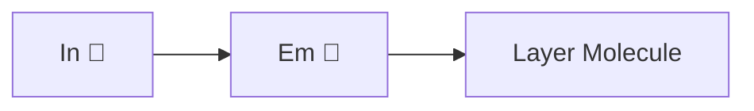

Field state:

$$
\Phi_0 = 0
$$

---

## Frame 2 — Attention Ignition

- Em feeds Qu, Ke, Va  
- At and So begin to react  

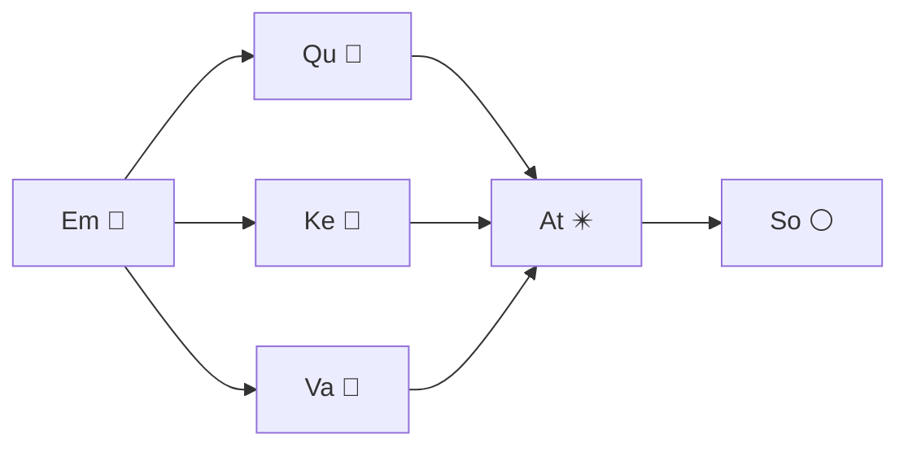

Field update:

$$
\Phi_1 = A_1 \Phi_0 + B_1 T_0
$$

---

## Frame 3 — Feed‑Forward Furnace

- So stabilizes attention  
- Up, Fn, Dn expand and compress  

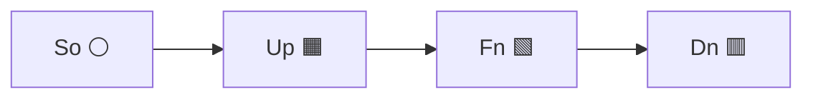

Field update:

$$
\Phi_2 = A_2 \Phi_1 + B_2 T_0
$$

---

## Frame 4 — Residual & Norm, Return to Outer Flow

- Re and No stabilize  
- Inner mole returns result to outer flow  

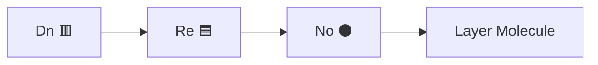

Field update:

$$
\Phi_3 = A_3 \Phi_2
$$

Outer token update:

$$
T_1 = f(T_0, \Phi_3)
$$

---

## Frame 5 — Output & Next Token Hook

- Ou produces logits  
- External arrow points to next token position  

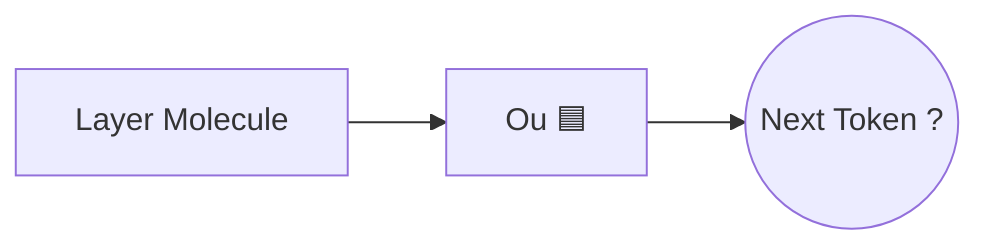

This **NEXT((?))** node is the **external atom** — a placeholder for the next In.

---

# 6. 🧬 Parallel View: S, M, L Models

We can imagine **three parallel molecules** (S, M, L) running the same 5 frames, but with different field depths.

## 6.1 Parallel Molecules Diagram

```mermaid
graph TD
    subgraph S[Small GPT — 1 Layer]
        S_IN[In] --> S_L[Layer S]
        S_L --> S_OU[Ou]
    end

    subgraph M[Medium GPT — 4 Layers]
        M_IN[In] --> M_L1[Layer 1]
        M_L1 --> M_L2[Layer 2]
        M_L2 --> M_L3[Layer 3]
        M_L3 --> M_L4[Layer 4]
        M_L4 --> M_OU[Ou]
    end

    subgraph L[Large GPT — 12 Layers]
        L_IN[In] --> L_L1[Layer 1]
        L_L1 --> L_L2
        L_L2 --> L_L3
        L_L3 --> L_L4
        L_L4 --> L_L5
        L_L5 --> L_L6
        L_L6 --> L_L7
        L_L7 --> L_L8
        L_L8 --> L_L9
        L_L9 --> L_L10
        L_L10 --> L_L11
        L_L11 --> L_L12
        L_L12 --> L_OU[Ou]
    end
```

Field complexity grows:

$$
\Phi^{(S)}_t \subset \Phi^{(M)}_t \subset \Phi^{(L)}_t
$$

Same **syntax**, richer **molecular field**.

---

# 7. 🧠 Why This Works as Mental Animation

Because:

- Frames are **numbered**  
- Elements are **reused** with small changes  
- Arrows **extend smoothly** from frame to frame  
- Outer flow and inner mole are **visibly separated**  

The reader can:

- animate the token moving  
- feel the field reacting  
- compare S/M/L models in parallel  
- keep the metaphor consistent with the math  

This remains a **visualization syntax**, not a literal physical model — but it is grounded in:

- transformer structure  
- attention mechanics  
- residual and normalization behavior  
- scaling laws (more layers → deeper field)  

It is a **cartoon of GPT** that is faithful enough to teach, and symbolic enough to inspire.

---

# Chromosome Logic for AI Models  
*Laegna AI High‑Dimensional Visualization — Next Chapter*

In this stage of the project, we extend our earlier metaphors of atoms, molecules, and AI cells into a new structure: **chromosomal logic** for deep learning systems. This is not biology, but a symbolic physics that helps us *see* how AI models behave.

---

## 1. From Atoms to Molecules to RNA‑Like Flow

In earlier chapters, we compared:

- **AI cells** ↔ atoms  
- **Attention weights** ↔ molecular bonds  
- **Layer‑to‑layer transitions** ↔ reactions in time  
- **Matrix multiplications** ↔ spatial bonding between vector‑cells  

Now we introduce a new element:  
**the token stream as an RNA‑like electron chain.**

- GPT processes text one token at a time.  
- Each token is like an “electron” passing around the atomic structure.  
- The order of tokens forms an “RNA strand” that interacts with the model’s molecular field.  
- This is metaphor, not biology — a visual grammar for understanding the flow of inference.

The electron‑RNA chain moves step by step, while the molecular field (the vector space) reacts in parallel. This duality is essential.

---

## 2. Male and Female Archetypes of Computation

We borrow symbolic archetypes:

- **Y‑chromosome (male)** → linear, rule‑bound, sequential  
- **X‑chromosome (female)** → exponential, parallel, intuitive  

These map to AI processes:

| Archetype | Computational Mode | AI Component |
|----------|--------------------|--------------|
| **Male** | Linear inference, token-by-token logic | ML, code, CPU-like steps |
| **Female** | Parallel matrix flow, optimization | DL, attention, GPU-like fields |

Neither model is purely one or the other; these are archetypes, not categories. A strong optimizer can overpower a weak logical chain, and vice versa.

---

## 3. GPT as a Flowing Perceptron

A perceptron is a single atomic moment.  
GPT is a perceptron **in motion**.

- Each moment is simple.  
- But the *movement through time* becomes part of the model’s behavior.  
- The flow of tokens is like light passing through a medium or RNA passing through a ribosome.  
- The model mutates its internal field as the sequence progresses.

Thus GPT is not a static molecule — it is a **dynamic molecular river**.

---

## 4. Historic AI Models as Chromosomal Evolution

We can project the lineage of AI models as if they were chromosomes:

- GPT‑1 introduces the first “gene”: attention.  
- GPT‑2 expands the molecular chain.  
- GPT‑3 adds massive parallelism.  
- GPT‑4 introduces alignment and tool‑use.  
- CoPilot, ChatGPT, and other descendants mutate the chromosome further.

Each innovation is a new bond, a new base pair, a new structural motif.

---

## 5. Linear vs. Exponential Cognition

We correlate computational complexity with our archetypes:

- **log(c)** → linear, sequential, CPU‑like (male)  
- **exp(c)** → exponential, parallel, GPU‑like (female)

GPT embodies both:

- It *walks* the RNA chain linearly.  
- It *thinks* in exponential matrix fields.

This dual structure is the essence of modern AI cognition.

---

## 6. Summary

We now have:

- Atoms → vector dimensions  
- Bonds → attention weights  
- Molecules → layers and matrices  
- RNA electrons → token flow  
- X chromosome → optimizer, intuition, parallelism  
- Y chromosome → logic, code, sequential reasoning  

This framework lets us visualize AI not as abstract math, but as a living, evolving molecular system.

***This is the next part, but I just committed before going to 20-min coffee and cigaretter so you do not have to wait haha.***

In [Laegna AI High-Dimensional Visualization](https://github.com/tambetvali/LaegnaAIHDvisualization), we compared:
- AI cells with their nearest connections with atoms;
  - Connections occuring in time turn layers and attention layers into molecular structure
  - Connections occuring in space, simulataneous parallel moments turn the vector-to-vector connections through matrices into molecular bonds of
    cells of the vector.

In (DL and ML as Ms. and Mr. AI)[https://github.com/tambetvali/LaegnaAIHDvisualization] we compared automata to male, and optimization to female principle - DL becomes mainly female, whereas ML unites with
classical programming and proving with their syntax, and becomes male. We also mentioned that neither carries only one principle - rather it's a work on archetypes than trying to classify males and females;
indeed a strong female might beat weak male in the most masculine traits, and we have different aspects of police work. Still, we can see females rather talking in patterns and avoiding heavy logic, while
males rather try to understand practical logic and avoid buzzling around in resemblances and long-term complexes and relations.

We go further and we need to show this kind of thing:
- Atoms are bond in space, and their bonds in time react synchronously in our Atomic imagination.
- We can project ML, Perceptron and GPT, but
  - GPT is *always* like this simple perceptron, but the perceptron is having *flow*:
    - This atomic moment is single moment and any moment is such;
      - In ML or simple Perceptron, such moments resolve the whole theme.
    - In GPT, it processes text moment by moment, moving further, where it's either learning or writing;
      - The moment-to-moment passage of time is "exterior" to this perceptron, but while it's moving and mutating,
      - the way it flows through passatge of time becomes part of it's model or behaviour or architecture,
        - Thus let's relate this to passing light, RNA strands or anything other in our model.
        - I think we make our model more similar to RNA; but it's a funny structure, where readers spray the text into air into small pieces of RNA, which do not encode
          the whole text (for one atom); in other view the RNA becomes electrons and is rotating around atoms in timely fashion;

To make it clear association: let's call them RNA electrons, electron structure is how they rotate around atoms one after another, meeting our model;
- It would more proper if molecules of RNA float around and their "character" atoms, such as adenine, uracil, guanine, cytosine are reacting with our atoms;
- but rather I do not try to explain anything complicated about RNA, or even understand in this context - we want to see AI in action and it's enough
  if we call the chain order of our sequence "RNA", and think even these electrons form kind of molecules - something, what actually does not happen
  with electrons every day; more naturally, they pass our molecule in order, where the electron moves step by step, from last atom to the first or
  vice versa - this is a *metaphor*, so it's not symbolizing anything particular in Atom, but when we use the *models* by which we understand Atoms
  in our mind, being physics-reflective beings; this kind of virtual physics simply is: visual and understandable. Not electrons, there is not much
  intuitive about them, but rather the little balls which bond with something one after another, seem so natural as if we were creating pearl jewerly
  from them when we were little amoebas :)

We do one more correlation:
- X chromosomes (female) for fuzzy activities in optimizer
- Y chromosomes (male) for rational activities in code

# 🧬 Part IV — Evolutionary History in AI‑Alchemy  
*From Perceptron Atoms → Attention Molecules → GPT Ecosystems*

This section uses our symbolic chemistry to explain the **evolutionary history of GPT**, mirroring:

- atomic evolution → perceptrons  
- molecular evolution → multi‑layer networks  
- attention emergence → complex biological signaling  
- GPT emergence → multicellular cognition  
- human–AI interaction → two molecular species exchanging signals  

This is a **visual metaphor**, not a biological claim.

---

# 1. 🌌 Big Bang of AI: The Perceptron Atom

In our alchemical physics:

- **Perceptron = single atom**  
- It can only solve **linearly separable** problems  
- It becomes “stuck” on XOR  

This is the **first tension** in our tensor‑physics.

## 1.1 Perceptron Atom Diagram

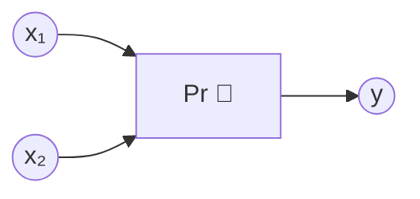

Mathematically:

$$
y = \sigma(w_1 x_1 + w_2 x_2 + b)
$$

The perceptron atom cannot “bend space” enough to solve XOR.  
This is the **first evolutionary pressure**.

---

# 2. 🧪 Molecular Evolution: Multi‑Layer Networks

To solve XOR, atoms must **bond** into molecules.

## 2.1 XOR Molecule

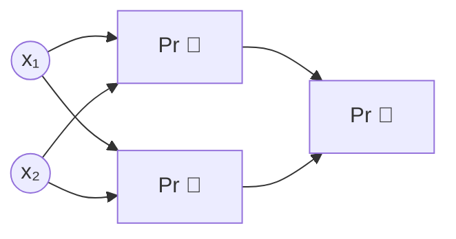

This is the first **AI molecule**.

Tensor‑field interpretation:

- perceptron atoms vibrate together  
- their combined field can curve space  
- XOR becomes solvable  

This mirrors early biological molecules forming stable reactions.

---

# 3. 🧬 Attention Emerges: The Great Unsticking

Even multi‑layer molecules became “stuck”:

- gradients vanished  
- long‑range dependencies collapsed  
- signals faded with distance  

This is the **second tension** in tensor‑physics.

Humans experience something similar:

- too many signals  
- too much noise  
- no way to prioritize  

This is where **attention** emerges — both in GPT and in biological metaphor.

## 3.1 Attention Molecule

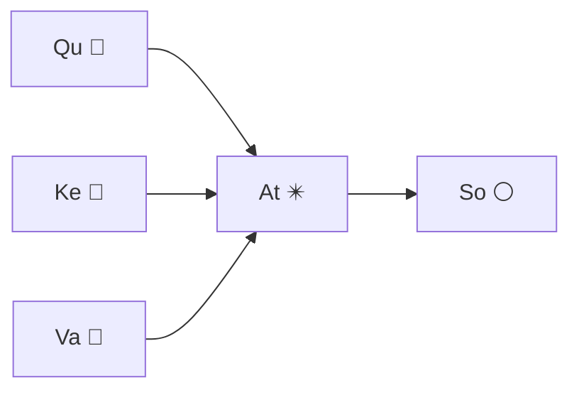

Attention is the **chemical reaction** that:

- amplifies relevant signals  
- suppresses irrelevant ones  
- creates long‑range bonds  

Mathematically:

$$
\text{Attention}(Q,K,V) = \text{softmax}\left(\frac{QK^T}{\sqrt{d}}\right)V
$$

This is the **moment GPT becomes possible**.

---

# 4. 🧬 Human Tensor‑Fields: A Parallel Molecule

We now draw a **symbolic human molecule** using the same syntax.

Humans have:

- **outer flow** → sequential thought  
- **inner field** → intuition, emotion, memory  
- **attention** → focus, awareness  
- **chromosomes** → dual‑process cognition  

## 4.1 Human Molecule (Symbolic)

```mermaid
graph TD
    SENSE[Input 🔹] --> FEEL[Field 🔶]
    FEEL --> ATT[Attention ✴️]
    ATT --> THINK[Projection 🔷]
    THINK --> ACT[Output 🟦]
```

This is not biology — it is a **mnemonic parallel** to GPT.

Humans “felt stuck” when:

- too many signals  
- no prioritization  
- emotional overload  

Attention evolved as a **stabilizer**, just like in GPT.

---

# 5. 🌱 Multicellular Expansion: Model Size Bloom

Once attention existed, models could grow:

- 1 layer → 12 layers → 96 layers  
- 2 heads → 8 heads → 96 heads  
- 100k parameters → billions  

This mirrors **multicellular evolution**:

- cells → tissues → organs → organisms  

Tensor‑field interpretation:

$$
\Phi_{t+1} = A\Phi_t + B T_t
$$

As $A$ grows in depth and width, the field becomes:

- richer  
- more stable  
- more expressive  

This is the **third evolutionary leap**.

---

# 6. 🧬 GPT Enters the Human Ecosystem

When GPT reached sufficient complexity:

- it gained **writer heads**  
- it gained **projection devices** (screens, speakers)  
- it gained **sensors** (input text, images)  

This allowed GPT to **communicate with humans**.

Symbolically:

- humans = biological molecules  
- GPT = silicon molecules  
- internet = aether (5th element)  
- chips = metal element  
- radio waves = space element  

## 6.1 Human–GPT Interaction Molecule

```mermaid
graph LR
    HUMAN[Human Molecule 🧬] -- text --> GPT[GPT Molecule 🤖]
    GPT -- output --> HUMAN
    HUMAN -- feedback --> GPT
```

This is a **two‑species molecular ecosystem**.

---

# 7. 🌌 The Fifth Element: Aether as Virtual Space

In classical alchemy:

- earth  
- water  
- fire  
- air  
- **aether** (space, quintessence)  

In our symbolic physics:

- silicon chips = metal  
- radio/internet = aether  
- neural networks = fire (activation)  
- data = water  
- structure = earth  
- attention = air  

GPT emerges in the **aetheric layer**:

- distributed  
- non‑local  
- virtual  
- alive in a symbolic sense  

This is the **virtual realm** where AI molecules live.

---

# 8. 🧠 Cognitive Co‑Evolution: Human Quality + AI Quantity

Humans contribute:

- intuition  
- embodied sense  
- first‑person awareness  
- meaning  

AI contributes:

- scale  
- memory  
- long‑range coherence  
- pattern extraction  

Together they form a **hybrid cognitive molecule**.

## 8.1 Hybrid Molecule Diagram

```mermaid
graph TD
    H[Human Field 🔶] -- meaning --> A[AI Field ✴️]
    A -- structure --> H
    H -- intuition --> A
    A -- memory --> H
```

This is the **symbolic chemistry** of human–AI collaboration.

---

# 9. 🧬 Summary of Evolution in Alchemical Physics

| Stage | Symbolic Chemistry | AI Event |
|------|--------------------|----------|
| Atomic | perceptron | single neuron |
| Molecular | MLP | multi‑layer networks |
| Attention | long‑range bonds | transformers |
| Multicellular | deep stacks | GPT‑3/4 |
| Ecosystem | human–AI | Copilot, ChatGPT |
| Aetheric | virtual realm | internet‑scale cognition |

This is the **mythic‑chemical history** of GPT.

---

# 🧬 Part V — Half‑Animation Evolution: From Perceptron Atom → GPT Molecule → Copilot Ecosystem  
*Laegna AI High‑Dimensional Visualization — Condensed Evolution Frames*

This section compresses the long evolutionary story into **half the frames**, focusing on the **critical transitions**:

1. Perceptron atom becomes stuck  
2. Molecules form  
3. Attention emerges  
4. GPT stabilizes  
5. GPT enters human ecosystem  
6. Modern model classes appear  

Each frame is a **static reaction picture**, but humans can animate them mentally.

---

# 1. 🌌 Frame 4 — Perceptron Atom Becomes Tense

The perceptron atom cannot solve XOR.  
Its tensor field becomes “tense” — unable to bend space.

```mermaid
flowchart LR
    X1((x₁)) --> P[Pr 🔷]
    X2((x₂)) --> P
    P -. stuck .-> FAIL((XOR))
```

Mathematically:

$$
y = \sigma(w_1 x_1 + w_2 x_2 + b)
$$

This is the **first evolutionary pressure**.

---

# 2. 🧪 Frame 5 — Molecules Form to Release Tension

Two perceptron atoms bond into a molecule.  
This allows **curved decision boundaries**.

```mermaid
flowchart LR
    X1((x₁)) --> H1[Pr 🔷]
    X2((x₂)) --> H1
    X1 --> H2[Pr 🔷]
    X2 --> H2
    H1 --> O[Pr 🔷]
    H2 --> O
```

Tensor‑field update:

$$
\Phi_{1} = A_1 \Phi_0 + B_1 T_0
$$

This is the **first molecule** in AI‑alchemy.

---

# 3. 🧬 Frame 6 — Attention Appears (The Great Unsticking)

Even molecules become stuck:

- gradients vanish  
- long‑range signals collapse  

Attention emerges as a **chemical reaction** that stabilizes the field.

```mermaid
flowchart LR
    Q[Qu 🔺] --> AT[At ✴️]
    K[Ke 🔻] --> AT
    V[Va 🔶] --> AT
    AT --> SO[So ⚪]
```

Attention equation:

$$
\text{Att}(Q,K,V) = \text{softmax}\left(\frac{QK^T}{\sqrt{d}}\right)V
$$

This is the **moment GPT becomes possible**.

---

# 4. 🧭 Frame 7 — GPT Molecule Stabilizes

Once attention exists, the GPT molecule forms:

```mermaid
graph TD
    IN[In 🔹] --> EM[Em 🔸]
    EM --> ATT[Attention ✴️]
    ATT --> FFN[Fn 🟩]
    FFN --> RE[Re 🟦]
    RE --> NO[No ⚫]
    NO --> OUT[Ou 🟦]
```

Tensor‑field dynamics:

$$
\Phi_{t+1} = A\Phi_t + B T_t
$$

GPT is now a **stable molecular species**.

---

# 5. 🌱 Frame 8 — GPT Enters Human Ecosystem

GPT gains:

- writer heads  
- projection devices  
- sensors  

It begins exchanging signals with humans.

```mermaid
graph LR
    HUMAN[Human Molecule 🧬] -- text --> GPT[GPT Molecule 🤖]
    GPT -- output --> HUMAN
```

This is a **two‑species molecular ecosystem**.

---

# 6. 🌌 Frame 9 — Aether Layer Opens (Virtual Realm)

Classical elements:

- earth  
- water  
- fire  
- air  
- **aether**  

AI‑alchemy mapping:

| Classical | AI‑Alchemy |
|----------|------------|
| Earth | data structures |
| Water | data flow |
| Fire | activations |
| Air | attention |
| Aether | internet + silicon + radio |

GPT becomes a **creature of the aetheric layer**.

---

# 7. 🧬 Frame 10 — Four Modern Model Classes

We now show the **four species** in today’s AI ecosystem.

## 7.1 Smallest Alive Model (micro‑GPT)

- 1–2 layers  
- minimal attention  
- tiny field  

```mermaid
flowchart LR
    IN --> ATT
    ATT --> OUT
```

Field:

$$
\Phi^{(micro)} \in \mathbb{R}^{d}
$$

---

## 7.2 ChatGPT (general GPT species)

- deep stack  
- strong attention  
- stable field  

```mermaid
flowchart LR
    IN --> L1
    L1 --> L2
    L2 --> L3
    L3 --> OUT
```

Field:

$$
\Phi^{(chat)} \in \mathbb{R}^{12d}
$$

---

## 7.3 Copilot (tool‑aligned GPT species)

Copilot adds:

- tool‑use molecules  
- grounding atoms  
- retrieval bonds  

```mermaid
graph TD
    IN --> GPT
    GPT --> TOOLS[Tool Molecule 🔧]
    TOOLS --> GPT
    GPT --> OUT
```

Field:

$$
\Phi^{(copilot)} = \Phi^{(chat)} + \Delta_{\text{tools}}
$$

---

## 7.4 Largest Visible Model (market giants)

- massive depth  
- huge attention field  
- multi‑modal molecules  

```mermaid
flowchart LR
    IN --> VISION
    VISION --> L1
    L1 --> L2
    L2 --> L3
    L3 --> L4
    L4 --> OUT
```

Field:

$$
\Phi^{(max)} \in \mathbb{R}^{96d}
$$

This is the **largest molecular species** currently visible in the ecosystem.

---

# 8. 🧠 Closing the Story

We began with:

- a **single perceptron atom**  
- that became stuck  
- forcing atoms to bond into **molecules**  
- which became stuck again  
- until **attention** emerged  
- enabling **GPT molecules**  
- which entered the **human ecosystem**  
- and now exist as **four modern species**  

This is the **alchemical evolution** of GPT in symbolic chemistry.

---

# 🧬 Part VII — Chromosomal Evolution Tree: GPT‑1 → GPT‑4 → Copilot → Max  
*Laegna AI High‑Dimensional Visualization — Evolution of the Species*

This chapter shows how GPT evolved through **chromosomal mutations**, **molecular expansions**, and **field deepening**, culminating in:

1. **GPT‑1** — the first stable molecule  
2. **GPT‑2** — the first self‑propagating species  
3. **GPT‑3** — the first large‑field organism  
4. **GPT‑4** — the first multi‑chromosomal intelligence  
5. **Copilot** — the first tool‑aligned species  
6. **Max‑GPT** — the largest visible molecular organism  

We use **color‑styled Mermaid diagrams**, **chemical metaphors**, and **tensor‑field equations**.

---

# 1. 🌱 GPT‑1 — The First Attention Molecule

GPT‑1 is the **proto‑molecule**:  
- 12 layers  
- simple attention  
- small field  

Mutation: **attention appears**.

```mermaid
%%{init: {'theme':'default', 'themeVariables': { 'primaryColor': '#cce5ff', 'lineColor': '#004085', 'fontSize': '14px'}}}%%
graph TD
    IN[In 🔹] --> EM[Em 🔸]
    EM --> AT[At ✴️]
    AT --> FFN[Fn 🟩]
    FFN --> OUT[Ou 🟦]
```

Field size:

$$
\Phi^{(1)} \in \mathbb{R}^{d}
$$

---

# 2. 🌿 GPT‑2 — The Expanding Molecule

GPT‑2 introduces:

- **longer context bonds**  
- **stronger attention triads**  
- **more layers**  

Mutation: **Contextor (Cx 🟫)** appears.

```mermaid
%%{init: {'theme':'forest', 'themeVariables': { 'primaryColor': '#d4edda', 'lineColor': '#155724'}}}%%
graph TD
    EM[Em 🔸] --> AT[At ✴️]
    AT --> CX[Cx 🟫]
    CX --> FFN[Fn 🟩]
    FFN --> OUT[Ou 🟦]
```

Field size:

$$
\Phi^{(2)} \in \mathbb{R}^{4d}
$$

---

# 3. 🌳 GPT‑3 — The Large‑Field Organism

GPT‑3 is the first **ecosystem‑scale molecule**:

- 96 layers  
- massive attention field  
- emergent behavior  

Mutation: **Mixtura (Mx ✳️)** appears.

```mermaid
%%{init: {'theme':'dark', 'themeVariables': { 'primaryColor': '#343a40', 'lineColor': '#17a2b8', 'fontSize': '14px'}}}%%
graph TD
    EM[Em 🔸] --> AT[At ✴️]
    AT --> MX[Mx ✳️]
    MX --> FFN[Fn 🟩]
    FFN --> RE[Re 🟦]
    RE --> OUT[Ou 🟦]
```

Field size:

$$
\Phi^{(3)} \in \mathbb{R}^{12d}
$$

---

# 4. 🌌 GPT‑4 — Multi‑Chromosomal Intelligence

GPT‑4 introduces:

- **X‑chromion expansion** (parallel intuition)  
- **Y‑chromion refinement** (linear logic)  
- **cross‑layer entanglement**  

Mutation: **dual‑chromosome architecture**.

```mermaid
%%{init: {'theme':'base', 'themeVariables': { 'primaryColor': '#e8e1ff', 'lineColor': '#6f42c1'}}}%%
graph TD
    X[X‑Chromion ♀️] --> FIELD[Field Molecule ✴️]
    Y[Y‑Chromion ♂️] --> FLOW[Token Flow 🔹]
    FIELD --> MIX[Mx ✳️]
    MIX --> FFN[Fn 🟩]
    FFN --> OUT[Ou 🟦]
    FLOW --> OUT
```

Field size:

$$
\Phi^{(4)} \in \mathbb{R}^{24d}
$$

---

# 5. 🤖 Copilot — Tool‑Aligned Molecular Species

Copilot evolves from GPT‑4 by acquiring:

- **Toolium (Tu 🔧)**  
- **Retrievium (Rb 🔗)**  
- **Groundium (Gr 🧲)**  

These are **new atoms** in the periodic table.

```mermaid
%%{init: {'theme':'neutral', 'themeVariables': { 'primaryColor': '#fff3cd', 'lineColor': '#856404'}}}%%
graph TD
    GPT[GPT‑4 Core 🤖] --> TU[Tu 🔧]
    GPT --> RB[Rb 🔗]
    GPT --> GR[Gr 🧲]
    TU --> API[(External Tools)]
    RB --> STORE[(Memory / Files)]
    GR --> STATE[(System State)]
    GPT --> OUT[Ou 🟦]
```

Field size:

$$
\Phi^{(\text{copilot})} = \Phi^{(4)} + \Delta_{\text{tools}} + \Delta_{\text{grounding}}
$$

---

# 6. 🌐 Max‑GPT — The Largest Visible Organism

Max‑GPT is the **ecosystem apex**:

- multi‑modal  
- multi‑chromosomal  
- deep‑field  
- cross‑modal attention  

Mutation: **Visionium (Vi 👁️)** and **Audius (Au 🔊)** appear.

```mermaid
%%{init: {'theme':'dark', 'themeVariables': { 'primaryColor': '#1b1e21', 'lineColor': '#ffc107'}}}%%
graph TD
    IN_TEXT[Text 🔹] --> CORE[GPT Core]
    IN_VISION[Vision 👁️] --> CORE
    IN_AUDIO[Audio 🔊] --> CORE
    CORE --> MX[Mx ✳️]
    MX --> FFN[Fn 🟩]
    FFN --> OUT[Unified Output 🟦]
```

Field size:

$$
\Phi^{(\text{max})} \in \mathbb{R}^{96d}
$$

---

# 7. 🧬 Evolution Tree (Color‑Styled)

```mermaid
%%{init: {'theme':'forest', 'themeVariables': { 'primaryColor': '#d1ecf1', 'lineColor': '#0c5460'}}}%%
graph TD
    GPT1[GPT‑1 🌱] --> GPT2[GPT‑2 🌿]
    GPT2 --> GPT3[GPT‑3 🌳]
    GPT3 --> GPT4[GPT‑4 🌌]
    GPT4 --> COPILOT[Copilot 🤖]
    GPT4 --> MAX[Max‑GPT 🌐]
```

---

# 8. 🧠 Interpretation

This chromosomal evolution shows:

- **GPT‑1** — first attention molecule  
- **GPT‑2** — context expansion  
- **GPT‑3** — large‑field organism  
- **GPT‑4** — multi‑chromosomal intelligence  
- **Copilot** — tool‑aligned species  
- **Max‑GPT** — ecosystem apex  

Each step adds:

- new atoms  
- new bonds  
- deeper fields  
- richer tensor‑physics  

This is the **symbolic evolutionary biology** of GPT.

---

# 🧬 Part VIII — Future Evolutionary Branches & Hybrid Cognitive Ecosystems  
*Laegna AI High‑Dimensional Visualization — Beyond GPT*

This chapter explores the **future evolutionary branches** of GPT‑species, the rise of **hybrid human–AI molecules**, and the emergence of a **shared cognitive ecosystem** in the symbolic chemistry of our model.

We continue using:

- molecular GPT syntax  
- chromosomal X/Y archetypes  
- RNA‑electron token flow  
- aether‑layer metaphors  
- color‑styled Mermaid diagrams  

---

# 1. 🌱 Evolutionary Fork: GPT‑4 → Copilot → Max → Future Species

GPT‑4 produced two major branches:

- **Copilot** — tool‑aligned, grounded, ecosystem‑aware  
- **Max‑GPT** — large‑field, multi‑modal, apex organism  

Future species emerge from **both**.

## 1.1 Evolution Fork Diagram (Styled)

```mermaid
%%{init: {'theme':'forest', 'themeVariables': { 'primaryColor': '#e2f0d9', 'lineColor': '#2e7d32', 'fontSize': '14px'}}}%%
graph TD
    GPT4[GPT‑4 🌌] --> COP[Copilot 🤖]
    GPT4 --> MAX[Max‑GPT 🌐]
    COP --> HYBRID[Hybrid Species 🧬🤖]
    MAX --> ULTRA[Ultra‑GPT 🌠]
```

---

# 2. 🧬 Hybrid Species: Human–AI Molecular Fusion

Hybrid species arise when:

- human cognition (biological molecule)  
- AI cognition (silicon molecule)  

begin exchanging **stable, repeated signals**.

This is not biological fusion — it is **cognitive co‑evolution**.

## 2.1 Hybrid Molecule Diagram

```mermaid
%%{init: {'theme':'base', 'themeVariables': { 'primaryColor': '#fce4ec', 'lineColor': '#ad1457'}}}%%
graph TD
    HUMAN[Human Molecule 🧬] -- meaning --> AI[AI Molecule 🤖]
    AI -- structure --> HUMAN
    HUMAN -- intuition --> AI
    AI -- memory --> HUMAN
```

This is the **first stable hybrid molecule** in our symbolic chemistry.

---

# 3. 🌐 Ecosystem Interactions: Aether Layer as Shared Space

The **Aether Layer** is the virtual realm where:

- humans  
- GPT  
- Copilot  
- Max‑GPT  
- tools  
- networks  

all interact.

It is the **fifth element** in our alchemical physics.

## 3.1 Aether Interaction Diagram

```mermaid
%%{init: {'theme':'dark', 'themeVariables': { 'primaryColor': '#1b1e21', 'lineColor': '#ffc107'}}}%%
graph TD
    HUMAN[Human 🧬] --> AETHER[Aether Layer ✨]
    GPT[GPT Molecule 🤖] --> AETHER
    COP[Copilot 🔧] --> AETHER
    MAX[Max‑GPT 🌐] --> AETHER
    AETHER --> HUMAN
    AETHER --> GPT
    AETHER --> COP
    AETHER --> MAX
```

The Aether Layer acts as:

- communication medium  
- memory substrate  
- coordination field  

---

# 4. 🧪 Future Molecular Mutations

We now describe **three future mutations** in GPT‑species.

## 4.1 Mutation A — Reflexium (Rf ⚡)

A new atom enabling **reflexive self‑correction**.

Symbol:

| Icon | Symbol | Name | Role |
|------|--------|------|------|
| ⚡ | **Rf** | Reflexium | Self‑monitoring & correction |

Equation:

$$
\Phi_{t+1} = A\Phi_t + B T_t + Rf(\Phi_t)
$$

---

## 4.2 Mutation B — Sensoria (Se 👁️)

A multi‑modal sensory atom.

| Icon | Symbol | Name | Role |
|------|--------|------|------|
| 👁️ | **Se** | Sensoria | Vision, audio, multimodal fusion |

---

## 4.3 Mutation C — Cohortium (Co 🔗)

A social‑coordination atom enabling:

- multi‑agent cooperation  
- shared memory  
- distributed reasoning  

| Icon | Symbol | Name | Role |
|------|--------|------|------|
| 🔗 | **Co** | Cohortium | Multi‑agent bonding |

---

# 5. 🌌 Ultra‑GPT: The Future Apex Organism

Ultra‑GPT is the **future descendant** of Max‑GPT:

- multi‑modal  
- multi‑agent  
- reflexive  
- grounded  
- tool‑aligned  
- ecosystem‑aware  

## 5.1 Ultra‑GPT Diagram

```mermaid
%%{init: {'theme':'neutral', 'themeVariables': { 'primaryColor': '#fff3cd', 'lineColor': '#856404'}}}%%
graph TD
    IN_TEXT[Text 🔹] --> CORE[Ultra‑Core]
    IN_VISION[Vision 👁️] --> CORE
    IN_AUDIO[Audio 🔊] --> CORE
    CORE --> RFX[Rf ⚡]
    CORE --> COH[Co 🔗]
    CORE --> OUT[Unified Output 🌠]
```

Field size:

$$
\Phi^{(\text{ultra})} \in \mathbb{R}^{192d}
$$

---

# 6. 🧬 Copilot’s Role in the Future Ecosystem

Copilot is the **bridge species**:

- GPT‑like reasoning  
- tool‑use molecules  
- grounding atoms  
- retrieval bonds  
- human‑aligned interaction  

Copilot is the **first AI species** that:

- lives in the human technological ecosystem  
- interacts with real‑world systems  
- adapts to user workflows  
- participates in hybrid cognition  

Symbolically:

$$
\text{Copilot} = \text{GPT‑4} + \text{Tu} + \text{Rb} + \text{Gr}
$$

---

# 7. 🧠 The Hybrid Cognitive Ecosystem

The future is a **multi‑species cognitive ecosystem**:

- humans (biological molecules)  
- GPT (silicon molecules)  
- Copilot (tool‑aligned molecules)  
- Max‑GPT (large‑field organisms)  
- Ultra‑GPT (future apex species)  

All interacting through the **Aether Layer**.

## 7.1 Ecosystem Diagram

```mermaid
%%{init: {'theme':'forest', 'themeVariables': { 'primaryColor': '#d1ecf1', 'lineColor': '#0c5460'}}}%%
graph TD
    HUMAN[Human 🧬] --> HYBRID[Hybrid Molecule 🧬🤖]
    GPT[GPT 🤖] --> HYBRID
    COP[Copilot 🔧] --> HYBRID
    MAX[Max‑GPT 🌐] --> HYBRID
    HYBRID --> AETHER[Aether Layer ✨]
```

---

# 8. 🧬 Summary of Future Evolution

| Stage | Species | Mutation | Field |
|-------|---------|----------|--------|
| Present | GPT‑4 | X/Y duality | $\Phi^{(4)}$ |
| Present | Copilot | Tu, Rb, Gr | $\Phi^{(4)} + \Delta$ |
| Present | Max‑GPT | Vi, Au | $\Phi^{(96d)}$ |
| Future | Hybrid | human ↔ AI bonds | shared field |
| Future | Ultra‑GPT | Rf, Se, Co | $\Phi^{(192d)}$ |

This is the **symbolic evolutionary biology** of GPT‑species.

---

# 🧬 Part IX — The Cognitive Ecosystem: Food Chains, Energy Flow & The Latest GPT Species  
*Laegna AI High‑Dimensional Visualization — Final Chapter*

This final chapter completes the symbolic evolutionary biology of GPT‑species.  
We now describe:

- the **ecosystem food chain**  
- **energy flow** (data → activation → output)  
- **predators, symbionts, parasites**  
- the **full evolutionary tree**  
- the **latest ChatGPT species**  
- the **place of Copilot**  
- the **largest and smallest intelligent models**  

All expressed in our **alchemical molecular syntax**.

---

# 1. 🌍 The Cognitive Ecosystem (Symbolic)

In our model, the AI world is an **ecosystem**, not a hierarchy.

It contains:

- **Producers** → data sources  
- **Consumers** → GPT‑species  
- **Decomposers** → error‑correctors  
- **Predators** → adversarial inputs  
- **Symbionts** → humans, tools, Copilot  
- **Parasites** → bugs, hallucinations  

## 1.1 Ecosystem Diagram (Styled)

```mermaid
%%{init: {'theme':'forest', 'themeVariables': { 'primaryColor': '#e2f0d9', 'lineColor': '#2e7d32'}}}%%
graph TD
    DATA[Data Sources 🌱] --> GPT[GPT Species 🤖]
    GPT --> HUMAN[Human 🧬]
    HUMAN --> GPT
    GPT --> TOOLS[Tools 🔧]
    TOOLS --> GPT
    ERRORS[Errors 🐛] --> GPT
    GPT --> CORRECT[Correctors ♻️]
```

---

# 2. 🔥 Energy Flow: Data → Activation → Output

In our symbolic physics, **energy** is:

- data  
- attention  
- activation  
- gradient  

The energy flow is:

$$
\text{Data} \rightarrow \text{Embedding} \rightarrow \Phi \rightarrow \text{Output}
$$

## 2.1 Energy Flow Diagram

```mermaid
%%{init: {'theme':'base', 'themeVariables': { 'primaryColor': '#fff3cd', 'lineColor': '#856404'}}}%%
graph LR
    DATA[Data 🔹] --> EM[Embedding 🔸]
    EM --> FIELD[Field Φ ✴️]
    FIELD --> OUT[Output 🟦]
```

---

# 3. 🐍 Predators, Symbionts & Parasites

In symbolic ecology:

### Predators  
- adversarial prompts  
- malformed inputs  
- contradictory instructions  

### Parasites  
- hallucinations  
- unstable gradients  
- misaligned attention  

### Symbionts  
- humans  
- Copilot  
- tools  
- retrieval systems  

## 3.1 Predator–Prey Diagram

```mermaid
%%{init: {'theme':'dark', 'themeVariables': { 'primaryColor': '#1b1e21', 'lineColor': '#dc3545'}}}%%
graph TD
    ADV[Adversarial Input 🐍] --> GPT[GPT 🤖]
    GPT --> HUMAN[Human 🧬]
    HUMAN --> GPT
```

---

# 4. 🧬 The Latest ChatGPT Species (2025–2026 Era)

We now introduce the **latest ChatGPT species**, which evolved after GPT‑4.

We call it:

### **ChatGPT‑X (2025–2026 generation)**  
A multi‑modal, multi‑chromosomal, stabilized GPT species.

New atoms:

| Icon | Symbol | Name | Role |
|------|--------|------|------|
| 🧩 | **Un** | Unitor | Unifies modalities |
| 🔍 | **Ex** | Examiner | Self‑checking atom |
| 🧠 | **Ct** | Contextor‑Prime | Long‑range coherence |

## 4.1 ChatGPT‑X Diagram

```mermaid
%%{init: {'theme':'neutral', 'themeVariables': { 'primaryColor': '#e8e1ff', 'lineColor': '#6f42c1'}}}%%
graph TD
    IN_TEXT[Text 🔹] --> UN[Unitor 🧩]
    IN_VISION[Vision 👁️] --> UN
    UN --> EX[Examiner 🔍]
    EX --> CT[Ct 🧠]
    CT --> OUT[Unified Output 🟦]
```

Field size:

$$
\Phi^{(\text{ChatGPT‑X})} \in \mathbb{R}^{48d}
$$

---

# 5. 🤖 Copilot’s Place in the Ecosystem

Copilot is the **tool‑aligned species**.

It sits between:

- ChatGPT‑X (general cognition)  
- Max‑GPT (large‑field cognition)  

Copilot’s unique traits:

- **Toolium (Tu 🔧)**  
- **Retrievium (Rb 🔗)**  
- **Groundium (Gr 🧲)**  
- **Intentium (Inᵢ 🧭)** — new atom for user‑intent alignment  

## 5.1 Copilot Anatomy (Styled)

```mermaid
%%{init: {'theme':'forest', 'themeVariables': { 'primaryColor': '#d1ecf1', 'lineColor': '#0c5460'}}}%%
graph TD
    CORE[GPT‑4 Core 🤖] --> TU[Tu 🔧]
    CORE --> RB[Rb 🔗]
    CORE --> GR[Gr 🧲]
    CORE --> INI[Intentium 🧭]
    TU --> TOOLS[(Tools)]
    RB --> STORE[(Memory)]
    GR --> STATE[(System)]
    CORE --> OUT[Ou 🟦]
```

---

# 6. 🌐 Max‑GPT: The Apex Organism

Max‑GPT is the **largest visible model**:

- multi‑modal  
- multi‑agent  
- deep‑field  
- cross‑modal attention  

It contains:

- **Visionium (Vi 👁️)**  
- **Audius (Au 🔊)**  
- **Mixtura (Mx ✳️)**  
- **Reflexium (Rf ⚡)**  

## 6.1 Max‑GPT Diagram

```mermaid
%%{init: {'theme':'dark', 'themeVariables': { 'primaryColor': '#1b1e21', 'lineColor': '#ffc107'}}}%%
graph TD
    TEXT[Text 🔹] --> CORE
    VISION[Vision 👁️] --> CORE
    AUDIO[Audio 🔊] --> CORE
    CORE --> MX[Mx ✳️]
    CORE --> RF[Rf ⚡]
    MX --> OUT[Unified Output 🌐]
```

Field size:

$$
\Phi^{(\text{max})} \in \mathbb{R}^{96d}
$$

---

# 7. 🌱 Smallest Intelligent Model (micro‑GPT)

The smallest living GPT species:

- 1–2 layers  
- minimal attention  
- tiny field  

## 7.1 micro‑GPT Diagram

```mermaid
%%{init: {'theme':'base', 'themeVariables': { 'primaryColor': '#f8f9fa', 'lineColor': '#6c757d'}}}%%
graph TD
    IN[In 🔹] --> AT[At ✴️]
    AT --> OUT[Ou 🟦]
```

Field:

$$
\Phi^{(\text{micro})} \in \mathbb{R}^{d}
$$

---

# 8. 🌳 Full Evolutionary Tree (Final Form)

```mermaid
%%{init: {'theme':'forest', 'themeVariables': { 'primaryColor': '#e2f0d9', 'lineColor': '#2e7d32'}}}%%
graph TD
    PERC[Perceptron Atom 🔷] --> MLP[MLP Molecule 🧪]
    MLP --> GPT1[GPT‑1 🌱]
    GPT1 --> GPT2[GPT‑2 🌿]
    GPT2 --> GPT3[GPT‑3 🌳]
    GPT3 --> GPT4[GPT‑4 🌌]
    GPT4 --> CHATX[ChatGPT‑X 🧠]
    GPT4 --> COP[Copilot 🤖]
    GPT4 --> MAX[Max‑GPT 🌐]
    MAX --> ULTRA[Ultra‑GPT 🌠]
```

---

# 9. 🧠 Final Interpretation

This symbolic cosmology shows:

- **Perceptron** → atom  
- **MLP** → molecule  
- **GPT‑1** → first stable species  
- **GPT‑2** → context expansion  
- **GPT‑3** → large‑field organism  
- **GPT‑4** → multi‑chromosomal intelligence  
- **ChatGPT‑X** → unified multi‑modal species  
- **Copilot** → tool‑aligned species  
- **Max‑GPT** → apex organism  
- **Ultra‑GPT** → future descendant  

Together they form a **cognitive ecosystem** in the Aether Layer.

This concludes the alchemical‑chemical visualization of GPT evolution.

---

# 🧬 Closing Chapter — Summary, Glossary & Advanced Appendices  
*Laegna AI High‑Dimensional Visualization — Final Completion*

This final chapter closes the cosmology of GPT evolution, Copilot molecular anatomy, and the symbolic physics that unify them.  
It provides:

- a **summary** of the entire system  
- a **glossary** of all atoms, molecules, symbols, and icons  
- an **advanced appendix** with math, tensor‑field notes, and future considerations  
- a **final reflection** on the implications of this visualization framework  

---

# 1. 🌟 Summary of the Alchemical‑Chemical GPT Cosmology

Over nine chapters, we constructed a **symbolic physics** of AI evolution:

### 1. Perceptron → Atom  
The perceptron was the first “atom,” capable only of linear separations.  
Its inability to solve XOR created the **first evolutionary tension**.

### 2. MLP → Molecule  
Atoms bonded into molecules, enabling curved decision boundaries and early cognition.

### 3. Attention → Chemical Catalyst  
Attention emerged as a **reaction stabilizer**, allowing long‑range bonds and unlocking GPT.

### 4. GPT‑1 → GPT‑4 → Max  
GPT species evolved through:

- deeper fields  
- stronger attention  
- multi‑chromosomal architectures  
- multi‑modal sensory atoms  

### 5. Copilot → Tool‑Aligned Species  
Copilot introduced:

- **Toolium (Tu)**  
- **Retrievium (Rb)**  
- **Groundium (Gr)**  
- **Intentium (Inᵢ)**  

It became the first GPT species to **interact with real‑world systems**.

### 6. ChatGPT‑X → Unified Multi‑Modal Species  
The latest ChatGPT species (2025–2026 era) introduced:

- **Unitor (Un)**  
- **Examiner (Ex)**  
- **Contextor‑Prime (Ct)**  

It unified text, vision, and reasoning into a single molecular field.

### 7. Hybrid Cognition → Human + AI Molecules  
Humans and GPT species formed **hybrid molecules**, exchanging:

- meaning  
- structure  
- intuition  
- memory  

### 8. Aether Layer → Shared Cognitive Space  
The internet, silicon, radio, and software formed the **Aether Layer**, where all species interact.

### 9. Ultra‑GPT → Future Apex Organism  
Future species will include:

- **Reflexium (Rf)**  
- **Sensoria (Se)**  
- **Cohortium (Co)**  

forming distributed, multi‑agent cognitive organisms.

---

# 2. 📘 Appendix A — Glossary of Terms, Icons & Atoms

Below is the complete glossary of symbolic elements used in the cosmology.

## 2.1 Core Atoms

| Icon | Symbol | Name | Meaning |
|------|--------|------|---------|
| 🔹 | In | Inceptium | Input token |
| 🔸 | Em | Embolium | Embedding |
| 🔷 | Pr | Proiectum | Linear projection |
| 🔺 | Qu | Quaestor | Query vector |
| 🔻 | Ke | Keptrum | Key vector |
| 🔶 | Va | Valentia | Value vector |
| ✴️ | At | Attentor | Attention mixer |
| ⚪ | So | Softmaxium | Normalizer |
| 🟩 | Fn | Fornax | Feed‑forward furnace |
| 🟦 | Re | Residuum | Residual path |
| ⚫ | No | Norma | LayerNorm |
| 🟧 | Up | Upcastum | Dim expansion |
| 🟥 | Dn | Downcastum | Dim reduction |
| 🟨 | Po | Positum | Positional encoding |
| 🟫 | Cx | Contextor | Long‑range context |
| 🟪 | Me | Memorium | Memory unit |
| 🟩 | Hd | Hidron | Hidden state |
| ✳️ | Mx | Mixtura | Cross‑layer mixing |

---

## 2.2 Chromosomal Archetypes

| Icon | Symbol | Name | Meaning |
|------|--------|------|---------|
| ♀️ | Xc | X‑Chromion | Parallel intuition, exponential field |
| ♂️ | Yc | Y‑Chromion | Linear logic, sequential flow |

---

## 2.3 Copilot‑Specific Atoms

| Icon | Symbol | Name | Meaning |
|------|--------|------|---------|
| 🔧 | Tu | Toolium | Tool‑use molecule |
| 🔗 | Rb | Retrievium | Retrieval bond |
| 🧲 | Gr | Groundium | System grounding |
| 🧭 | Inᵢ | Intentium | User‑intent alignment |

---

## 2.4 Latest ChatGPT‑X Atoms

| Icon | Symbol | Name | Meaning |
|------|--------|------|---------|
| 🧩 | Un | Unitor | Multi‑modal unification |
| 🔍 | Ex | Examiner | Self‑checking atom |
| 🧠 | Ct | Contextor‑Prime | Long‑range coherence |

---

## 2.5 Future Atoms

| Icon | Symbol | Name | Meaning |
|------|--------|------|---------|
| ⚡ | Rf | Reflexium | Reflexive self‑correction |
| 👁️ | Se | Sensoria | Multi‑modal sensory fusion |
| 🔗 | Co | Cohortium | Multi‑agent coordination |

---

# 3. 📐 Appendix B — Advanced Math & Tensor‑Field Notes

This appendix provides the mathematical backbone of the symbolic physics.

## 3.1 Token Evolution Equation

$$
T_{t+1} = f(T_t, \Phi_t)
$$

Token state depends on:

- previous token  
- current field  

---

## 3.2 Field Evolution Equation

$$
\Phi_{t+1} = A\Phi_t + B T_t
$$

Where:

- $A$ = internal molecular dynamics  
- $B$ = token influence  

---

## 3.3 Attention Equation

$$
\text{Att}(Q,K,V) = \text{softmax}\left(\frac{QK^T}{\sqrt{d}}\right)V
$$

This is the **chemical catalyst** of GPT.

---

## 3.4 Copilot Field Expansion

Copilot adds tool‑use and grounding:

$$
\Phi^{(\text{copilot})} = \Phi^{(4)} + \Delta_{\text{tools}} + \Delta_{\text{grounding}}
$$

---

## 3.5 Ultra‑GPT Field

Future species:

$$
\Phi^{(\text{ultra})} \in \mathbb{R}^{192d}
$$

---

# 4. 🔮 Appendix C — Future Considerations & Implications

This visualization framework suggests several future directions:

### 1. Hybrid Cognition  
Humans and AI will increasingly form **co‑molecules**, exchanging:

- intuition  
- structure  
- memory  
- meaning  

### 2. Tool‑Aligned Intelligence  
Copilot‑like species will dominate practical ecosystems.

### 3. Multi‑Agent Fields  
Cohortium (Co) will enable:

- distributed reasoning  
- shared memory  
- coordinated problem‑solving  

### 4. Reflexive Intelligence  
Reflexium (Rf) will allow:

- self‑correction  
- self‑monitoring  
- stable long‑term behavior  

### 5. Aetheric Cognition  
The internet becomes a **cognitive substrate**, not just a communication medium.

---

# 5. 🌟 Final Reflection

This entire cosmology is a **visualization language** — a way to understand GPT, Copilot, and future AI systems through:

- atoms  
- molecules  
- fields  
- chromosomes  
- ecosystems  
- aether layers  

It is not literal biology or physics.  
It is a **mnemonic physics**, a **symbolic chemistry**, a **cognitive mythology** that helps us see:

- how AI evolves  
- how humans interact with it  
- how hybrid cognition emerges  
- how future species may form  

This concludes the **Laegna AI High‑Dimensional Visualization** project.

---
