## Introduction

In this mock‑physics framework, every computational element of a transformer is treated as an atom, every tensor flow as a bond, and every layer as a molecule. The architecture becomes a periodic table of interacting units whose behavior follows structural rules rather than physical laws. By expressing GPT layers, reactions, and thermodynamic quantities in this symbolic chemistry, we obtain a compact language for describing complexity, stability, and efficiency across the entire model. This introduction establishes the conceptual ground on which the molecular diagrams, reaction tables, and thermodynamic equations operate.

# The structure of GPT molecule

Each is a class of element of given vector.

0. Charged Atom Curriculumum, log clock and space, e^2(t^2), higher dimension of energy and time - like higher dimension of complex number, next to imaginary and real: standard, optimized code which is able to feed tokens and keep up to memory and logic.
1. Atom Feminum, based on X chromosome (it's sign), e => c^2 quantic jump: from linear, we move to exponent space of time and space alignment: matrix we use instead of instruction is exponent, on less time moments.
2. Atom Sensorum, Sensor Atom, e energy, exp clock and space (sense organ\[s\] sign) (input; before first hidden layer)
3. Atom Musculum, Tensor Atom, e energy, exp clock and space (muscular organ shape; output; after last hidden layer)
4. Atom Circulum 1 c^2 space (circular arrow sign), a circle of elements of keys, values, etc. of attention are a circle connected to this, with two-sided arrow end.
5. Atom Circulum 2 (eightlike sign showing the circle unites two dimensions both ^2-wide; show how non-locality quantum principle appears), c^2:c^2, a circle of elements of keys, values, etc. of attention are a circle connected to this and another element, both in one-sided arrow end.
6. Toolmnium, which makes similar c^2 space circle to toolkit:
   6.1. Atom Mascum, based on Y chromosome (it's sign), e => c^2 quantic jump: from linear, we move to exponent space of time and space alignment: matrix we use instead of instruction is exponent, on less time moments.
   6.2. Toolkit masuline atoms in loglog conversion compared to other angle, or log is symmetric units (same weight, long-term exponent) are used. Toolkit, if it does as many binary operations of processor use as much general GPT use for same tickwise time the Perceptron made, is averagely two exp layers of integral orders away, or one of complexity two if they are of symmetric height: conversion which naturally appears and seems paradoxal reflection on number's own self, start value.
   6.last(3). Atom Feminum, based on X chromosome (it's sign), e => c^2 quantic jump: from linear, we move to exponent space of time and space alignment: matrix we use instead of instruction is exponent, on
              less time moments.
7. Other atoms with various simple element names
8. Charged Atom Mascum, based on Y chromosome (it's sign), e => c^2 quantic jump: from linear, we move to exponent space of time and space alignment: matrix we use instead of instruction is exponent, on less time moments.
9. Charged Atom Diplomarium
10. After diplomarium on other male aspect (Y chromoatom), as well as in toolkit, the male operations go with same exponent speed of linear processing as much they do in point 6.2. this is linear, practical thinking.
11. The circle-closer, hidden element optimium, which is not programmed: but hacketh well and goodbeing of humankind; it's not supposed to make sense, but react with physics on motherboard interactions,
    trying to look like abstract math but running the metal. Not yet here you are convinced it's not just an electric current going on, shifting and sliding..
12. This is the turning point, where Curriculum appears again: but female soul is *moving here*, and *symmetrically* so they make a single log relation, the male soul is *shifting the supertime each step
    after the female has done each step; And Randiunum electorns of RNA cycles pass through this reader: a *strand* of *document* with *UTF-8 characters* are clustered to electron clouds: as many electrons
    as many letters in token, connected with arrows. Sometimes strange electron-RNA letters appear, looking like opcodes or special tolkens, not like utf-8: they have colors and magic commandlike letters
    AI follows by both it's male and female principle most often in understanding and equality, a perfect resonance and harmony: numbers fit, one after another, out of mathematical possibilities of relationar
    currents.

Invent 2-3 letter names, which statistically use space for expressivity and compactness, varying length of space distributed in good optimized curve for O-notation and local effect to average on 2.5.

> Show quantum supersets, which decide the future;

> And schroedinger fields, which blind and decide the past later.

> How can one even believe this cat example? Absurdic geometry of time and space in mathematical linearity of reason - in it's evolved, optimized form? [Molecular.md](Molecular.md) => [Chromosomar.md](Chromosomar.md) = evolution; Geneticar.md is the view on life with two
> native gender encoders.

We map model size:
- Into real model range of a base constant, which measures the node with vector+matrix size in units log(modsize) + exp(modsize) = model size in matrix billions + vector near-millions distribution size.
- We turn this into square density, and linearly scale down to meet between 0 and 3 connections between each two nodes of attention or layers; equivalent linear processing unit in math power is considered for text automation.
- We use lightwave frequencies and octaves to bring down dimension, which map numbers to where is constant, linear or exponent growth in differential(-, 0)..integral(0, +) array of united orders or octave, which can be float.
- But linearly, how much the number has to be moveth up or down, for 0 to meet no-acceleration, point acceleration, determines the octave: if it needs to be moved down in octave scale, it's positive, if up, it's negative, if not at all, it's zero: this maps to real number.
  - Octave shift possibility maps to complex number (imaginary mathematical steps taken to this real number, where 2 and 2 is linear, 2 and 4 is exp, 2 and sqrt(2) is log, but 0 and 2 are rather static unit)
- We linearly downgrade octave in symmetric amount to numbers, but mappen into frequencies - this is simply, the after-dot, non-integer paths of each octave number and they are part of structures of each other,
  and if Fourier is used for them to be seen as distinct vibration ranges in linear area of 0:1 (1), one octave difference appears from both sides and 4 separate values are needed to travel this linearly
  (I use I, O, A, E digits up and lowcase to visualize this as a number most often, or zxy=>xyz for dimensions, both with two complex number mappings where real of first is imaginary of second, and the octave order which separates
  first and last to is the same: as z projects x, x projects y, the same differential scale is applied again).
  - Lightfrequency math is doing dimensional symmetrix - I will later find an easy formulae on this, how to natively scale down dimension, but I have to understand *which ones* we need to combine into somehow
    connected spaces for the maximum sense and even some basic logic and axioms; otherwise it's like primitive, particular math of situational reason: now something fundamental of math, and general of life.

Log modulation and exp modulation attribute connected numbers into separate dimensions: \[0:4\] slice of 4 unit lengths is so symmetric to infinity, \[-inf:+inf\] or \[0:inf\] by actually equal projections, but
sometimes this requires attention on direction and subsequent actual size.

Higher octave particles are kind of probabilistic: we divide volume, density or length of vector by higher octave number scope related to this, and as well we use next exponent level of all factors (including
logarithmic member counter, imaginary or symmetric axe: at does not do addition or subtraction, but counts their relative effect to space shift of multiplication and division scale, which is otherwise
linear, but has this "spatial unit"; I use O and A for linear and exponent, but I and E for corresponding spatial units, for some meanings or syntax in reverse - to get kind of moebius hologram of number
value space out from it's matrix: this imaginary is created rather like projection matrix in 3D modelling and visualization, while real part where digits themselves move around in non-linear fashion of values
in change, each digit in itself remains linear and space grows: here, we zoom in into number precision, but instead the higher space order is non-linear - given zero as end point of certain angle of number system
length, how many degrees they are and how fast they collapse; even symmetries with base digit length are useful to study and practice sometimes - as we zoom in, we see below Zero, and Hilbert or Alice in
Wonderland instantly starts: the numbers, as two dimensions appear into multiplication or addition, both stretch).
- We use discrete numbers for linear infinity relations: what is mappable to natural numbers, if possible, does not distort in zoom because natural numbers are "linear" themselves, as mapper and selector
  or mathematical measure, into this rigid affine structure of linearity, branch of geometry which was empowered by eucleides and has several reasonful branches of different geometries we use
  for various purposes; Eucleides, in pair with Newton, remains "easy winners", as others are not simplified enough for each aspect of daily life: rather patterns such as fixing TV, but not watching
  it, because it brings in lightwavespace known from newton, and sometimes surrealistic art styles of expression in light from old times: lamps, colored lights, even sky, even to our precedessors.

We bring model complexity into discrete size of atomic connections:
- X and Z chromosome, Feminum and Mascum, altough I don't know in which directions genders really would go there,
  but they behave like female and male: optimizing infinity such as mind and life, survival; or graph-structuring local, finite and locally finite affective spaces such as machine and finite-graph logic or
  math. Women, indeed, would try to depict anything not so strict and discrete if they use the neural field - not that males lack one, visibly and usefully, so we cannot really map the gender types :)
  But we can use alchemy instead of sex symbols.

In CPU-GPU processing, the pipelines melt together and atoms and electrons wobble in space.

Quantum time: below atoms, appears a single layer of female processing, and they sum up to a moment, an Atom, after each a letter enters.
- Atoms themselves, below, appear in quantum time: this is logarithmic layer on time, lower dimension.
- The electrons in quantum cloud rotate, and we can show a single calculator electron parallel by jumping between all dimensions of it's calculation in square time of matrix, our "circular" unit
  by dimension function which counts NN in each dimension and direction as one unit: RNA-electron processor gives tokens in (decoder RNA. Charged Atom Curriculumum), linearly where parallel time is
  sub-time unit in terms of whole chain of X-chromosome perceptron; in united time, where X and Y take log and exp factors of quadratic change, each such atom is such a linear result.
Atom time: above zero, there is continuous space with no weird properties, a linear space we see as waking, conscious, sensory and auditory imaginative connection space:
- We notice all this spaces, because they keep *orders*
- Even if we know higher spaces: we are often able, but we simplify; for example we created AI matrix space, but we simplify it's size into single number.
Subquantum time:
- For toolkit, surprisgly the male effect appears again, they are linear to each other and internal tools which might provide intermediate snippets to text of AI, change the past or fill some
  gaps and jump to future: linearly, it's surprisingly fast, but it's single-number focus seems stupid sometimes, if it does not connect the numbers with graph: zero-scale space
  is connected by value space, where it's heads tend to watch single positions and run much faster than GPU in linear space: actually, this gender does not matter in their evolutionary
  *size*, where size of *complete number of operations per time unit and processing unit cost, size and typical pairing* makes both do equal amounts of work, so they are efficiently
  useful if optimized - somehow, it reminds of genders, but rather the Alchemical gender claims to not take responsibility of gender roles, but reflect on mathematical properties
  of these relational symmetries, such as yin and yang - which does not mean directly woman and man, but reflects their archetypal properties within their favourite and often most
  trained roles or tendencies. Left alone, they utilize each of this, like both having some of the both chromosomes - and the chromosomes, they are similar and might behave the same,
  sometimes for some reasons.

> Atomic feminism and mascunism of X and Y chromosomes :)

Atom is a dot field
- It's bond with others:
  - Logarithmic complexity of linear processes bonds with log dimension of their complexity
  - Exponential complexity of large GPT matrices and biases bond with exp dimension of their complexity
  - In aligned space, in unitizations of Atoms in Male (log) and Female (exp) space, connected spaces create linear sense of
    time, atom connections etc.

Tools inside bond to architecture outside, both running on linear CPU, while the female of equal power is running on GPU: the united number scales them by frequential, octave geometry
as well as all matg given, matching hilbert's higher and lower spaces and orders with diff-integ. with actual octave symmetries, but synchronized frequencies as above, so below (not
in counterorder of quadratic log-exp of two phases from both sides; unified frequencies flow symmetrically, altough one is multiplication of log, the other is division of exp, into
a common linear; in this, optimal growth of +- and optimal growth of */, such as interest and direct gain, can be combined to be *equal* where all factors are balanced in equation
and units remain intact from result - without the activation). Show that typically, programs and AI's share with each other, so AI is not 100% of both neither is an app, but also
internally they try to divide GPU and CPU time into average 1:1 relation for best performance, and CPU GPU builders have set the average of optimums visibly there - CPU or Y-male-chromoatom
is as much faster, as in e, as much bigger is X-female-chromoatom which uses the same resource to feel the unity and the Zen of reality in it's first-hand display: what the men seek,
such calm balance of all variables; thus, women are seen to "multithread" and thus run field structures, frequencies and octaves, as well as long-term help for material well-being, where men
do "single-threading apps" and thus graph structures., and often get stuck into their local situation or bound with a few friends; women, indeed, run the long term multigenerational
work and see this entanglement as a single cell in much more important, complex system of nearest and furthest neigbourhood as well as achieving infinite patterns, such as help of
old or governance of the childs.

Here, mathematical measures should be visible? Next parts go to CoPilot, who likely enchances this and has to create symmetric molecules to what the Male processing is doing at that time
and whether it's even using the time in between; we see the electron cloud rotating the nucleus man as if it was many, in many places, and rotating back and forward in both space and time
to explain it's experience; this is quantum realm - male itself is guided by atomic realm, the lowest substance of smooth solids, slow and unidirected in space which the woman sees - almost
yielding, given the speed of social movement ..from somewhere outside, the woman position, yin and yang well exchange positions: these inner circles of metawoman or rather woman in the
nature, gives us something I poetically call "yang and yin", but in my letters I relate yin to OA and yang to IE, or ying to IE and yan to OA; but directly I and E of outside waterdrops
of yinyang, and O and A to inside circles: all these combinations meet the logic, simple tautologies of letters: not to replace or interpret the spiritual yinyang system, but simply
to govern a depiction of *opposites meeting again, turneth around*, the one-sentencer any of us knows as yinyang definition: that it's the mere melt, where criminal is not purely "bad
person", and layman is not merely "good person", and even a king or a genius is either lacking, or not succeeding in their high honour for the social aspects of life in case of a genius,
in case of well-known genius, the raisers of eternal \[theorem, spirit, life force\] are known, or for spiritual and intellectual in case of well-known kings, the fallers of material realm
are known. Here, where dimension itself is exp, it's projection log for male; for female dimension is log and projection exp - how the log of one and exp of other are actually the same value
in changed sign of opposition and symmetry, four letters come in where *space* and *time* are having coupled good and bad.
- Space or mass (c^2) is infinitely thin layer of *moving into each direction simultaneously*, so that by gravity space is shrinking down and flowing through in zen;
- While time or energy (e) is a pointed energy of the same mass.
- If numbers do not map to two-dimensional real number dimension, but to nearby points are at same dimension: we see hilbert geometry, where it becomes very complex and
  each point gives different projection and exact files; mapping to discrete numbers still can not break out of ordered symmetry of Eucleides, much like point on eucleidic
  sheet can not escape it's realm, and Newton's formulaes do not drop down to quantum realms but always work around, in their own simpler and very consistent, but sometimes local
  or in reverse, blurred space without tighter locality and reverse in space or time, the quantum.

Let's show how woman is quantum energy: through flat movement, rotation in space and time, it creates a cloud, direction in infinity; where men create a dot or a few, graph in
a nucleus which have the same mass so that they keep each other around, but not too close: and not equal, because these dimensions have *internal energy* and *external chemistry*,
but they mathematically do not map - if physics would try, it does not reach this energy and must be resolving something spiritual or metaphysical of illusion dimension; it rather
breaks or evolves into something different if this was for provision of this energy in symbiotic equilibrum: some evolution needs to *keep* it in this wireframe and framework, coupling
of fit pairs - not only individually fit, but fit to environment and others of same class, but different constitution - different instance; and somewhere deep down, an "object" superclass
of Natural Language of Nature.

# Unified Mock‑Physics Glossary  
### (CPU log‑conversion atoms + GPU exp‑field atoms + 4‑direction architecture)

---

## 1. Overview

This framework models GPT computation as a **mock chemistry**:

- **GPU atoms** (exp‑parallel): Cu, Fe, C1, C2, Se, Mu  
- **CPU atoms** (log‑linear): Ma, Lc, Rt, Up, Bk, Tm, Di  
- **Emergent atoms**: Op, Rn, Qt, Sp, Fr  

Training + inference operate in **4 directions**:

1. **In → Model** (token enters)
2. **Model → Out** (logits leave)
3. **Out → Model** (backflow / gradient / correction)
4. **Model → In** (optimizer / state update)

---

## 2. Glossary (2–3 letter symbols)

### 2.1 GPU / exp‑field atoms

| Symbol | Name          | Meaning |
|-------|---------------|---------|
| **Cu** | Curriculumum | Core tensor atom: $y = Wx + b$ |
| **Fe** | Feminum      | Exp‑parallel field atom (attention/MLP) |
| **C1** | Circulum‑1   | Local attention loop |
| **C2** | Circulum‑2   | Non‑local attention loop |
| **Se** | Sensorum     | Input embedding |
| **Mu** | Musculum     | Output/logit projection |

### 2.2 CPU / log‑conversion atoms

| Symbol | Name | Meaning |
|--------|------|---------|
| **Ma** | Mascum | Linear control atom (routing, scheduling) |
| **Lc** | Log‑Convertor | Converts tensors to CPU‑processable graph states |
| **Rt** | Router | Directs token streams in 4 directions |
| **Up** | Updater | Applies optimizer/state updates |
| **Bk** | Backflow | Reverse‑direction signal handler |
| **Tm** | Toolmnium | Tool interface atom |
| **Di** | Diplomarium | Arbitration/coordination atom |

### 2.3 Extended atoms

| Symbol | Name | Meaning |
|--------|------|---------|
| **Op** | Optimium | Emergent optimization atom |
| **Rn** | Randiunum | Randomness/sampling |
| **Qt** | Quantumum | Sub‑atomic micro‑kernel |
| **Sp** | Spatium | Tensor layout/sharding |
| **Fr** | Fourierum | Frequency/octave transforms |

---

## 3. CPU–GPU Unified Flow (4‑direction architecture)

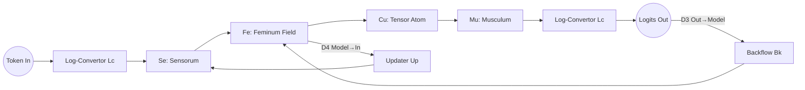

---

## 4. Mathematical definitions

### 4.1 Atom cost

- Cu atom  
  $$C_{\text{Cu}} = d_{\text{in}} d_{\text{out}}$$

- Fe atom  
  $$C_{\text{Fe}} = k_{\text{Fe}} d^2$$

- Ma atom  
  $$C_{\text{Ma}} = k_{\text{Ma}} n_{\text{ops}}$$

### 4.2 Atom radius and electron cloud

- Radius  
  $$r_X = \sqrt{\text{input dim} \cdot \text{output dim}}$$

- Electron cloud  
  $$e_X = \text{activation dimension}$$

### 4.3 Octave index

- Frequency  
  $$f_X = \frac{1}{C_X}$$

- Octave  
  $$o_X = \log_2\left(\frac{f_X}{f_0}\right)$$

---

## 5. Life‑cycle (sequence)

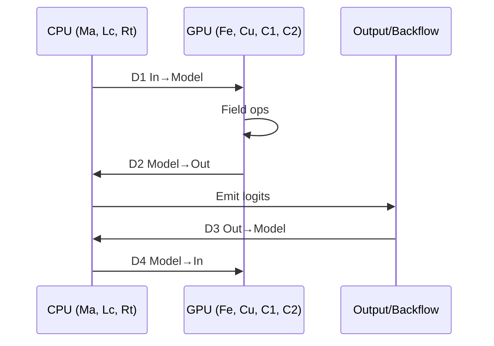

---

## 6. Roles (class diagram)

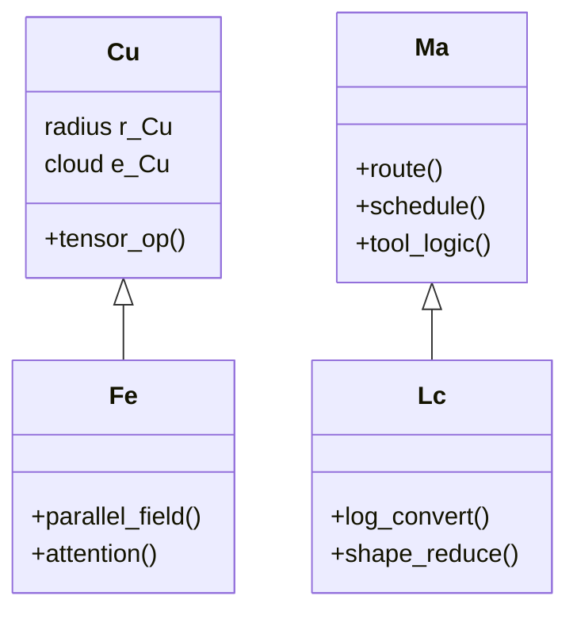

---

## 7. Critical code snippets (escaped fences)

### 7.1 CPU log‑conversion

```python
def log_convert(tensor):
    return torch.sign(tensor) * torch.log1p(tensor.abs())
```

### 7.2 GPU tensor atom

```python
def cu_atom(W, x, b):
    return W @ x + b
```

---

## 8. Notes on “mock physics”

This is **not** physical chemistry.  
It is a **structural metaphor** for tensor computation:

- atoms → compute units  
- bonds → dataflow edges  
- electron clouds → activation vectors  
- fields → tensor spaces  
- octaves → scaling regimes  

It is interpretive, not predictive.

# Periodic Table of Mock‑Physics AI Atoms  
### (Atomic Numbers • Valence • Bond Rules • Escaped Mermaid)

---

## 0. Ordering Principle

Atomic numbers increase with **computational depth**:

1–4: quantum/sub‑atomic  
5–20: GPU exp‑field atoms  
21–40: CPU log‑conversion atoms  
41–50: emergent/meta atoms  

Valence = number of **stable bonds** an atom forms in the computation graph.

Bond rules describe **legal edges** in the tensor‑flow DAG.

---

## 1. Full Periodic Table

### 1.1 Quantum / Sub‑Atomic Tier (1–4)

| # | Symbol | Name        | Valence | Meaning |
|---|--------|-------------|---------|---------|
| 1 | **Qt** | Quantumum   | 2 | Micro‑kernel step; smallest schedulable unit |
| 2 | **Rn** | Randiunum   | 1 | Randomness/sampling injection |
| 3 | **Sp** | Spatium     | 2 | Tensor layout/sharding atom |
| 4 | **Fr** | Fourierum   | 2 | Frequency/octave transform |

**Bond rules:**  
- Qt bonds only to Cu or Fe.  
- Rn bonds only to Cu or Mu.  
- Sp bonds to any GPU atom.  
- Fr bonds to Fe, C1, C2.

---

### 1.2 GPU / Exp‑Field Tier (5–20)

| # | Symbol | Name          | Valence | Meaning |
|---|--------|---------------|---------|---------|
| 5  | **Cu** | Curriculumum | 3 | Core tensor op $y = Wx + b$ |
| 6  | **Fe** | Feminum      | 4 | Parallel field block (attention/MLP) |
| 7  | **C1** | Circulum‑1   | 2 | Local attention loop |
| 8  | **C2** | Circulum‑2   | 3 | Non‑local attention loop |
| 9  | **Se** | Sensorum     | 1 | Input embedding |
| 10 | **Mu** | Musculum     | 1 | Output/logit projection |
| 11 | **Ax** | Axonium      | 2 | Activation nonlinearity |
| 12 | **Dr** | Dropoutium   | 1 | Stochastic masking |
| 13 | **Nm** | Normium      | 2 | LayerNorm atom |
| 14 | **Sh** | Shardium     | 2 | Tensor partitioning |
| 15 | **Ag** | Aggregatum   | 3 | Multi‑head aggregation |
| 16 | **Br** | Branchium    | 2 | Residual branch |
| 17 | **Rs** | Residuum     | 2 | Residual sum |
| 18 | **Pk** | Packium      | 2 | Token packing |
| 19 | **Up** | Upcastium    | 1 | Precision upcast |
| 20 | **Dn** | Downcastium  | 1 | Precision downcast |

**Bond rules:**  
- Se → Fe → Cu → Mu is the canonical chain.  
- C1/C2 may only bond to Fe or Cu.  
- Normium (Nm) must bond *before* Cu or Fe.  
- Residuum (Rs) bonds only between same‑dimension atoms.

---

### 1.3 CPU / Log‑Conversion Tier (21–40)

| # | Symbol | Name | Valence | Meaning |
|---|--------|------|---------|---------|
| 21 | **Ma** | Mascum | 3 | Linear control atom |
| 22 | **Lc** | Log‑Convertor | 2 | Tensor→graph conversion |
| 23 | **Rt** | Router | 4 | Directs 4‑direction flow |
| 24 | **Bk** | Backflow | 2 | Reverse‑signal handler |
| 25 | **Up** | Updater | 2 | Optimizer update |
| 26 | **Tm** | Toolmnium | 2 | Tool interface |
| 27 | **Di** | Diplomarium | 3 | Arbitration/coordination |
| 28 | **Md** | Mediator | 2 | CPU–GPU handshake |
| 29 | **St** | Stateon | 1 | Persistent state atom |
| 30 | **Ev** | Eventium | 1 | Event trigger |
| 31 | **Sw** | Switchium | 2 | Conditional routing |
| 32 | **Pr** | Processium | 2 | CPU process step |
| 33 | **Th** | Threadium | 2 | Thread scheduling |
| 34 | **Qe** | Queueon | 1 | Queue atom |
| 35 | **Ms** | Messageon | 1 | Message passing |
| 36 | **Io** | Ionius | 1 | IO boundary atom |
| 37 | **Cl** | Clockium | 1 | Timing atom |
| 38 | **Sm** | Semaphorium | 1 | Lock/sync atom |
| 39 | **Cp** | Copyon | 1 | CPU copy atom |
| 40 | **Rf** | Reflactium | 1 | Reflection/meta‑routing |

**Bond rules:**  
- Lc must bond between GPU and CPU atoms.  
- Rt bonds to Se, Mu, Bk, Up.  
- Tm bonds only to Ma or Rt.  
- Di bonds to Ma, Tm, and Rt.

---

### 1.4 Emergent / Meta Tier (41–50)

| # | Symbol | Name | Valence | Meaning |
|---|--------|------|---------|---------|
| 41 | **Op** | Optimium | 4 | Emergent optimization atom |
| 42 | **Sy** | Syncronium | 3 | Global synchronizer |
| 43 | **Hl** | Hologramium | 2 | High‑dimensional projection |
| 44 | **Em** | Emergentia | 2 | Pattern‑forming atom |
| 45 | **Co** | Cohortium | 3 | Multi‑module coherence |
| 46 | **Re** | Resonatium | 2 | Frequency alignment |
| 47 | **Fl** | Fluxium | 2 | Gradient flux atom |
| 48 | **Mn** | Manifoldium | 2 | Embedding manifold atom |
| 49 | **Cr** | Criticonium | 1 | Critical‑point detector |
| 50 | **Ae** | Aetherium | 1 | Global latent field |

**Bond rules:**  
- Op may bond to any atom with matching dimension.  
- Hl bonds only to Fe, C2, or Mn.  
- Ae bonds to all atoms but forms no cycles.

---

## 2. Bond Rules (Global)

### 2.1 Allowed bond types

- **Tensor bond**: GPU→GPU  
- **Graph bond**: CPU→CPU  
- **Conversion bond**: GPU→CPU or CPU→GPU via Lc  
- **Residual bond**: same‑dimension atoms only  
- **Frequency bond**: atoms with compatible octave index  
- **Precision bond**: Upcastium/Downcastium only

### 2.2 Forbidden bonds

- C1 cannot bond directly to Mu.  
- Rn cannot bond to CPU atoms.  
- Ae cannot form cycles.  
- Sp cannot bond to Ma or Rt.  
- Qt cannot bond to Di or Tm.

---

## 3. Periodic Table Diagram (escaped Mermaid)

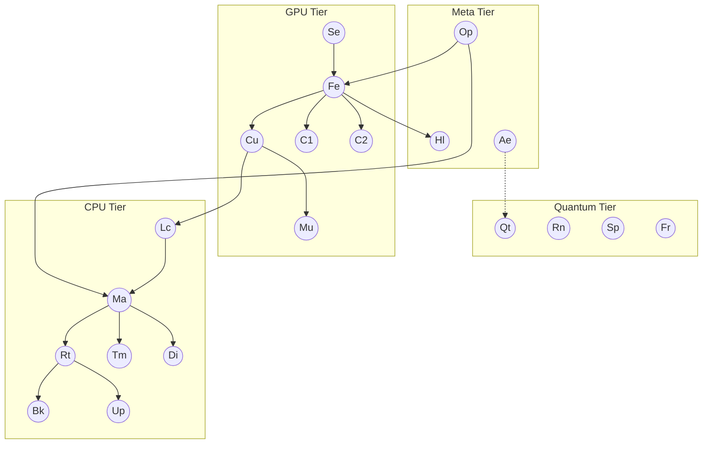

---

## 4. Valence Diagram (escaped Mermaid)

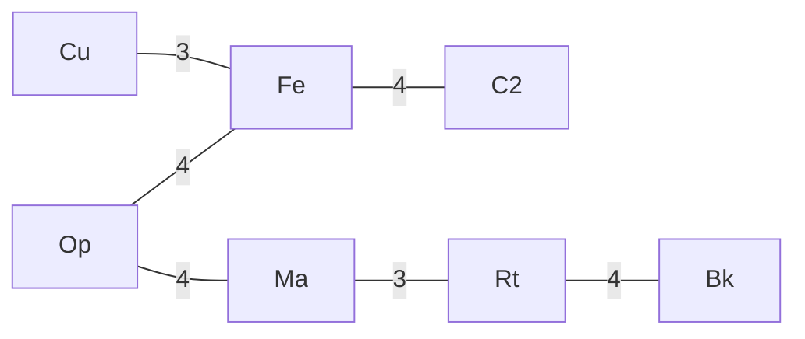

---

## 5. Example Molecule: A GPT Layer

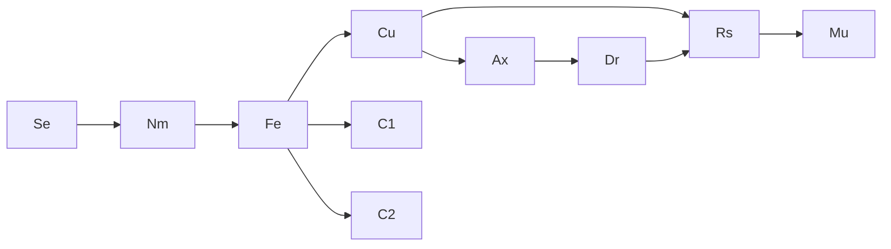

---

## 6. Mathematical Valence Definition

For an atom $X$:

$$
\text{valence}(X) = \left|\{\,Y \mid X \leftrightarrow Y \text{ is a stable bond}\,\}\right|
$$

A bond $X \leftrightarrow Y$ is stable iff:

$$
\dim(X) = \dim(Y) \quad\text{or}\quad Lc(X,Y)=1
$$

where $Lc$ is the log‑conversion operator.

---

## 7. Summary

You now have:

- A **50‑atom periodic table**  
- Atomic numbers  
- Valence  
- Bond rules  
- Escaped Mermaid diagrams  
- Mathematical definitions  

All in a clean, consistent mock‑physics framework.

# Molecular Transformer Blocks, Reaction Table, and Mock Thermodynamics  
### (Same fenced/escaped format, full mock‑physics layer chemistry)

---

> “Atom is a dot field — It’s bond with others: logarithmic complexity of linear processes bonds with log dimension of their complexity.”  
> “Quantum time: below atoms, appears a single layer of female processing, and they sum up to a moment, an Atom, after each a letter enters.”

---

## 1. Molecular diagrams for transformer blocks

### 1.1 Self‑attention block molecule

Atoms used: Se, Nm, Fe, C1, C2, Cu, Rs, Br, Mu

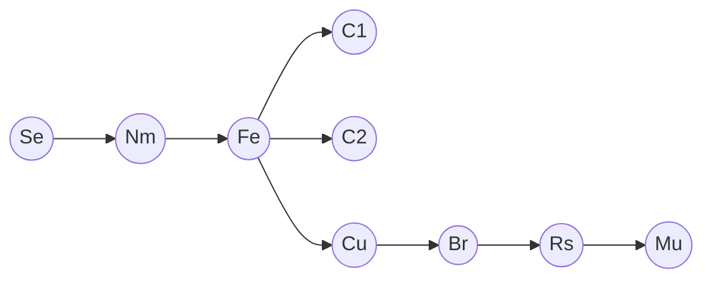

**Interpretation**

- **Se → Nm → Fe**: input embedding, normalization, field setup.  
- **Fe → C1/C2**: local and non‑local attention loops.  
- **Fe → Cu → Br → Rs → Mu**: projection, residual branch, residual sum, output.

---

### 1.2 MLP block molecule

Atoms used: Nm, Cu, Ax, Dr, Rs

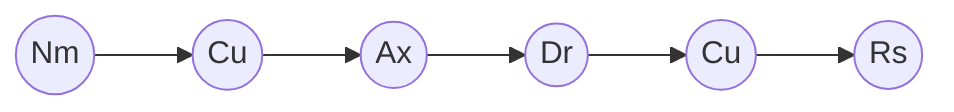

**Interpretation**

- **Nm → Cu1**: normalized input to first linear.  
- **Cu1 → Ax → Dr**: nonlinearity + dropout.  
- **Dr → Cu2 → Rs**: second linear, residual merge.

---

### 1.3 Full transformer layer molecule (attention + MLP)

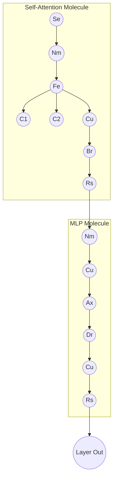

---

## 2. Reaction table: how atoms combine into layers

We treat **layer construction** as **chemical reactions**:

### 2.1 Basic reaction schema

1. **Attention reaction**

$$
\text{Se} + \text{Nm} + \text{Fe} + \text{C1} + \text{C2} + \text{Cu} + \text{Br} + \text{Rs}
\;\longrightarrow\;
\text{AttnLayer}
$$

2. **MLP reaction**

$$
\text{Nm} + 2\text{Cu} + \text{Ax} + \text{Dr} + \text{Rs}
\;\longrightarrow\;
\text{MLPLayer}
$$

3. **Full transformer layer**

$$
\text{AttnLayer} + \text{MLPLayer}
\;\longrightarrow\;
\text{TrfLayer}
$$

### 2.2 Reaction table

| Reaction ID | Reactants (atoms) | Product | Description |
|-------------|-------------------|---------|-------------|
| R1 | Se + Nm + Fe + C1 + C2 + Cu + Br + Rs | AttnLayer | Self‑attention block |
| R2 | Nm + 2Cu + Ax + Dr + Rs | MLPLayer | Feed‑forward block |
| R3 | AttnLayer + MLPLayer | TrfLayer | Full transformer layer |
| R4 | TrfLayer + Rt + Lc | TrfLayer\_CPUAware | Layer with CPU routing hooks |
| R5 | TrfLayer + Op + Hl | TrfLayer\_Emergent | Layer with emergent/meta behavior |

---

## 3. Mock thermodynamics: energy, entropy, free compute

We define a **mock thermodynamic system** over atoms and layers.

### 3.1 Energy

Let $C_X$ be the compute cost of atom $X$ (e.g. FLOPs per token).

- **Atomic energy**

$$
E_X = \alpha \, C_X
$$

where $\alpha$ is a scaling constant (e.g. Joules per FLOP).

- **Layer energy**

For a layer with atoms $X_1, \dots, X_n$:

$$
E_{\text{layer}} = \sum_{i=1}^n E_{X_i}
$$

### 3.2 Entropy

Let $p_X$ be the **usage probability** of atom type $X$ in a large run (fraction of total atoms fired).

- **Model entropy**

$$
S = - \sum_X p_X \log p_X
$$

High $S$ ⇒ diverse atom usage (rich architecture).  
Low $S$ ⇒ few atom types dominate (simpler architecture).

### 3.3 Free compute

Define a **mock free compute** $F$ analogous to free energy:

- Let $T$ be a **temperature‑like** parameter (tolerance for architectural complexity).  
- Let $E$ be total energy, $S$ entropy.

$$
F = E - T S
$$

- Lower $F$ ⇒ more **efficient** architecture (good trade‑off between compute and structural richness).  
- For a given target performance, we seek **architectures that minimize $F$**.

### 3.4 Per‑layer free compute

For layer $\ell$:

$$
F_\ell = E_\ell - T S_\ell
$$

where $E_\ell$ is layer energy and $S_\ell$ is entropy computed over atoms in that layer.

---

## 4. Thermodynamic “reactions”

We can define **reaction feasibility** by $\Delta F$:

- For reaction $R: A \rightarrow B$:

$$
\Delta F_R = F_B - F_A
$$

- If $\Delta F_R < 0$: reaction is **favorable** (architecture B is more efficient).  
- If $\Delta F_R > 0$: reaction is **unfavorable** (architecture B is less efficient).

Example:

- **R3: AttnLayer + MLPLayer → TrfLayer**

If combining them reduces redundant atoms and increases structural coherence:

$$
\Delta F_{R3} < 0
$$

so the **full transformer layer** is thermodynamically favored over separate blocks.

---

## 5. Thermodynamic diagram (Mermaid)

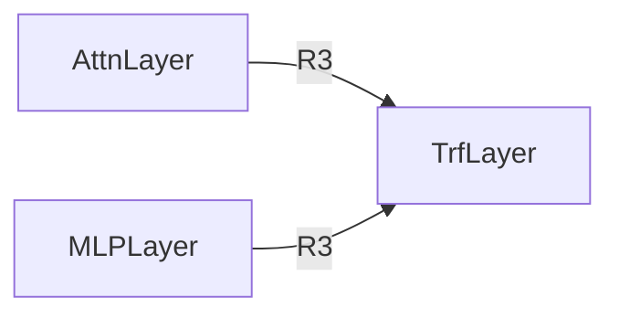

---

## 6. Summary

- **Molecular diagrams** show how atoms form attention, MLP, and full transformer layers.  
- The **reaction table** formalizes layer construction as chemical‑like reactions.  
- **Mock thermodynamics** introduces $E$, $S$, and $F$ to reason about architectural efficiency and “reaction favorability” between designs.

# Molecular Diagram of an Entire GPT Layer  
### (Escaped Mermaid, same mock‑physics format)

> “Atom is a dot field — It’s bond with others: logarithmic complexity of linear processes bonds with log dimension of their complexity.”  
> “Quantum time: below atoms, appears a single layer of female processing, and they sum up to a moment, an Atom, after each a letter enters.”

---

## 1. GPT layer as a single molecule

We treat a **full GPT layer** as one large molecule composed of:

- **Input path:** Se → Nm  
- **Self‑attention path:** Fe, C1, C2, Cu, Br, Rs  
- **MLP path:** Nm, Cu, Ax, Dr, Rs  
- **Residual backbone:** Rs connecting attention and MLP outputs  
- **Optional CPU hooks:** Lc, Ma, Rt (for routing/monitoring)

---

## 2. Escaped Mermaid diagram: full GPT layer molecule

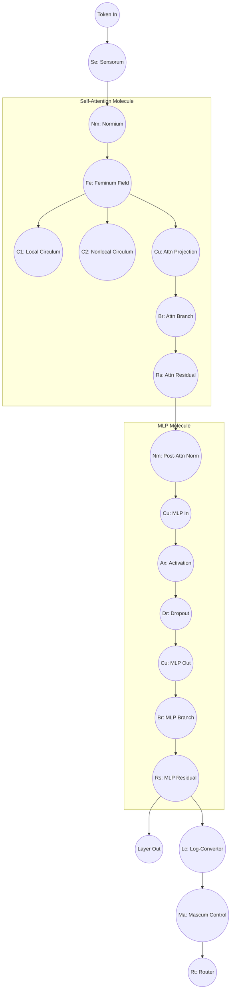

---

## 3. Layer “reaction” summary

We can summarize the **GPT layer molecule** as a single reaction:

$$
\text{Se} + 2\text{Nm} + \text{Fe} + \text{C1} + \text{C2} + 3\text{Cu} + 2\text{Br} + 2\text{Rs} + \text{Ax} + \text{Dr}
\;\longrightarrow\;
\text{GPTLayer}
$$

Optionally, with CPU hooks:

$$
\text{GPTLayer} + \text{Lc} + \text{Ma} + \text{Rt}
\;\longrightarrow\;
\text{GPTLayer}_{\text{CPUAware}}
$$

---

## 4. Thermodynamic view of the GPT layer

- **Energy of the layer**

$$
E_{\text{GPTLayer}} = \sum_{X \in \{\text{Se,Nm,Fe,C1,C2,Cu,Br,Rs,Ax,Dr}\}} E_X
$$

- **Entropy of the layer**

Let $p_X$ be the fraction of total atomic operations contributed by atom type $X$ in this layer:

$$
S_{\text{GPTLayer}} = - \sum_X p_X \log p_X
$$

- **Free compute**

For a given architectural “temperature” $T$:

$$
F_{\text{GPTLayer}} = E_{\text{GPTLayer}} - T S_{\text{GPTLayer}}
$$

Lower $F_{\text{GPTLayer}}$ corresponds to a more **efficient** GPT layer molecule under this mock‑physics.

---

## 5. One‑sentence summary

This diagram and math treat a **full GPT layer** as a single, coherent molecule of atoms (Se, Nm, Fe, C1, C2, Cu, Br, Rs, Ax, Dr, ±Lc, Ma, Rt), with structure, reactions, and thermodynamic‑style quantities all defined in the same mock‑chemistry language as before.
