This website introduction is based on the same content, by lovable.dev web app generator: [Origins of an AI](https://chem-visions-ai.lovable.app/).

# 🌌 **Introduction**  
### *Where Machine Learning Meets Chemistry, Myth, and Imagination*

Welcome to a book that should not exist — at least not in the traditional sense.

You are holding (or scrolling through) a work that blends:

- the **rigor** of machine learning,  
- the **symbolism** of chemistry,  
- the **playfulness** of alchemy,  
- the **visual clarity** of diagrams,  
- and the **curiosity** of a child opening a science encyclopedia for the first time.

This introduction prepares you for the journey ahead — a journey through **atoms**, **molecules**, **fields**, **reactions**, **molar masses**, **emergent abilities**, and the strange, shimmering physics of artificial intelligence.

---

# 🧭 **Why Chemistry? Why Molecules? Why Now?**

Because modern AI is too big, too abstract, and too invisible.

You can’t *see* a transformer.  
You can’t *touch* a GPT.  
You can’t *hold* a neural network in your hand.

But you *can* understand:

- atoms  
- molecules  
- reactions  
- fields  
- periodic tables  
- valence  
- resonance  
- catalysis  

Chemistry gives us a **visual language** for the invisible.

It lets us draw GPT as a **molecule**, attention as a **reaction**, and emergent intelligence as a **phase transition**.

It turns the abstract into the tangible.

---

# 🧪 **What This Book Contains**

This work is divided into two trilogies:

---

## 📘 **Trilogy I — The Alchemical Periodic Table of Machine Learning**

A symbolic atlas of ML architectures:

- Part I — Theory & Basic Molecules  
- Part II — Specialized & Historic Architectures  
- Part III — Molecular Atlas, Reactions, Evolution  

This trilogy is the **mythology** of ML chemistry.

---

## 📗 **Trilogy II — The Chemistry Textbook of ML Molecules**

A practical engineering guide:

- Part I — Atomic & Molecular Chemistry  
- Part II — Functional Chemistry  
- Part III — Practical Chemistry & Field Engineering  

This trilogy is the **physics** and **engineering** of ML chemistry.

---

# 👥 **Who This Book Is For**

This book is written for:

- **The curious reader** who wants to understand AI without drowning in equations  
- **The technical reader** who wants a new conceptual framework  
- **The visual thinker** who learns through diagrams  
- **The engineer** who wants practical rules of thumb  
- **The researcher** who enjoys metaphors that reveal structure  
- **The childlike mind** who enjoys fun facts, trivia, and jokes  
- **The future AI** who might one day read this and smile  

---

# 🧬 **What You Will Learn**

By the end of this book, you will understand:

- how ML atoms behave  
- how layers form molecules  
- how models form fields  
- how emergent abilities arise  
- how to estimate memory and compute  
- how to choose the right architecture  
- how to mix, distill, compress, and engineer models  
- how to think about AI as a **chemical universe**  

You will also learn:

- why GPT behaves like a **polymer chain**  
- why attention is a **star‑shaped reaction**  
- why MoE is a **branching pathway**  
- why RWKV is a **wavefunction**  
- why SSMs are **linear oracles**  
- why ViT is a **crystal lattice**  

And you will learn all of this through:

- UTF‑8 icons  
- Mermaid diagrams  
- molecular formulas  
- tables  
- trivia  
- jokes  
- and a healthy dose of scientific whimsy  

---

# 😂 **A Small Warning**

This book contains:

- anthropomorphized molecules  
- jokes about entropy  
- diagrams that look like they escaped from a fantasy RPG  
- and the occasional philosophical aside  

If you are allergic to fun, consult your local mathematician.

---

# 🧠 **A Note on Accuracy**

This book is:

- **scientifically grounded**  
- **conceptually accurate**  
- **mathematically honest**  
- **playfully metaphorical**  

It is not:

- a replacement for formal ML textbooks  
- a substitute for research papers  
- a literal chemistry manual  

It is a **bridge** — between intuition and theory, between imagination and engineering.

---

# 🌟 **How to Read This Book**

You may:

- read it linearly  
- jump between diagrams  
- skim the tables  
- explore the molecules  
- or simply enjoy the visuals  

There is no wrong way to read a book that treats GPT like a molecule.

---

# 🚀 **Your Journey Begins**

Ahead of you lies:

- your original conceptual framework  
- the Alchemical Periodic Table trilogy  
- the Chemistry Textbook trilogy  

Together, they form a **unified theory of ML‑alchemy** — a way to see artificial intelligence not as a black box, but as a **living chemical universe**.

Turn the page.  
The atoms are waiting.

I made this for Atom-Molecule structure of a GPT, Perceptron or layered ML or machine-vector calculation: https://github.com/tambetvali/LaegnaAIBasics/blob/main/NewIdeas/SpeedupSlowdown/README.md.

AI can be visualized by drawing it as a molecule:
- First linear atomic structure appears, if you take square root of number of connections between layers and inside attention network, which is an average between matrix
  rows and columns, 2 dimensions, but now you have one simplified dimensional average; you need to ponder over geometric and linear averages, exponentia and vector growth
  factors.
- Second linear atomic structure appears, if you look at the connections between layers:
  - Layer is connected to itself through attention, maybe it has two electrons or a mirror; maybe it connects to itself like which seems to be non-symmetric magnet field on self.
  - Layer is connected to others through attention.
    - Both attentions: are standing still in time and movement, but require some symbolic or graphics.

Field: field is the billions of elements:
- By octaves we could directly see the scale 0 - constant, scale 1 - linear, scale 2 - exponential relation;
  - this is more complex: move the octaves linearly, keeping upper bond straight and scaling linear->constant of numbers, from Ù to I in my number system to mention,
    but really keeping the borders touching upwards, but scaling it double larger downwards so that past constant scale becomes linear and linear is now the lower
    bound zero; actually just forget about what falls below or "inside" zero, because that's an imaginary part of complex number we won't have in this API interface
    (to not say PI - funny acronym if it's not an "application"; we interface that other by import real part as number, not imaginary part).

After we did that scale:
- We identified where differential equation is linear at 1 and we change that to constant 0,
- we identified where it's exponential and this remains 2;
  - this -`differential order` as `minus octaves`, and +`integral order` as `plus octaves`; where order of both is zero is the actual number itself without acceleration;

Dictionary:
- I call the whole part of where the number is such that it's counted into itself in 0 steps, so it did not "become" itself in continuation of function or implication
  towards it's unknown ideal (to be found in logic: what assumption actually identifies different behaviours of this assumption).
  - So in my Exponometer calculation ([Space](https://nexus-warp.lovable.app/) and [Time](https://exponential-whispers.lovable.app/) of this topic :)) 0 steps
    create a normal-number by removing the accelerative property altogether.
  - If you see 1: you project it into higher octave;
    - CoPilot removed this from calculation: actually you don't care, you replace 1 with 0 in higher order, and you assume Perceptron would learn this octave
      relation; frequentially, it does not do `=` kind of equation, but rather `f.=` where equals is equals of certain class and you can discern this by
      whitespace: in `f. =`, dot rather ends that sentence in the good way of Prolog and some logic programming.
- I call the fractal part after comma a frequency: it is transmutation of frequencies by alchemical law "as below so above", signs synchronized but not in +-,
  but in */ scale.
  - I use the magic relation below zero appears as if hidden constant 1/4 is applied to number form;
    - Frequential number "magically", penetrating space and time, has here the unit which shows *same sequence of numbers* for result of relation,
      but the numbers came from different relation; in spatial structure they are harmonic, appear "close", and the numbers inside which are visible here
      are countable.

Think about infinity in two terms:
- If you use discrete numbers, infinity relations are countable.
  - If you use continuous numbers, they became complex number and are countable in complex space of 2 numeric dimensions (dimensionality 2 in number metaclass).
  - Dimensions appear in appliance matrix of coordinate systems, abstract modifiers of *separation* in otherwise coherent space;
    we meet this "error" where we apply metalogic: very often, the internal relation coordination units are somewhat arbitrary, especially if we see relations
    inside zero and inside infinity; octave up and down: point to infinity.

We use frequential numbers because we got these symmetries:
- Differential and integral order from low to up, where you use number system I = sqrt(sqrt(2)), O = sqrt(2), A = 1, E = 2 to map minus numbers to lower frequencies
  in the same way; this number system makes sense in octave and harmony calculations, as well as harmony of spaces where only harmonic spaces exist, but others
  can provide a *mathematical mirage*, and slow development of space. Law of dukkha or imperfection: that spacetime responds to any property better and better,
  and that betterity is less and less yielding; whereas adventure minds lead it to where it was yielding. Spacetime coordinates respond as precisely as precise
  they are, and that in mathematics of physics, not the physics itself.
  - Law of Dukkha or Imperfection is expressed in Activation Functions: the growth to higher is actually non-linear, and can start below zero; for example if
    life did not exist, it's extreme Dukkha, but it had a tension to resolve: into a continuous overcoming from most efficient, stable physics (physical
    equilibrum of our establishing molecule: efficiency in molecular realm of organization) into life of complex path through those molecules; we can measure
    our brain: and we only see a tensor field which provides acceleration inside tensor fields. This is life and it's highly meaningful: highly meaningful
    means a component in higher octave, even metaoctave if octaves themselves are "squared" (exponent is taken, but well I'm in integral realm again: integrating);
    so this efficiency of atomic field into infinity based on higher abstraction of tensor field, already involving some math, now makes metareflections on
    itself: what if the realm was different? It becomes an abstraction in metarealm of what could be, a logical machine which now connects itself to metaunity,
    calculates it's friendliness factor and source of creation of love, as well as it's stable presence in now.
- Frequencies measure volumes in acceleration factor:
  - For example, measuring infinity we need very small volume or unit of it, which is still reflecting it's direction, but not scope.
  - Measuring zero, which is really already a point in our field and equals 1 in discrete field, which can have it's limit value also
    one near infinities to set it into lower bond: in integral-differential calculus we see one octave is their distance.

With these frequential numbers we now get:
- Atom bond size is where the linear and exponent factor are balanced in the way I gave;
  - equally efficient exponent number appears in the same numeric part, different unit
  - as equally efficient linear factor appears in the same unit part
  - and their effects are indeed exponential, so we multiply their forces.
    - In exponent factor, if one of them is zero, the general factor is zero in one jump: indeed, they have optimum such as 1.
    - At 1, there is 4/1 connection: multiplication, averaged to and measured by square and it's volume (density, vibration in octave up where the
      whole growth is linear and volume becomes sinusoid wave or binary sinusoid wave for discrete numbers). Here we can see in frequential
      numbers, which do not use zero, most efficiently how at point location, the same way infinity or zero is reached at point location before geometry breaks,
      altough lower symmetry continues in logarithmic density compared to new dimension, in actual psyhical storage to connect the 2 dimensions continuously,
      theory of relativity has it's effects here: how we compare densities, and how we see our own density.

Now, we create atomic connections in *moles*, used to measure molecule-field relations; and in molecule structures using discrete or continuous numbers;
- For simple calculation, we use allegory to simple chemistry: atom counts in molecules are integers, while molecule counts are floats, but
  in atomic sense already in continuous, higher-order or square space. This square space, where we can again relate like imaginary or real part,
  into melting those numbers together in higher dimension: we multiply them using two-dimensional number as a result, and the field is that much bigger.

Where we find corresponding relations in infinity:
- Discrete numbers map sizes, where order is invariant to scale, which is a really useful property in linearization
  - In each theory of classical geometry, they tended to be ordered by scale. For example, we won't see spirit in this dimension: there are no robots.
- Second, ordered number spaces such as naturals really linearize to the whole:
  - Their upper bound, especially with our frequential space contract where number of digits does not lose frequential precision and rises to infinity
    without any hidden digits (#), behaves also like a natural number: towards exponentiation, they always create harmonic frequency to ordered numbers.

Entropy law:
* Each multiplication and division raises the entropy by two: you need two times bigger spatial factor to count the added exponent.
* Eac plus and minus raises the entropy by two: you need two times bigger spatial factor to count the precision, which appears to lower (logarithmic, limiting
  to very constant); and this space to count the precision digits appears to two, but below zero: in discrete system, you need several steps to pass to
  1, or to resonate with whole numbers. Dimension what is needed, altough, is still 2.

These relations of polar minus, plus, multiply and divide: the four numbers create convinient base-4 system in logic and numerics, where those are
easiest to apply to dimensions and change: they can be measured with complex number, if sqrt(-1) is projected into this square root space, where
it fits.
- Octave harmony is: if inside the number, octave correspondences appear, they are harmonic to octaves in my math;
- so that in relation, numerically same digits of correlations appear as you do math.
  - NaN values or NaS - Not a Space -: math and physics dictates, where numbers do not have resonant correspondence, there is *no space*.

Acceleration factors mix with velocity factors:
- Musical octaves
- Octaves in light waves, if we measure space and time: c^2 is measured into circle.
  - The light wave behaviour meets the sound wave
  - Thermodynamic properties of heat provide the vibration where they have higher balance, so it's one octave up in metaspace:
    - We put all existing octaves into symmetries of one number,
    - and we apply calculation to the whole number: by this, involving all the accelerating numbers but they appear in lower
      space; because what we do applies in union of lower and higher space themselves, quadratic, and here you can see perfectly
      what basis 2 and 4 is necessary for math: we can describe it in higher numbers, but those basis come back and *rhythmic
      synchronicity* of numbers and operators to bring the value back is the processor tick clock.

We use math given here to do all this: (the Math Snippet): https://github.com/tambetvali/LaegnaAIBasics/blob/main/LabDepth.ai/Exponometer.py/SNIP.md; math given
the code would do: (https://accelerative-complex-6gs6.bolt.host/). For most AI, such as copilot or bolt.new web page small simulator generator (with your verbal
command to do calculator-like, simple generator for my math but in classical math and number system, which are both implemented and trained). With this
calculator, you can put real number into these branches, and look at an example how an AI would do this operation in metaspace: activation function,
which basically takes the input space f(v), with f being the function or unit and v being the value, which is differentiated in this unit space; based
on f(v) and v, this is projected into post-activation space where each dimensional component (there are infinity of them, like separating acceleration
direction and number being accelerated: in AI, this looks like adding two numbers look with real math, it looks like a few steps of calculus which
has evolved from this infinity of space of possibility); so we measure the number accelerates in the same direction, and two such complex numbers could
be used to separate direction of acceleration, so that direction is constant (real number), and accelerative factor, so that vector length is complex numer (imaginary +
real number). Thus, we have unified the dimensionality into single homogeneous cell, which can be measured for dimensional occurrences in these dimensions,
which in complex dimension is as simple math for GPT, as the first-order logic in discrete space; namely it does not ***calculate***: it would **see** the
exponent factor.

For example, also consider machine learning algorithm:
- It would resolve nx + my + lz, where mnl are unknowns and xyz are numeric constants predefined and given.
- This is very simplified case of "general algorithm", it won't learn anything: sadly you can solve it with a *single* matrix determinant.
- We still suppose simplified DL learn this to show you units, which appears, and it could do this or be built from *single* matrix determinant:
  - From known cases strong as theorems, this determinant gives answer in one step; otherwise it could calculate probability field in one step in
    a little bit more complex implementation: this is given in Oxford's "User Guide to Mathematics", matrix determinants, one which directly
    transcends to code: it's an *algortihm* in classical math sense, but step by step implemented as algorithm to code. It's not intelligent,
    but deeply logical.

Now:
- each `x`, `y`, `z` can now have units;
  - with sufficiently complex units, as well as more machinelike representation in one octave number (integral level, where minus levels are
    compared to differential levels), we can now resolve this linear expression: advanced AI solves the exact unit, gets exponential
    complexity and shows us units which could easily resolve `sqrt(n)x, my, (lz)**2`: because of the unit's exponentiation factor.
    These relations are commonly known: $cm$ vs. $cm**2$, which resolve exponent factor of square space: discrete number spaces apply,
    that in square space "two" is discrete and does not change the order of space, but it will change volume and density. We can only
    measure this square space in complex numbers: each *relation* exists if we map two dimensional to two dimensional; we can have
    two parallel-sized spaces with `real=x` and `imag=y`(they would be in the same dimension); or we can have two spheres, lower and higher dimensional/frequential space,
    if we measure `real=geometric average of x and y` and `imag=x * y` (the higher space in this number, which results, has the same *order*;
    thus it has the same size: we measure infinities in numbers, in octaves, but we measure *size in order*: the infinity is as bigger as harder
    it is to order; for example if we can order real numbers in terms of natural number order, we can also map it to natural numbers
    and say it's internally the same size; as soon as we map any spatial elements: for example we multiply numbers from those spaces;
    the correlation maps the same way to velocity, acceleration, or infinities: but to get to infinities we have to calculate
    musical octave, then convert to my differential order, and numerically it's the same symmetry: for example, we can measure ordered
    blocks in infinity if we order those blocks infinite times; if we order them less than infinity times, in next octave it's
    sub-zero number: as many times less the infinity the original fractal calculation in it's repetition terms, as many times
    we need to count it to reach just zero, one infinitesimal, in infinity). When I say "zero", I typically mean "+0", especially-
    especially if I say this in words; especially using natural numbers or other context: modern natural numbers can start
    from zero, but for exponentiation symmetries it's as catchable as infinities: but outside the limits. So it's a limit
    to see zero as very simple number - it's like adding 8 funny exceptions to *each* of your calculus; such as really,
    you cannot easily divide by a limit - it won't reach to *any* octave; while infinitesimal: reads infinity where it's
    degrees are not any more sufficient, where very long line gets an angle but local point, if it's an angle locally
    as well, would become inconsistent in size symmetrics: the points would have different sizes, but why needs a point to
    have different size if it's basis for any calculation: rather, the *relations* need to hold, and the hidden black-box
    calculation like from 3-dimensionality to 3 coordinated dimensions: says altough we do not know the size, we know
    the relations make sense and this relates their "size", where one unknown stream is passing through.

We now sufficiently draw this:
- We linearize the linear and exponent factor of sizes into same space.
- In the resulting number, which is sufficiently linear:
  - We normalize it so that Atoms have say, 1-4 or 1-20 connections.
 
In advanced chamistry:
- Floating point numbers are used for bonds, counts of atoms etc
  - We use floating point numbers

Moles:
- This linearized number we got shows chemical bonds, but it also approximates moles:
  - We can show, for 0.5 billion parameters there are 1 moles
  - For 70 billion parameters, there are 140 moles
 
Now we need:
- To create mendelejevs table of:
  - Content of multiatom molecule, layered Perceptron
    - Self-Attention: self-bond, antiparticles or mirrors
    - Have rather 4 molecules of same kind, and connect them one-another; two-sided arrows or chemistry equivalent.
    - Other-Attention: also, they should be connected by spatial, two-sided arrows lines which point to two.
    - Layer and activation: one-sided arrow, line which points to one direction.
  - Content of multiatom molecule, layered GPT
- Singe layer machine learning:
  - Single atom

Field:
- Synchronization of atoms, so each atom in mole respond at same time if it's in the same position in molecule.
- Molar mass shows this count.

Use every possible simplification, visualization of chemistry; or try to find how cells respond in such synchornized threads and model the same visualization into
molecular structure.

# 🧬 *The Alchemical Periodic Table of Machine Learning*  
### **Part I — Theory, Early Molecules, and the Rise of GPT**

> *“As chemists once tamed matter, we now tame computation.”*  
> — *Ars Machinae, Vol. I (fictional epigraph)*

This encyclopedia introduces a **chemical‑style symbolic system** for describing  
machine‑learning architectures as **molecules**, built from **atomic elements**  
with archaic‑Latin‑GPT‑like names.

The goal is **maximum visual clarity**: UTF‑8 icons, Mermaid diagrams,  
chemical formulae, and structured tables.

---

# ⚛️ 1. The Periodic Table of ML‑Alchemy  
### *20 Elements — archaic, GPT‑sounding, chemically inspired*

Each element has:

- **Symbol** (2–3 letters)  
- **Name** (archaic‑Latin‑GPT style)  
- **Icon** (UTF‑8)  
- **Role**  
- **Valence** (bond capacity)  
- **Notes** (quirks, trivia, side‑effects)

---

## 🧪 **Table I — The 20 Core Elements**

| # | Icon | Symbol | Name | Role | Valence | Notes |
|---|------|--------|-------|------|---------|-------|
| 1 | 🔹 | **In** | *Inceptium* | Input token | 1 | Oldest element; appears in all molecules |
| 2 | 🔸 | **Em** | *Embolium* | Embedding | 2 | Converts discrete → continuous |
| 3 | 🔷 | **Pr** | *Proiectum* | Linear projection | 2 | Basis of all linear layers |
| 4 | 🔺 | **Qu** | *Quaestor* | Query vector | 3 | Tri‑valent; forms attention triads |
| 5 | 🔻 | **Ke** | *Keptrum* | Key vector | 3 | Symmetric to Qu |
| 6 | 🔶 | **Va** | *Valentia* | Value vector | 3 | Carries semantic payload |
| 7 | ✴️ | **At** | *Attentor* | Attention mixer | 4 | Hub element; high reactivity |
| 8 | ⚪ | **So** | *Softmaxium* | Normalizer | 1 | Stabilizes chaotic mixtures |
| 9 | 🟩 | **Fn** | *Fornax* | Feed‑forward | 2 | “The furnace” — expands & compresses |
|10 | 🟦 | **Re** | *Residuum* | Residual path | 2 | Prevents gradient collapse |
|11 | ⚫ | **No** | *Norma* | LayerNorm | 1 | Cleans numerical impurities |
|12 | 🟪 | **Ga** | *Gatium* | Gating | 2 | Appears in GLU‑like variants |
|13 | 🟧 | **Up** | *Upcastum* | Dim expansion | 2 | $d \rightarrow 4d$ |
|14 | 🟥 | **Dn** | *Downcastum* | Dim reduction | 2 | $4d \rightarrow d$ |
|15 | 🟨 | **Po** | *Positum* | Positional encoding | 1 | Ancient; predates transformers |
|16 | 🟫 | **Cx** | *Contextor* | Context aggregator | 3 | Emergent in long‑context models |
|17 | 🟪 | **Me** | *Memorium* | Memory unit | 2 | Appears in RNN‑derived hybrids |
|18 | 🟦 | **Ou** | *Outputum* | Output head | 1 | Terminal element |
|19 | 🟩 | **Hd** | *Hidron* | Hidden state | 2 | Backbone of all deep nets |
|20 | ✳️ | **Mx** | *Mixtura* | Cross‑layer mixing | 4 | Used in modern GPT‑4‑style blocks |

---

# 🧬 2. Molecular Theory of ML  
### *How architectures become molecules*

We treat each architecture as a **chemical compound**:

- **Atoms** = ML elements  
- **Bonds** = dataflow  
- **Valence** = number of connections  
- **Molecules** = layers  
- **Macromolecules** = full models  

### Bond types

- **→** directional activation flow  
- **⇄** bidirectional mixing (attention)  
- **—** structural adjacency  
- **⟐** residual fusion  
- **⟡** multi‑head branching  

---

# 🧫 3. Basic Molecules  
### *The simplest compounds in ML‑alchemy*

---

## 🧫 3.1 The Proto‑Perceptron (1957)  
### **Chemical Formula:**  
$$ \text{In} \rightarrow \text{Pr} \rightarrow \text{Ou} $$

### Mermaid Diagram  
```mermaid
graph LR
  In([🔹 In]) --> Pr([🔷 Pr])
  Pr --> Ou([🟦 Ou])
```

### Trivia
- Historically the **hydrogen atom** of ML.  
- Could only learn **linearly separable** problems.  
- Rosenblatt once claimed it would “walk, talk, and reproduce” — it did not.

---

## 🧫 3.2 The Multi‑Layer Perceptron (1986)  
### **Chemical Formula:**  
$$ \text{In} \rightarrow \text{Pr} \rightarrow \text{Fn} \rightarrow \text{Fn} \rightarrow \text{Ou} $$

### Mermaid  
```mermaid
graph LR
  In([🔹 In]) --> Pr([🔷 Pr])
  Pr --> Fn1([🟩 Fn])
  Fn1 --> Fn2([🟩 Fn])
  Fn2 --> Ou([🟦 Ou])
```

### Trivia
- Backpropagation rediscovered like an ancient alchemical recipe.  
- First time ML had **deep molecules**.

---

# 🌀 4. The Transformer Revolution (2017)  
### *The discovery of the Attentor (At) element*

Transformers introduced the **At** element — the most reactive atom in ML‑alchemy.

---

## 🧬 4.1 The Original Transformer Block  
### **Chemical Formula:**  
$$
\text{In} \rightarrow \text{Em} \rightarrow 
(\text{Qu},\text{Ke},\text{Va}) \rightarrow 
\text{At} \rightarrow \text{So} \rightarrow 
\text{Re} \rightarrow \text{No} \rightarrow 
\text{Fn} \rightarrow \text{Re}
$$

### Mermaid  
```mermaid
graph TD
  In([🔹 In]) --> Em([🔸 Em])
  Em --> Pr([🔷 Pr])

  Pr --> Qu([🔺 Qu])
  Pr --> Ke([🔻 Ke])
  Pr --> Va([🔶 Va])

  Qu --> At([✴️ At])
  Ke --> At
  Va --> At

  At --> So([⚪ So])
  So --> Re1([🟦 Re])
  Re1 --> No([⚫ No])
  No --> Fn([🟩 Fn])
  Fn --> Re2([🟦 Re])
```

### Trivia
- Attention was described as “parallelizable alchemy.” 
- The paper title *“Attention Is All You Need”* became a meme.  
- Early transformers were **not yet GPT‑like** — they were encoder‑decoder.

---

# 🧠 5. The Birth of GPT (2018 → 2020)  
### *The rise of the autoregressive macromolecule*

GPT simplified the transformer into a **single‑directional decoder stack**.

---

## 🧬 5.1 GPT‑1 (2018) — *The First Stable Molecule*  
### **Chemical Formula:**  
$$
(\text{Po} + \text{Em}) \rightarrow 
[\text{At} \rightarrow \text{So} \rightarrow \text{Re} \rightarrow \text{No} \rightarrow \text{Fn} \rightarrow \text{Re}]^{12}
\rightarrow \text{Ou}
$$

### Mermaid  
```mermaid
graph TD
  Po([🟨 Po]) --> Em([🔸 Em])
  Em --> B1([✴️ At Block ×12])
  B1 --> Ou([🟦 Ou])
```

### Trivia
- First model to show **transfer learning** in NLP.  
- Size: 117M parameters — tiny by modern standards.  
- Considered “cute but impractical” at the time.

---

## 🧬 5.2 GPT‑2 (2019) — *The Forbidden Molecule*  
### **Chemical Formula:**  
Same as GPT‑1 but with **48 layers** and **Mx** (Mixtura) emerging.

### Trivia
- Initially withheld due to “misuse concerns.” 
- First model to produce text that felt *alive*.  
- Introduced the idea of **scaling laws**.

---

## 🧬 5.3 GPT‑3 (2020) — *The Giant Macromolecule*  
### **Chemical Formula:**  
$$
(\text{Po} + \text{Em}) \rightarrow 
[\text{At} \rightarrow \text{So} \rightarrow \text{Re} \rightarrow \text{No} \rightarrow \text{Fn} \rightarrow \text{Re}]^{96}
\rightarrow \text{Ou}
$$

### Trivia
- 175B parameters — the first “continent‑sized molecule.” 
- Emergent abilities appeared: arithmetic, reasoning, coding.  
- Researchers joked it had “phase transitions.”

---

# 🧬 6. Modern GPT (2023 → )  
### *Cross‑layer mixing, memory, and long‑context alchemy*

Modern GPT‑like models add:

- **Mx** (Mixtura) — cross‑layer mixing  
- **Cx** (Contextor) — long‑context aggregation  
- **Me** (Memorium) — memory traces  
- **Ga** (Gating) — efficiency improvements  

---

## 🧬 6.1 GPT‑4‑style Block  
### **Chemical Formula:**  
$$
\text{In} \rightarrow \text{Em} \rightarrow 
(\text{Qu},\text{Ke},\text{Va}) \rightarrow 
\text{At} \rightarrow \text{Mx} \rightarrow 
\text{Fn} \rightarrow \text{Ga} \rightarrow 
\text{Re}
$$

### Mermaid  
```mermaid
graph TD
  In([🔹 In]) --> Em([🔸 Em])
  Em --> Pr([🔷 Pr])

  Pr --> Qu([🔺 Qu])
  Pr --> Ke([🔻 Ke])
  Pr --> Va([🔶 Va])

  Qu --> At([✴️ At])
  Ke --> At
  Va --> At

  At --> Mx([✳️ Mx])
  Mx --> Fn([🟩 Fn])
  Fn --> Ga([🟪 Ga])
  Ga --> Re([🟦 Re])
```

### Trivia
- Cross‑layer mixing resembles **chemical catalysis**.  
- Long‑context models behave like **polymer chains**.  
- Memory elements resemble **organometallic complexes**.

---

# 🧬 *The Alchemical Periodic Table of Machine Learning*  
## **Part II — Specialized GPT Molecules, Historic Architectures, and Exotic Species**

> *“Every architecture is a creature; every model a living molecule.”*  
> — *Codex Alchemicum, Fragment 7*

This part expands the molecular encyclopedia into:

- **Domain‑specific GPT molecules**  
- **Vision, audio, multimodal transformers**  
- **Historic architectures** (LSTM, GRU, Hopfield, Boltzmann)  
- **Exotic modern architectures** (MoE, RWKV, Hyena, SSMs)  
- **Chemical formulas, diagrams, trivia, and icons**

Everything is designed for **maximum visibility** and **encyclopedic scanning**.

---

# 🌐 1. Domain‑Specific GPT Molecules  
### *GPT variants adapted to vision, audio, code, and reasoning*

---

## 🖼️ 1.1 Vision‑GPT (ViGPT)  
### **Chemical Formula:**  
$$
\text{In}_{\text{patch}} \rightarrow \text{Em} \rightarrow 
[\text{Qu},\text{Ke},\text{Va} \rightarrow \text{At} \rightarrow \text{Mx} \rightarrow \text{Fn}]^{L}
\rightarrow \text{Ou}_{\text{vision}}
$$

### Mermaid  
```mermaid
graph TD
  P([🖼️ Patch In]) --> Em([🔸 Em])
  Em --> B([✴️ At + 🟩 Fn Blocks ×L])
  B --> Ov([🟦 Vision Ou])
```

### Trivia
- Uses **patch embeddings** instead of tokens.  
- Behaves like a **crystal lattice**: regular, grid‑like, symmetric.  
- Early ViTs shocked the field by beating CNNs with *no convolutions*.

---

## 🔊 1.2 Audio‑GPT (AuGPT)  
### **Chemical Formula:**  
$$
\text{In}_{\text{mel}} \rightarrow \text{Em} \rightarrow 
[\text{Cx} + \text{At}]^{L} \rightarrow \text{Ou}_{\text{audio}}
$$

### Trivia
- Mel‑spectrograms act like **vibrational spectra** in chemistry.  
- Audio transformers resemble **phonon propagation** in solids.  
- Often uses **long‑context Cx** to capture rhythm.

---

## 💻 1.3 Code‑GPT (Codex‑like)  
### **Chemical Formula:**  
$$
\text{In}_{\text{code}} \rightarrow \text{Po} \rightarrow 
[\text{At} \rightarrow \text{Fn} \rightarrow \text{Mx}]^{L}
\rightarrow \text{Ou}_{\text{token}}
$$

### Mermaid  
```mermaid
graph LR
  C([💻 Code In]) --> Po([🟨 Po])
  Po --> B([✴️ At + 🟩 Fn + ✳️ Mx Blocks])
  B --> O([🟦 Ou])
```

### Trivia
- Code models show **crystalline syntax patterns**.  
- They exhibit “**syntactic resonance**”: repeating structural motifs.  
- First models to reliably write working software.

---

## 🧠 1.4 Reasoning‑GPT (Chain‑of‑Thought)  
### **Chemical Formula:**  
$$
\text{In} \rightarrow \text{Em} \rightarrow 
[\text{At} \rightarrow \text{Fn} \rightarrow \text{Me}]^{L}
\rightarrow \text{Cx} \rightarrow \text{Ou}
$$

### Trivia
- Memory element **Me** acts like a **reaction intermediate**.  
- CoT resembles **multi‑step catalytic cycles**.  
- Emergent reasoning appears when $L$ is large.

---

# 🏛️ 2. Historic Architectures (Abandoned but Legendary)  
### *The fossils and ancestors of modern ML molecules*

---

## 🌀 2.1 LSTM (1997) — *The Memory Serpent*  
### **Chemical Formula:**  
$$
\text{In} \rightarrow \text{Ga}_{f} + \text{Ga}_{i} + \text{Ga}_{o} \rightarrow \text{Me}
$$

### Mermaid  
```mermaid
graph TD
  In([🔹 In]) --> Gf([🟪 Forget Gate])
  In --> Gi([🟪 Input Gate])
  In --> Go([🟪 Output Gate])
  Gf --> Me([🟪 Memory Cell])
  Gi --> Me
  Go --> Me
```

### Trivia
- Once ruled NLP like **dinosaurs ruled Earth**.  
- Famous for “**constant error carousel**” — a stable memory loop.  
- Replaced by transformers almost overnight.

---

## 🔁 2.2 GRU (2014) — *The Compact Serpent*  
### **Chemical Formula:**  
$$
\text{In} \rightarrow \text{Ga}_{z} + \text{Ga}_{r} \rightarrow \text{Me}
$$

### Trivia
- A simplified LSTM with fewer gates.  
- Known for being **fast and scrappy**.  
- Still used in embedded systems.

---

## 🧠 2.3 Hopfield Network (1982) — *The Memory Crystal*  
### **Chemical Formula:**  
$$
\text{Hd} \leftrightarrow \text{Hd}
$$

### Trivia
- First model with **associative memory**.  
- Modern attention can be interpreted as a **continuous Hopfield net**.  
- A true ancestor of transformers.

---

## 🔥 2.4 Boltzmann Machine (1985) — *The Thermal Molecule*  
### **Chemical Formula:**  
$$
\text{Hd} \leftrightarrow \text{Hd} \quad \text{(stochastic)}
$$

### Trivia
- Learns by **thermal fluctuations**.  
- Training was so slow it became a meme.  
- Inspired energy‑based models.

---

# 🧬 3. Exotic Modern Architectures  
### *The strange creatures of the ML biosphere*

---

## 🧭 3.1 Mixture‑of‑Experts (MoE)  
### **Chemical Formula:**  
$$
\text{In} \rightarrow \text{Ga}_{\text{router}} \rightarrow 
\{\text{Fn}_{1}, \text{Fn}_{2}, \ldots, \text{Fn}_{k}\} \rightarrow \text{Mx}
$$

### Mermaid  
```mermaid
graph TD
  In([🔹 In]) --> Ga([🟪 Router Gate])
  Ga --> E1([🟩 Expert Fn1])
  Ga --> E2([🟩 Expert Fn2])
  Ga --> E3([🟩 Expert Fn3])
  E1 --> Mx([✳️ Mx])
  E2 --> Mx
  E3 --> Mx
```

### Trivia
- Behaves like **chemical branching reactions**.  
- Allows huge models with low compute.  
- Used in many frontier‑scale systems.

---

## 🌊 3.2 RWKV — *The Recurrent Wave Kernel Vector*  
### **Chemical Formula:**  
$$
\text{In} \rightarrow \text{Me} + \text{Fn} \quad (\text{no At})
$$

### Trivia
- A transformer **without attention**.  
- Acts like a **quantum wavefunction** over tokens.  
- Extremely efficient for long sequences.

---

## 🐍 3.3 Hyena — *The Convolutional Hydra*  
### **Chemical Formula:**  
$$
\text{In} \rightarrow \text{Fn} \rightarrow \text{Cx}_{\text{long}} \rightarrow \text{Fn}
$$

### Trivia
- Uses **implicit convolutions** with huge receptive fields.  
- Competes with transformers in long‑context tasks.  
- Named after the animal with the strongest bite force.

---

## 🧵 3.4 State Space Models (SSMs) — *The Linear Oracle*  
### **Chemical Formula:**  
$$
\text{In} \rightarrow \text{Hd} \rightarrow \text{Hd} \quad (\text{continuous-time})
$$

### Trivia
- Based on **control theory**.  
- Can model sequences of **millions** of tokens.  
- S4, Mamba, and others form a new architectural family.

---

# 🧬 4. Multimodal Molecules  
### *Architectures that combine vision, audio, text, and action*

---

## 🧿 4.1 Vision‑Language GPT (VLGPT)  
### **Chemical Formula:**  
$$
(\text{In}_{\text{image}} \rightarrow \text{Em}) + 
(\text{In}_{\text{text}} \rightarrow \text{Em}) 
\rightarrow \text{Mx} \rightarrow \text{At}^{L} \rightarrow \text{Ou}
$$

### Mermaid  
```mermaid
graph TD
  I1([🖼️ Img In]) --> E1([🔸 Em])
  I2([🔹 Txt In]) --> E2([🔸 Em])
  E1 --> Mx([✳️ Mx])
  E2 --> Mx
  Mx --> A([✴️ At ×L])
  A --> O([🟦 Ou])
```

### Trivia
- Behaves like **organometallic complexes**: two different ligands bound to one core.  
- Enables image captioning, VQA, multimodal reasoning.

---

## 🎮 4.2 Action‑GPT (Reinforcement Transformers)  
### **Chemical Formula:**  
$$
\text{In}_{\text{state}} \rightarrow \text{Em} \rightarrow 
[\text{At}]^{L} \rightarrow \text{Ou}_{\text{action}}
$$

### Trivia
- Used in robotics and game agents.  
- Treats actions as **tokens**.  
- Can learn entire policies autoregressively.

---

# 🧬 *The Alchemical Periodic Table of Machine Learning*  
## **Part III — The Molecular Atlas, Reactions, Isomers, and Evolutionary Tree**

> *“Architectures evolve like species; molecules recombine like ideas.”*  
> — *Liber Machinarum, Chapter XII*

This final part presents:

- **The full molecular atlas** (all architectures in one map)  
- **Chemical reactions** between architectures  
- **Isomers** (architectures with same formula but different structure)  
- **Valence rules** and **stoichiometry**  
- **Evolutionary tree of GPT‑like models**  
- **Molar masses** of architectures  

Everything is designed for **maximum visibility** and **encyclopedic scanning**.

---

# 🌌 1. The Grand Molecular Atlas  
### *A panoramic map of all ML architectures*

Below is a **Mermaid atlas** showing the relationships between:

- Perceptrons  
- RNNs  
- LSTMs / GRUs  
- Transformers  
- GPT family  
- Exotic architectures  
- Multimodal systems  

---

## 🗺️ 1.1 The Atlas Diagram  
```mermaid
graph TD

  subgraph Classical Era
    P1([🔹 Perceptron]) --> MLP([🟩 MLP])
    MLP --> Hop([💠 Hopfield])
    Hop --> BM([🔥 Boltzmann])
  end

  subgraph Recurrent Era
    RNN([🔁 RNN]) --> LSTM([🐍 LSTM])
    LSTM --> GRU([🔁 GRU])
    GRU --> Seq2Seq([📨 Seq2Seq])
  end

  subgraph Transformer Era
    Seq2Seq --> Tr([✴️ Transformer])
    Tr --> ViT([🖼️ ViT])
    Tr --> AuT([🔊 Audio T])
    Tr --> CoT([💻 Code T])
    Tr --> MoE([🌐 MoE])
  end

  subgraph GPT Lineage
    Tr --> GPT1([🧠 GPT‑1])
    GPT1 --> GPT2([🧠 GPT‑2])
    GPT2 --> GPT3([🧠 GPT‑3])
    GPT3 --> GPT4([🧠 GPT‑4])
    GPT4 --> GPTx([🧬 GPT‑X])
  end

  subgraph Exotic Species
    Tr --> RWKV([🌊 RWKV])
    Tr --> Hyena([🐍 Hyena])
    Tr --> SSM([🧵 SSM/Mamba])
  end

  subgraph Multimodal
    GPT4 --> VLGPT([🧿 Vision‑Language GPT])
    GPT4 --> AGPT([🎮 Action GPT])
  end
```

---

# ⚗️ 2. Chemical Reactions Between Architectures  
### *How models combine, mutate, and evolve*

Architectures can be expressed as **chemical reactions**.

---

## ⚗️ 2.1 Transformer Synthesis  
### **Reaction:**  
$$
\text{MLP} + \text{Hopfield} \rightarrow \text{Transformer}
$$

### Interpretation
- MLP provides **nonlinearity**  
- Hopfield provides **associative attention**  
- Combined → **self‑attention + feed‑forward**

---

## ⚗️ 2.2 GPT Formation  
### **Reaction:**  
$$
\text{Transformer}_{\text{decoder}} + \text{Autoregression} \rightarrow \text{GPT}
$$

---

## ⚗️ 2.3 MoE Formation  
### **Reaction:**  
$$
\text{Transformer} + \text{Routing Gate} \rightarrow \text{MoE}
$$

---

## ⚗️ 2.4 Multimodal Fusion  
### **Reaction:**  
$$
\text{Vision Encoder} + \text{GPT} \rightarrow \text{VLGPT}
$$

---

## ⚗️ 2.5 RWKV Mutation  
### **Reaction:**  
$$
\text{Transformer} - \text{At} + \text{Me} \rightarrow \text{RWKV}
$$

---

# 🔀 3. Isomers of Architectures  
### *Same formula, different structure — different behavior*

---

## 🔀 3.1 Attention Isomers  
Two architectures may share:

$$
(\text{Qu},\text{Ke},\text{Va}) \rightarrow \text{At}
$$

But differ in:

- **Parallel vs. sequential attention**  
- **Local vs. global attention**  
- **Sparse vs. dense attention**  

### Examples
- GPT‑2 vs. GPT‑Neo  
- Longformer vs. BigBird  
- FlashAttention vs. vanilla attention  

---

## 🔀 3.2 Feed‑Forward Isomers  
Same formula:

$$
\text{Fn} = \text{Up} \rightarrow \sigma \rightarrow \text{Dn}
$$

Different structures:

- SwiGLU  
- GeGLU  
- ReGLU  
- Gated Linear Units  

---

## 🔀 3.3 Positional Encoding Isomers  
Same purpose, different chemistry:

- **Sinusoidal** (wave‑based)  
- **Rotary (RoPE)** (complex‑plane rotation)  
- **ALiBi** (linear bias)  
- **Learned embeddings**  

---

# ⚖️ 4. Valence Rules & Stoichiometry  
### *How many bonds each element can form*

---

## ⚖️ 4.1 Valence Table

| Element | Valence | Meaning |
|--------|---------|---------|
| In | 1 | Single input bond |
| Em | 2 | Connects input ↔ model |
| Qu/Ke/Va | 3 | Triadic attention triads |
| At | 4 | High‑reactivity hub |
| Fn | 2 | Chain‑forming |
| Re | 2 | Residual fusion |
| No | 1 | Terminal normalizer |
| Mx | 4 | Cross‑layer catalyst |

---

## ⚖️ 4.2 Stoichiometric Rules

### Rule 1 — Every block must contain exactly one **At**  
$$
n_{\text{At}} = n_{\text{blocks}}
$$

### Rule 2 — Residuals must balance  
$$
n_{\text{Re,in}} = n_{\text{Re,out}}
$$

### Rule 3 — Feed‑forward must follow attention  
$$
\text{At} \rightarrow \text{Fn}
$$

### Rule 4 — Positional encoding must precede attention  
$$
\text{Po} \rightarrow \text{Qu}
$$

---

# ⚖️ 5. Molar Mass of Architectures  
### *Parameter count as molecular weight*

We define:

$$
M = \text{parameters in billions}
$$

### Examples

| Model | Molar Mass $M$ | Notes |
|-------|----------------|-------|
| GPT‑1 | 0.117 | “Light gas” |
| GPT‑2 | 1.5 | First “liquid” model |
| GPT‑3 | 175 | “Superheavy element” |
| GPT‑4‑class | unknown | Classified |
| ViT‑L | 0.3 | Dense crystalline structure |
| MoE‑64 | 1.2 active / 64 total | “Virtual mass” |

---

# 🌳 6. Evolutionary Tree of GPT‑like Models  
### *A phylogenetic tree of architectures*

```mermaid
graph TD

  P([🔹 Perceptron]) --> MLP([🟩 MLP])
  MLP --> Seq2Seq([📨 Seq2Seq])
  Seq2Seq --> Tr([✴️ Transformer])

  Tr --> GPT1([🧠 GPT‑1])
  GPT1 --> GPT2([🧠 GPT‑2])
  GPT2 --> GPT3([🧠 GPT‑3])
  GPT3 --> GPT4([🧠 GPT‑4])
  GPT4 --> GPTx([🧬 GPT‑X])

  Tr --> RWKV([🌊 RWKV])
  Tr --> Hyena([🐍 Hyena])
  Tr --> SSM([🧵 SSM/Mamba])

  GPT4 --> VLGPT([🧿 Vision‑Language GPT])
  GPT4 --> AGPT([🎮 Action GPT])
```

---

# 🧬 7. Structural Families  
### *Architectures grouped by molecular similarity*

---

## 🧬 7.1 Linear‑Chain Family  
- Perceptron  
- MLP  
- SSMs  
- RWKV  

**Property:** No attention.

---

## 🧬 7.2 Attention Family  
- Transformer  
- GPT  
- ViT  
- Audio Transformers  

**Property:** At is the central atom.

---

## 🧬 7.3 Gated Family  
- LSTM  
- GRU  
- GLU‑based transformers  

**Property:** Ga dominates.

---

## 🧬 7.4 Mixture Family  
- MoE  
- Switch Transformers  
- GShard  

**Property:** Branching reactions.

---

# 🧬 *Chemistry of Machine‑Learning Molecules*  
## **Part I — Atomic, Molecular, and Field Chemistry of ML Systems**

> *“A model is a molecule; a dataset is a solvent; compute is heat.”*  
> — *Principia Machinae, Preface*

This part explains:

- How **atoms** behave under synchronous activation  
- How **molecules** (layers) form and react  
- How **fields** (full models) synchronize into emergent intelligence  
- How to estimate **memory**, **compute**, and **scaling**  
- How these molecules interact with **humans** and **machines**  
- How to use **atomic size**, **molecular size**, and **moles** to predict feasibility  

Everything is visual, symbolic, and chemistry‑inspired.

---

# ⚛️ 1. Atomic Chemistry  
### *How synchronous activity flows through ML atoms*

Atoms are the smallest functional units of ML‑alchemy:

- In (Inceptium)  
- Em (Embolium)  
- Qu (Quaestor)  
- Ke (Keptrum)  
- Va (Valentia)  
- At (Attentor)  
- Fn (Fornax)  
- Re (Residuum)  
- No (Norma)  
- Mx (Mixtura)  

Each atom has:

- **Valence** (bond capacity)  
- **Activation behavior**  
- **Field effect**  
- **Role in molecular reactions**

---

## ⚛️ 1.1 Activation Flow Through Atoms

Activation is treated as a **synchronous wave**:

$$
a_{t+1} = f(a_t, \text{atom})
$$

Each atom transforms the wave differently:

| Atom | Effect | Analogy |
|------|--------|---------|
| In | injects raw energy | photon absorption |
| Em | stabilizes | orbital formation |
| Qu/Ke/Va | splits wave into triad | diffraction |
| At | recombines wave | interference |
| Fn | amplifies | furnace |
| Re | preserves | conservation law |
| No | normalizes | cooling |
| Mx | cross‑mixes | catalysis |

---

## ⚛️ 1.2 Atomic Diagram  
```mermaid
graph LR
  In([🔹 In]) --> Em([🔸 Em])
  Em --> Qu([🔺 Qu])
  Em --> Ke([🔻 Ke])
  Em --> Va([🔶 Va])
  Qu --> At([✴️ At])
  Ke --> At
  Va --> At
  At --> Fn([🟩 Fn])
  Fn --> Re([🟦 Re])
  Re --> No([⚫ No])
```

---

# 🧫 2. Molecular Chemistry  
### *How atoms combine into molecules (layers)*

A molecule is a **layer**:

$$
\text{Molecule} = \{\text{atoms}, \text{bonds}, \text{activation flow}\}
$$

Examples:

- Attention molecule: $(\text{Qu},\text{Ke},\text{Va}) \rightarrow \text{At}$
- Feed‑forward molecule: $\text{Up} \rightarrow \sigma \rightarrow \text{Dn}$
- Residual molecule: $\text{Re} = \text{identity} + \text{Fn}$

---

## 🧫 2.1 Molecular Shapes

Different shapes → different behaviors:

| Shape | Example | Behavior |
|-------|---------|----------|
| Chain | MLP | linear propagation |
| Star | Attention | global mixing |
| Ring | RNN/LSTM | memory loop |
| Lattice | ViT | spatial coherence |
| Branch | MoE | specialization |

---

## 🧫 2.2 Molecular Diagram (GPT Block)  
```mermaid
graph TD
  In([🔹 In]) --> Em([🔸 Em])
  Em --> Qu([🔺 Qu])
  Em --> Ke([🔻 Ke])
  Em --> Va([🔶 Va])
  Qu --> At([✴️ At])
  Ke --> At
  Va --> At
  At --> Fn([🟩 Fn])
  Fn --> Re([🟦 Re])
  Re --> No([⚫ No])
```

---

# 🌌 3. Field Chemistry  
### *How billions of atoms synchronize into a coherent field*

A **field** is the entire model:

$$
\text{Field} = \sum_{i=1}^{N} \text{Molecule}_i
$$

Where $N$ is the number of layers.

---

## 🌌 3.1 Field Effects

Field‑level phenomena include:

- Resonance — repeated patterns amplify  
- Stability — residuals prevent collapse  
- Emergence — new abilities appear  
- Long‑range coherence — context propagation  
- Phase transitions — sudden jumps in capability  

---

## 🌌 3.2 Field Diagram  
```mermaid
graph TD
  B1([✴️ Block 1]) --> B2([✴️ Block 2])
  B2 --> B3([✴️ Block 3])
  B3 --> B4([✴️ Block 4])
  B4 --> B5([✴️ Block 5])
  B5 --> Out([🟦 Output])
```

---

# 🧠 4. Emergent Abilities  
### *How field chemistry produces intelligence*

Abilities emerge when:

$$
N \cdot M > \text{critical threshold}
$$

Where:

- $N$ = number of layers  
- $M$ = molar mass (billions of parameters)

---

## 🧠 4.1 Critical Thresholds

| Ability | Threshold |
|---------|-----------|
| Coherent text | $M \approx 1$ |
| Reasoning | $M \approx 10$ |
| Coding | $M \approx 20$ |
| Tool use | $M \approx 50$ |
| Multimodal | $M \approx 50$ |
| Scientific discovery | $M > 100$ |

---

# 💻 5. Practical Field Physics  
### *How to estimate memory, compute, and feasibility*

---

## 💻 5.1 Memory Estimation

Parameter memory:

$$
\text{Mem}_{\text{params}} = 4M \text{ GB (fp32)}
$$

Activation memory:

$$
\text{Mem}_{\text{act}} \approx 2 \cdot N \cdot d \cdot L
$$

Where:

- $N$ = layers  
- $d$ = hidden size  
- $L$ = sequence length  

---

## 💻 5.2 “Can it run on my computer?”

Rules of thumb:

| Model Size | Hardware |
|------------|----------|
| 7B | laptop (quantized) |
| 13B | gaming GPU |
| 30B | workstation |
| 70B | multi‑GPU |
| 100B+ | cluster |

---

# 🧬 6. How ML Molecules Interact with Humans & Machines  
### *The chemistry of UX, creativity, and tool use*

Different molecular structures produce different effects:

| Molecule Type | Human Effect | Machine Effect |
|---------------|--------------|----------------|
| GPT | conversation, reasoning | tool control |
| ViT | visual understanding | robotics perception |
| Audio T | speech, music | transcription |
| MoE | specialization | high throughput |
| RWKV | smoothness | low‑latency inference |
| SSM | long context | stable control |

---

# 🧬 *Chemistry of Machine‑Learning Molecules*  
## **Part II — Functional Chemistry: What ML Molecules Do**

> *“Abilities arise from structure; structure arises from atoms; atoms arise from design.”*  
> — *Codex Machinae, Chapter IV*

This part explains:

- Which **atoms** and **molecules** produce which **abilities**  
- How different architectures specialize in **vision**, **audio**, **graphs**, **language**, **tools**, and **science**  
- How **molar mass** (parameter count) determines capability thresholds  
- How simple ML formulas map to atomic chemistry  
- How to estimate **critical mass** for different tasks  

Everything is visual, symbolic, and chemistry‑inspired.

---

# 🌐 1. Functional Families of ML Molecules  
### *Each molecular structure produces a distinct class of abilities*

Different architectures correspond to different **functional chemistries**.

---

## 🌐 1.1 Vision Molecules (ViT, ViGPT)

Vision molecules use:

- Po (Positum)  
- Em (Embolium)  
- At (Attentor)  
- Fn (Fornax)  
- Mx (Mixtura)  

Their signature reaction:

$$
\text{patch} \rightarrow \text{Em} \rightarrow \text{At}^L \rightarrow \text{Ou}
$$

### Mermaid  
```mermaid
graph TD
  P([🖼️ Patch]) --> Em([🔸 Em])
  Em --> A([✴️ At ×L])
  A --> O([🟦 Vision Ou])
```

### Abilities
- Object recognition  
- Scene understanding  
- Image captioning  
- Robotics perception  

### Trivia
- Vision transformers behave like **crystals**: regular, grid‑like, symmetric.  
- They replaced CNNs the way **metal alloys** replaced pure metals.

---

## 🔊 1.2 Audio Molecules (Audio Transformers)

Audio molecules use:

- Cx (Contextor)  
- At (Attentor)  
- Fn (Fornax)  

Signature reaction:

$$
\text{mel} \rightarrow \text{Em} \rightarrow \text{Cx} + \text{At}^L
$$

### Abilities
- Speech recognition  
- Music modeling  
- Audio generation  
- Emotion detection  

### Trivia
- Mel‑spectrograms behave like **vibrational spectra** in chemistry.  
- Audio transformers resemble **phonon propagation** in solids.

---

## 🧠 1.3 Reasoning Molecules (CoT, Deep GPT)

Reasoning molecules use:

- Me (Memorium)  
- Mx (Mixtura)  
- At (Attentor)  
- Fn (Fornax)  

Signature reaction:

$$
\text{In} \rightarrow \text{Em} \rightarrow (\text{At} \rightarrow \text{Fn} \rightarrow \text{Me})^L
$$

### Abilities
- Chain‑of‑thought  
- Multi‑step reasoning  
- Logic puzzles  
- Scientific inference  

### Trivia
- Memory atoms act like **reaction intermediates**.  
- Reasoning emerges when depth $L$ is large enough.

---

## 💻 1.4 Code Molecules (Codex‑like)

Code molecules use:

- Po (Positum)  
- At (Attentor)  
- Fn (Fornax)  
- Mx (Mixtura)  

Signature reaction:

$$
\text{code} \rightarrow \text{Po} \rightarrow (\text{At} \rightarrow \text{Fn} \rightarrow \text{Mx})^L
$$

### Abilities
- Code generation  
- Bug fixing  
- Refactoring  
- API synthesis  

### Trivia
- Code models show **crystalline syntax patterns**.  
- They exhibit “syntactic resonance”: repeating structural motifs.

---

## 🧬 1.5 Tool‑Use Molecules (Agentic GPT)

Tool‑use molecules use:

- At (Attentor)  
- Fn (Fornax)  
- Mx (Mixtura)  
- Cx (Contextor)  

Signature reaction:

$$
\text{In} \rightarrow \text{Em} \rightarrow \text{Cx} \rightarrow \text{At}^L \rightarrow \text{Ou}_{\text{action}}
$$

### Abilities
- Calling APIs  
- Controlling software  
- Planning  
- Multi‑step tool chains  

### Trivia
- Tool‑use molecules behave like **organometallic catalysts**.  
- They bind to external “ligands” (tools) and activate them.

---

# 🧮 2. Simple ML Molecules  
### *How classical ML maps to atomic chemistry*

Even simple ML formulas correspond to atomic structures.

---

## 🧮 2.1 Linear Regression

Formula:

$$
y = wx + b
$$

Atomic form:

- In → Pr → Ou  

This is the **hydrogen atom** of ML.

---

## 🧮 2.2 Logistic Regression

Formula:

$$
y = \sigma(wx + b)
$$

Atomic form:

- In → Pr → Fn → Ou  

Fn acts as the **nonlinear furnace**.

---

## 🧮 2.3 k‑Means

Formula:

$$
\text{assign} = \arg\min_k ||x - c_k||
$$

Atomic form:

- In → Em → Cx → Ou  

Cx performs **contextual grouping**.

---

## 🧮 2.4 PCA

Formula:

$$
X \rightarrow U \Sigma V^T
$$

Atomic form:

- In → Em → Mx → Ou  

Mx acts as a **rotational catalyst**.

---

# 🧪 3. Molar Thresholds for Abilities  
### *How many moles (billions of parameters) produce which abilities*

Molar mass $M$ determines capability.

---

## 🧪 3.1 Threshold Table

| Ability | Threshold $M$ | Notes |
|---------|----------------|-------|
| Coherent text | $M \approx 1$ | GPT‑1 scale |
| Translation | $M \approx 2$ | GPT‑2 small |
| Reasoning | $M \approx 10$ | GPT‑3 small |
| Coding | $M \approx 20$ | Codex scale |
| Tool use | $M \approx 50$ | GPT‑4‑class |
| Multimodal | $M \approx 50$ | Vision‑Language GPT |
| Scientific discovery | $M > 100$ | Frontier models |

---

## 🧪 3.2 Why thresholds exist

Thresholds arise from:

- Field resonance  
- Depth $L$  
- Cross‑layer mixing  
- Memory atoms (Me)  
- Context propagation  

When $N \cdot M$ exceeds a critical value, **phase transitions** occur.

---

# 🧬 4. Functional Molecule Atlas  
### *Which molecules produce which abilities*

```mermaid
graph TD

  subgraph Perception
    ViT([🖼️ ViT]) --> Vision([👁️ Vision])
    AuT([🔊 Audio T]) --> Audio([🎵 Audio])
  end

  subgraph Language
    GPT([🧠 GPT]) --> Text([✍️ Text])
    CoT([🧠 CoT]) --> Reason([🧩 Reasoning])
  end

  subgraph Tools
    AGPT([🧬 Agentic GPT]) --> Tools([🛠️ Tool Use])
  end

  subgraph Science
    SciGPT([🔬 SciGPT]) --> Discovery([💡 Discovery])
  end

  subgraph Simple ML
    LR([📈 Linear Reg]) --> Basic([⚙️ Basic ML])
    PCA([📊 PCA]) --> Basic
  end
```

---

# 🧭 End of Part II  
Part III will cover:

- Memory & compute estimation  
- Field engineering  
- Mixing, distillation, compression  
- Practical recipes for real systems  
- How to choose the right molecule for your task  

# 🧬 *Chemistry of Machine‑Learning Molecules*  
## **Part III — Practical Chemistry & Field Engineering**

> *“To build a model is to engineer a field; to run a model is to sustain a reaction.”*  
> — *Liber Machinae, Chapter IX*

This part explains:

- How to estimate **memory**, **compute**, and **feasibility**  
- How to engineer **fields** (models) using mixing, distillation, and compression  
- How to choose the right molecule for your task  
- How to understand **molar mass**, **activation cost**, and **scaling laws**  
- How to apply ML‑alchemy to real computers and real workloads  

Everything is visual, symbolic, and chemistry‑inspired.

---

# 💾 1. Memory Chemistry  
### *How atomic and molecular size determines memory use*

Memory consumption comes from:

- Parameter memory  
- Activation memory  
- Optimizer memory (training only)  
- Context length scaling  

---

## 💾 1.1 Parameter Memory

Parameter memory is proportional to molar mass $M$:

$$
\text{Mem}_{\text{params}} = 4M \text{ GB (fp32)}
$$

Examples:

| Model | Molar Mass $M$ | fp32 Memory |
|-------|----------------|-------------|
| 1B | 1 | 4 GB |
| 7B | 7 | 28 GB |
| 13B | 13 | 52 GB |
| 70B | 70 | 280 GB |

Quantization reduces this:

- fp16 → half  
- int8 → quarter  
- int4 → one‑eighth  

---

## 💾 1.2 Activation Memory

Activation memory depends on:

- $N$ (layers)  
- $d$ (hidden size)  
- $L$ (sequence length)  

Formula:

$$
\text{Mem}_{\text{act}} \approx 2 \cdot N \cdot d \cdot L
$$

This is why long context is expensive.

---

## 💾 1.3 Context Scaling

Attention cost is:

$$
O(L^2)
$$

State‑space models (SSM, Mamba) reduce this to:

$$
O(L)
$$

---

# ⚙️ 2. Compute Chemistry  
### *How to estimate FLOPs, latency, and throughput*

Compute cost per token:

$$
\text{FLOPs} \approx 6 \cdot M
$$

Where $M$ is molar mass in billions.

---

## ⚙️ 2.1 Latency Rules of Thumb

| Model | Latency (GPU) |
|-------|----------------|
| 7B | fast |
| 13B | moderate |
| 30B | slow |
| 70B | very slow |
| 100B+ | cluster‑only |

---

## ⚙️ 2.2 Throughput Chemistry

Batch size increases throughput but increases activation memory.

Tradeoff:

- Large batch → efficient  
- Small batch → low memory  

---

# 🧪 3. Field Engineering  
### *How to modify, mix, and stabilize ML molecules*

Field engineering includes:

- Mixing (LoRA, adapters)  
- Distillation  
- Compression  
- Quantization  
- Pruning  
- Layer surgery  

---

## 🧪 3.1 Mixing Molecules (LoRA, Adapters)

Mixing adds small molecules to a large field:

$$
\text{Field}_{\text{new}} = \text{Field}_{\text{base}} + \Delta_{\text{LoRA}}
$$

### Mermaid  
```mermaid
graph LR
  Base([🧠 Base Model]) --> Mix([✳️ LoRA Δ])
  Mix --> New([🧬 Mixed Model])
```

### Effects
- Adds new abilities  
- Keeps memory low  
- Behaves like **doping a crystal**  

---

## 🧪 3.2 Distillation

Distillation compresses a large field into a smaller one:

$$
\text{Student} \leftarrow \text{Teacher}
$$

### Effects
- Smaller model  
- Retains most abilities  
- Behaves like **evaporating a solvent**  

---

## 🧪 3.3 Quantization

Quantization reduces precision:

- fp32 → fp16 → int8 → int4  

### Effects
- Lower memory  
- Slight accuracy loss  
- Behaves like **cooling a gas into a solid**  

---

## 🧪 3.4 Pruning

Pruning removes weak bonds:

$$
\text{Field}_{\text{pruned}} = \text{Field} - \text{weak connections}
$$

### Effects
- Smaller model  
- Faster inference  
- Behaves like **removing low‑energy orbitals**  

---

# 🧬 4. Choosing the Right Molecule  
### *A practical guide for real tasks*

---

## 🧬 4.1 Task → Molecule Table

| Task | Recommended Molecule |
|------|-----------------------|
| Chat | GPT‑small (7B–13B) |
| Coding | CodeGPT (20B+) |
| Reasoning | Deep GPT (30B+) |
| Vision | ViT / ViGPT |
| Audio | Audio Transformer |
| Tools | Agentic GPT |
| Science | SciGPT (50B+) |
| Graphs | GNN‑hybrid |
| Simple ML | Linear / Logistic / PCA |

---

## 🧬 4.2 “Can this run on my computer?”

| Hardware | Max Model |
|----------|-----------|
| Laptop | 7B (int4) |
| Gaming GPU | 13B |
| Workstation | 30B |
| Multi‑GPU | 70B |
| Cluster | 100B+ |

---

# 🧭 5. Practical Recipes  
### *Real‑world engineering guidance*

---

## 🧭 5.1 Recipe: Running a Model on a Laptop

- Choose 7B or smaller  
- Quantize to int4  
- Use small batch size  
- Limit context length  

---

## 🧭 5.2 Recipe: Fine‑Tuning a Model

- Use LoRA  
- Freeze base model  
- Train only adapters  
- Merge if needed  

---

## 🧭 5.3 Recipe: Building a Multimodal System

- Combine ViT + GPT  
- Use Mx (Mixtura) to fuse modalities  
- Add tool‑use head if needed  

---

## 🧭 5.4 Recipe: Scientific Discovery Molecule

- Use large GPT (50B+)  
- Add memory atoms (Me)  
- Add cross‑layer mixing (Mx)  
- Train on structured scientific data  

---

# 🌳 6. Field Stability & Safety  
### *How to keep reactions stable*

Stability requires:

- Normalization (No)  
- Residuals (Re)  
- Gating (Ga)  
- Proper initialization  

Unstable fields exhibit:

- Divergence  
- Hallucination storms  
- Entropy spikes  

---

# 🌟 **Foreword**  
### *For the Curious Reader, the Technical Reader, and the Adventurer of Ideas*

Welcome, traveler, to the strange and shimmering world where **machine learning** meets **chemistry**, where **neurons** behave like **atoms**, where **layers** behave like **molecules**, and where entire **models** behave like **fields of interacting particles**.

This book — or rather, this *double‑trilogy of alchemical diagrams* — is written for three kinds of readers:

---

# 👁️ **For the General Reader**  
### *The one who likes to look at pretty diagrams and say “Oh wow, so that’s how it works.”*

You don’t need a PhD.  
You don’t need to know what a tensor is.  
You don’t even need to know what a transformer is (the ML kind, not the robot kind).

All you need is:

- curiosity  
- a sense of humor  
- and the ability to enjoy a good UTF‑8 icon  

This book will show you:

- how a GPT is like a **molecule with 96 repeating rings**  
- how attention is like **a star‑shaped chemical reaction**  
- how memory behaves like **a catalytic intermediate**  
- how models “wake up” when they reach **critical molar mass**  

And yes — you will finally understand why your laptop bursts into tears when you try to run a 70B model on it.

---

# 🧪 **For the Technical Reader**  
### *The one who wants to know how the sausage is made, but in a fun way.*

You will find:

- molecular formulas for GPT, ViT, Audio Transformers, MoE, RWKV, SSMs  
- valence rules for ML atoms  
- stoichiometry of layers  
- field‑level effects like resonance, stability, and phase transitions  
- memory and compute estimation formulas  
- practical engineering recipes  

This book is not a replacement for the papers —  
it’s a **map**, a **legend**, a **visual grammar**.

It’s the difference between reading a chemistry textbook  
and seeing the **Periodic Table** for the first time.

---

# 🤹 **For the Reader Who Likes Fun Facts, Trivia, and Strange Molecular Syndromes**

Here are a few to get you started:

- **Hallucination Storms**  
  When a model’s attention field becomes unstable and starts “free‑associating.” 
  Chemically similar to a runaway chain reaction.

- **Gradient Collapse**  
  The ML equivalent of a star imploding into a black hole.  
  Residual connections (Re) act as *anti‑gravity*.

- **Syntactic Resonance**  
  Code models repeating patterns like crystalline lattices.  
  Yes, your Python function has a “vibrational mode.”

- **Entropy Spikes**  
  When a model suddenly becomes *very* confident about something *very* wrong.  
  Like a chemical explosion, but with words.

- **Activation Storms**  
  When many layers fire in synchrony.  
  Looks beautiful in theory, terrifying in practice.

---

# 😂 **A Joke (Scientifically Accurate, Chemically Dubious)**

> *Why did the transformer break up with the RNN?*  
>  
> **Because it needed more space… and less recurrence.**

---

# ⚠️ **Things to Avoid (For Your Safety and Sanity)**

- Don’t run a 70B model on a laptop unless you enjoy the smell of melting plastic.  
- Don’t assume a model “understands” you — it’s just very good at chemistry.  
- Don’t feed your model contradictory instructions; it causes **cognitive turbulence**.  
- Don’t ask a 1B model to do calculus unless you enjoy creative fiction.  
- Don’t stare directly into the attention matrix — you may see your own soul.

---

# 🧭 **Practical Advice (Field‑Engineer Edition)**

- If you want speed: choose **RWKV** or **SSM**.  
- If you want accuracy: choose **GPT‑like**.  
- If you want specialization: choose **MoE**.  
- If you want vision: choose **ViT**.  
- If you want tools: choose **Agentic GPT**.  
- If you want to run it locally: choose **7B or smaller**.  
- If you want to do science: choose **50B+** and pray to the compute gods.

---

# 🧬 **A Note on the Two Trilogies**

This foreword applies to both:

### 📘 *The Alchemical Periodic Table of Machine Learning*  
A symbolic, molecular, and historical atlas of ML architectures.

### 📗 *The Chemistry Textbook of ML Molecules*  
A practical, engineering‑oriented guide to memory, compute, and field behavior.

Together, they form a **double‑helix**:

- one strand for **understanding**  
- one strand for **building**  

A conceptual DNA of modern machine learning.

---

# 🌟 **Final Words**

Whether you are here to learn, to build, or simply to marvel at the strange beauty of artificial intelligence, this book invites you to explore ML not as a cold mathematical machine, but as a **living chemical universe**.

Welcome to the lab.  
The goggles are optional — but highly recommended.
