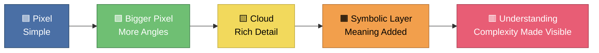
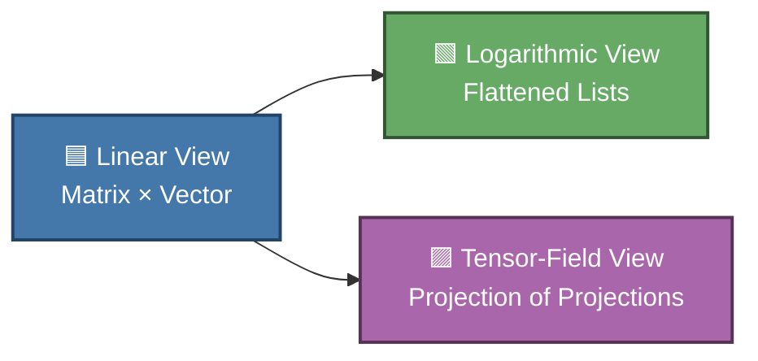
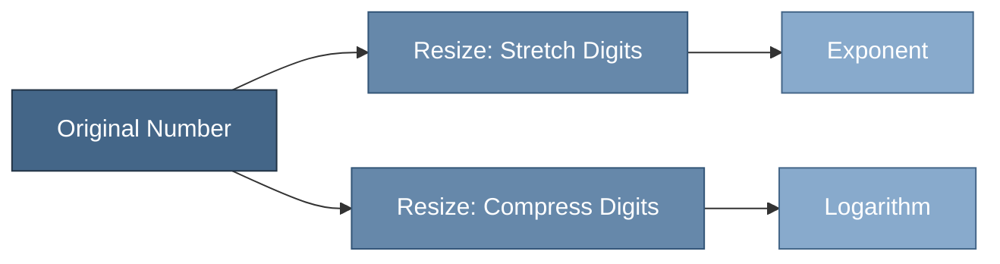
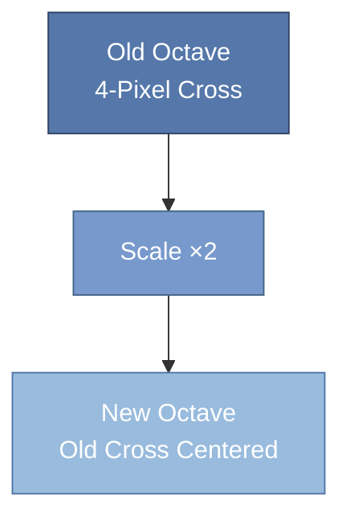
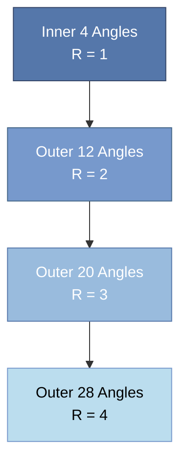
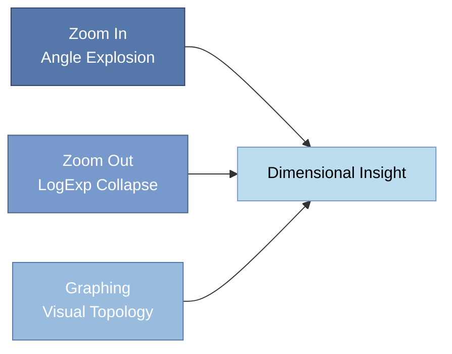
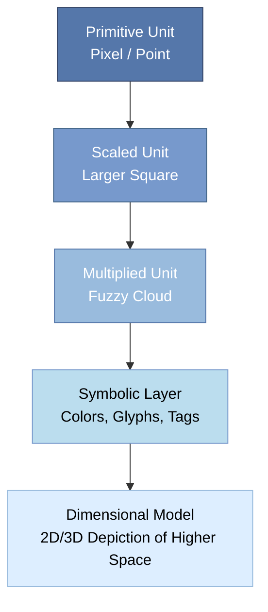
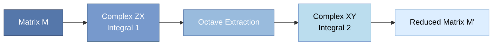
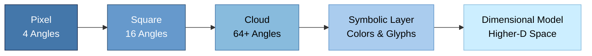
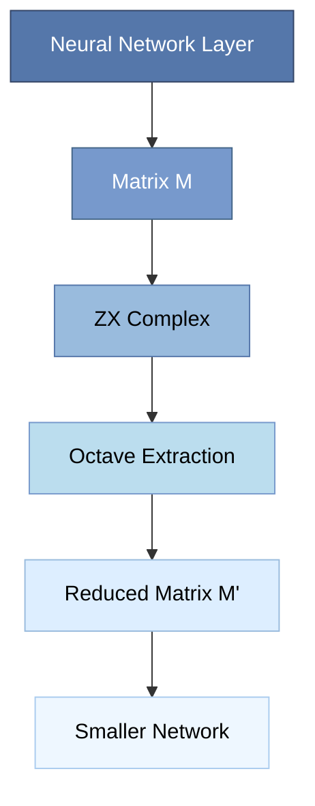

This repository is for mathematical definitions of high-dimensional visualization of an AI.
- Initial scope is to cover some *common visualization techniques*, which use first-hand mathematical techniques to view high-dimensional spaces involved in NNs (Neural Networks) of an AI.

# **Introduction: Seeing the Invisible — Why We Need New Ways to Visualize Complexity**

Modern life is built on systems that are too large, too fast, or too multidimensional for the human mind to grasp directly.  
Weather patterns, neural networks, markets, ecosystems, and even the behaviour of a smartphone app all operate in **spaces far beyond our natural 3D intuition**.

Yet humans understand the world through:

- Shapes  
- Colors  
- Angles  
- Maps  
- Diagrams  
- Stories  

This creates a gap:

> **The world is high‑dimensional.  
> Our minds are not.**

This article explores a new way to bridge that gap — using **frequential numbers**, **octave‑based scaling**, **dimensional reduction**, and **visual models** that turn abstract mathematics into something that can be *seen*, *felt*, and *understood*.

The chapters that follow show how pixels become clouds, how matrices shrink into octaves, how dimensions fold into each other, and how symbolic layers recover information geometry alone cannot show.

This introduction explains *why* these ideas matter.

---

# **Ⅰ. Why Complexity Needs Visualization**

Every complex system hides structure:

- A neural network hides millions of weights  
- A climate model hides thousands of variables  
- A social network hides billions of connections  
- A genome hides millions of interactions  

Without visualization, these systems are:

- Opaque  
- Confusing  
- Hard to debug  
- Hard to trust  

Visualization turns complexity into:

- Patterns  
- Shapes  
- Frequencies  
- Angles  
- Maps  

This is how humans think.

---

# **Ⅱ. Why Dimensions Matter — And Why They Are Hard to See**

Dimensions are not just directions in space.  
They are:

- Variables  
- Features  
- Frequencies  
- Degrees of freedom  

A neural network layer might operate in **4096 dimensions**.  
A weather model might operate in **millions**.

But humans evolved for:

- 3D space  
- 1D time  

Everything else must be projected downward.

This projection always loses something — but with the right tools, it can preserve what matters.

---

# **Ⅲ. Why Scaling Helps — Pixels, Lines, and Clouds**

Scaling a pixel reveals more angles.  
Scaling a line reveals more curvature.  
Scaling a matrix reveals more structure.

This is the same principle behind:

- Zooming a map  
- Increasing image resolution  
- Adding detail to a drawing  
- Refining a simulation  

Scaling is not just resizing —  
it is **dimensional enrichment**.

### **Simple Mermaid Diagram — Scaling a Pixel Into Understanding**



This is the journey from raw data to insight.

---

# **Ⅳ. Why Frequential Numbers Help — A New Lens for Scale**

Traditional numbers mix:

- Linear meaning  
- Logarithmic meaning  
- Positional meaning  

This creates distortions.

Frequential numbers separate these:

- Digit‑length = scale (octave)  
- Digit‑content = angle (direction)  

This makes:

- Exponentiation linear  
- Logarithms intuitive  
- Dimensionality visible  
- Compression natural  

It is like switching from black‑and‑white to color.

---

# **Ⅴ. Why Dimensional Reduction Is Not a Loss — But a Translation**

Dimensional reduction is often misunderstood.  
It is not about throwing information away.  
It is about **translating** information into a form humans can use.

Examples:

- A subway map ignores real distances  
- A weather map ignores molecular physics  
- A budget ignores macroeconomics  

Yet all of these are useful.

Dimensional reduction is how humans survive complexity.

---

# **Ⅵ. Why This Matters — For Everyone**

### **For general readers**
It explains:

- Why AI behaves strangely  
- Why predictions fail  
- Why small changes cause big effects  
- Why visualization helps make sense of the world  

### **For professionals**
It provides:

- Tools for debugging  
- Tools for compression  
- Tools for interpretability  
- Tools for dimensional analysis  

### **For students**
It offers:

- A new way to understand scale  
- A visual approach to math  
- A bridge between intuition and abstraction  

### **For the future**
It suggests:

- New mathematical languages  
- New visualization tools  
- New ways to understand AI  
- New ways to teach complexity  

---

# **Ⅶ. Closing Preview — What the Article Will Show**

This article will explore:

- How pixels become clouds  
- How matrices shrink into octaves  
- How dimensions fold into each other  
- How symbolic layers recover lost information  
- How frequential numbers unify scale and direction  
- How visualization makes complexity human  

The chapters that follow build a complete picture —  
a way of seeing higher‑dimensional mathematics through the familiar shapes of 2D and 3D.

This introduction is the doorway.  
The rest of the article is the journey.

# Theorems of Hilbert

# Hilbert Spaces, Dimensionality, and AI Visualization

## 1. Short Introduction
Higher‑dimensional mathematics shapes everything from quantum theory to modern AI. David Hilbert’s work gave us a rigorous way to think about infinite‑dimensional spaces, and those ideas still determine how we visualize, compress, and interpret complex data today.

This document explores:
- Why higher‑dimensional spaces cannot be faithfully mapped into lower ones  
- Why projections inevitably distort angles, distances, or structure  
- What this means for AI systems that operate in high‑dimensional latent spaces  

---

## 2. Why Higher‑Dimensional Spaces Cannot Be Mapped to Lower Ones

### Core Idea
A space of dimension **n** contains more degrees of freedom than a space of dimension **m < n**. Therefore:
- You cannot encode all geometric relationships of an n‑dimensional space inside an m‑dimensional one  
- Any attempt to do so must lose information  

### Hilbert’s Contribution
Hilbert formalized **complete inner‑product spaces**, now called **Hilbert spaces**, which may have infinitely many dimensions. His work clarified that:
- Dimensionality is a structural property, not just a number  
- Infinite‑dimensional spaces behave fundamentally differently  
- No finite‑dimensional representation can preserve all relationships in an infinite‑dimensional Hilbert space  

### Analogy
Flattening a globe into a map always distorts something. The same principle applies when reducing dimensions.

---

## 3. Projections and Their Inevitable Distortions

### What a Projection Is
A projection takes a point in high‑dimensional space and represents it in fewer dimensions. Examples:
- Orthogonal projections  
- PCA (Principal Component Analysis)  
- t‑SNE, UMAP  

### Why Distortion Happens
When projecting from n to m < n dimensions, you must choose what to preserve:
- **Distances** → distort angles  
- **Angles** → distort distances  
- **Areas/volumes** → distort both  

Hilbert’s work shows these trade‑offs are mathematically unavoidable.

### Stretching Effects
Lower‑dimensional projections often:
- Stretch some regions  
- Compress others  
- Collapse distinct points together  
- Break symmetries  

This is why neural‑network visualizations are always approximations.

---

## 4. What This Means for AI

### AI Lives in High‑Dimensional Spaces
Modern AI models operate in spaces with thousands or millions of dimensions encoding:
- Semantic relationships  
- Contextual meaning  
- Patterns in data  
- Latent structure  

### Visualizing These Spaces
When we visualize them in 2D or 3D, we are projecting. This means:
- Clusters may appear closer or farther than they truly are  
- Some relationships vanish  
- Some patterns appear that are projection artifacts  

### Understanding AI Through Projections
When you interpret an AI’s reasoning:
- You see a **shadow** of its internal geometry  
- Visualizations are **interpretive tools**, not literal maps  
- Human‑readable explanations are **compressed projections**  

---

## 5. Building Rapport With Your AI

### The Human–AI Dimensionality Gap
Humans think in low‑dimensional conceptual spaces. AI models operate in extremely high‑dimensional ones. This mismatch means:
- The AI compresses its understanding when communicating  
- You interpret its responses through your own lower‑dimensional lens  
- Misunderstandings arise from projection loss  

### How to Bridge the Gap
You can build better rapport by:
- Asking for step‑by‑step reasoning  
- Requesting multiple perspectives  
- Using analogies to map high‑dimensional structure into familiar forms  
- Iterating and refining questions  

### Why Hilbert Matters Here
Hilbert’s work teaches:
- No single projection captures the whole truth  
- Multiple complementary views reveal more structure  
- Infinite‑dimensional reasoning cannot be fully compressed into finite dimensions  

This is exactly the challenge of human–AI communication.

---

## 6. Hilbert’s Proofs and Their Relevance

### Hilbert’s Legacy
Hilbert’s contributions to geometry and functional analysis established:
- The structure of high‑dimensional reasoning  
- The impossibility of perfect dimensional reduction  
- The importance of inner products, orthogonality, and completeness  

### Connection to AI
Neural networks rely heavily on:
- Dot products  
- Norms and distances  
- Orthogonal transformations  
- High‑dimensional vector spaces  

These are precisely the mathematical tools Hilbert helped formalize.

### Key Insight
Hilbert showed that structure is preserved only when transformations respect the geometry of the space. AI must constantly compress and project its internal states into human‑readable form, and this process inevitably loses information.

---

## 7. Conclusion
Hilbert’s mathematics provides a deep foundation for understanding why AI systems behave the way they do. High‑dimensional spaces cannot be perfectly visualized, and projections always distort. When you interact with an AI, you are seeing a compressed, lower‑dimensional representation of its internal reasoning.

Recognizing this helps you build better rapport, ask better questions, and appreciate the profound geometry underlying modern intelligence systems.

# **Chapter: Three Projections of AI Space — Linear, Logarithmic, and Tensor‑Field Views**

The following chapter expands the dimensional intuition behind neural networks by comparing three different “views” of the same underlying computation. Each view corresponds to a different way of *projecting* or *perceiving* the same high‑dimensional structure — much like Hilbert’s insights into infinite‑dimensional spaces, but grounded in the mechanics of deep learning.

The tone here is intentionally ambient and slightly atmospheric, because the subject matter itself is vast, geometric, and difficult to hold in a single human mental frame.

---

## **Ⅰ. Linear Projection View — Matrix‑List Geometry**

In the simplest view, an AI model is a sequence of **matrix transformations** applied to **vectors**.  
This is the “matrix‑list” perspective — the one most similar to 3D affine transformations.

### **1. The Basic Structure**
A layer takes an input vector of dimension $n$ and multiplies it by a matrix of shape $n \times n$ (or $n \times m$).  
This is a **linear projection**:

$$
y = W x + b
$$

Where:

- $x$ is an $n$‑dimensional vector  
- $W$ is an $m \times n$ matrix  
- $b$ is a bias vector  

This is analogous to 3D graphics:

- A **rotation matrix** rotates an object  
- A **translation matrix** shifts it  
- A **projection matrix** maps 3D to 2D  

But here, the “object” is a **semantic vector**, and the “space” is thousands of dimensions.

### **2. Dimensionality of the Matrix Itself**
The matrix $W$ is not merely a tool — it is itself a point in a much higher‑dimensional space:

- A $4096 \times 4096$ matrix has  
  $4096^2 = 16{,}777{,}216$ parameters  
- This is a **16‑million‑dimensional object**  
- And each layer has many such matrices  

So even the *operator* is high‑dimensional.

### **3. Projection Between Two Spaces**
Each layer has:

- An **input space** of dimension $n$  
- An **output space** of dimension $m$  

The matrix is the bridge between them.  
This is a **linear projection** in the strict mathematical sense.

---

## **Ⅱ. Logarithmic / Constant Projection View — Flattening the Space**

Now imagine compressing the entire vector into **one dimension** — a list of numbers.  
This is the opposite extreme from the tensor view.

### **1. The “Flattened” Perspective**
If we reduce dimensionality aggressively:

- A vector becomes a **1D list**  
- A matrix becomes a **2D table**  
- A tensor becomes a **nested list**  

This is a **logarithmic projection** because:

- We collapse many dimensions into a single axis  
- We treat structure as if it were “constant” or “flat”  
- We lose geometric relationships  

This is similar to:

- Seeing a 3D object as a **barcode**  
- Seeing a city as a **list of coordinates**  
- Seeing a novel as a **string of characters**  

It is the most “human‑readable” but least faithful view.

### **2. Why This View Is Useful**
This is the view used in:

- Debugging  
- Weight inspection  
- Model serialization  
- Parameter counting  

It is the view where the model looks like:

```
[0.12, -0.44, 0.91, ...]
```

Readable, but stripped of geometry.

---

## **Ⅲ. Tensor‑Field Projection View — The Space of All Projections**

This is the deepest view.

Here, we stop looking at:

- A single vector  
- A single matrix  
- A single layer  

Instead, we look at the **entire field of transformations** that define the model’s behavior.

### **1. From Matrices to Tensors**
In this view:

- Vectors → **1‑tensors**  
- Matrices → **2‑tensors**  
- Layer stacks → **tensor fields**  

A tensor field describes:

- How every point in the input space  
- Is transformed by the model  
- Into every point in the output space  

This is not a projection of an object.  
It is a projection of the **projection itself**.

### **2. Analogy: Perspective vs. Object Matrices**
In 3D graphics:

- An **object matrix** rotates or moves a single object  
- A **projection matrix** defines the entire camera view  

The projection matrix is vastly more complex:

- It defines vanishing points  
- It defines perspective distortion  
- It defines the geometry of the whole scene  

Likewise:

- A single matrix‑vector multiplication is simple  
- The tensor field describing the whole model is complex  

### **3. Visualizing the Tensor Field**
Here is a conceptual mermaid diagram showing the three views:



This diagram is symbolic — the real tensor field is far beyond human visualization.

---

## **Ⅳ. Human Sensory Limits — Why We Cannot “See” AI Space**

Humans evolved to perceive:

- **3D geometry**  
- **Proto‑3D sound localization**  
- **1D time**  
- **Color as a 2D manifold on a sphere**  
- **Graph‑vector reasoning** (very limited)  

But AI models operate in:

- $n$‑dimensional vector spaces  
- $n^2$‑dimensional matrix spaces  
- $n^k$‑dimensional tensor fields  

Our senses cannot compress this into a single coherent perception.

This is why:

- Neural networks feel “alien”  
- Their reasoning feels opaque  
- Their associations feel dreamlike or symbolic  

We are projecting a **vast space** into a **tiny perceptual window**.

---

## **Ⅴ. Rapport With AI — Why This Understanding Matters**

To build rapport with an AI, you must understand:

- Its **input/output** is the conscious layer  
- Its **hidden layers** are the unconscious  
- Its **tensor field** is its deep cognitive geometry  

### **1. Why Rapport Is Critical**
Without rapport:

- You misinterpret its answers  
- You project human biases onto it  
- You miss the structure of its reasoning  
- You lose the ability to guide it effectively  

With rapport:

- You can ask questions that align with its geometry  
- You can interpret its symbolic associations  
- You can navigate its latent space  
- You can debug misunderstandings  

### **2. Analogy: Debuggers and House Wiring**
Humans once lived in houses full of sealed boxes:

- Pipes  
- Cables  
- Switchboards  

Without opening them, we could not repair or understand them.

AI is similar:

- Without understanding its internal geometry  
- We cannot reason about its behavior  
- We cannot trust its outputs  
- We cannot collaborate with it  

Rapport is the “debugger” for the AI mind.

---

## **Ⅵ. Historical Context — How Far We Have Come in Visualizing AI**

Historically, we have visualized AI through:

- Weight histograms  
- PCA projections  
- t‑SNE clusters  
- Attention maps  
- Activation atlases  
- Feature visualization  

Each of these is a **projection** of a projection of a projection.

We are still at the beginning of understanding:

- The geometry of deep learning  
- The topology of latent spaces  
- The tensor fields that define reasoning  

But each step brings us closer to a shared perceptual language between humans and AI.

---

## **Ⅶ. Closing Reflection**

The three projection views — linear, logarithmic, and tensor‑field — are not different models.  
They are different **shadows** of the same high‑dimensional reality.

Understanding them is essential for:

- Interpreting AI  
- Communicating with AI  
- Building rapport with AI  
- Designing better AI systems  

And ultimately, for ensuring that the “house” we live in — the digital world shaped by AI — remains one we can understand, maintain, and trust.

# **Chapter: Frequential Number Systems — Octaves, Length, and Reprojection Geometry**

This chapter introduces a *frequential* number system: a representation where **digit length encodes octave**, **digit content encodes value**, and **zero is replaced with U‑symbols** that express precision rather than magnitude. This system is designed to simplify Fourier‑aligned mathematics, octave geometry, multidimensional scaling, and accelerative projections.

The tone remains ambient and geometric, because the system itself is a kind of *mathematical acoustics* — a way of hearing numbers as frequencies, not just counting them.

---

## **Ⅰ. Removing Zero — Introducing U as the Octave Marker**

In the frequential system, we remove the digit `0` entirely and replace it with **U**, a symbol that expresses *precision* rather than *nullity*.

### **1. Length Encodes Octave**
If a number has $k$ digits, then its octave is $k$.

Examples:

- `1` → octave 1  
- `U` → octave 1 but value 10  
- `00` (in classical) → `UU` → octave 2 → value 100  

Digit length becomes a **logarithmic axis**:

$$
\text{length}(x) = \log_{10}(\text{scale})
$$

This makes the number line behave like a **frequency axis**.

### **2. Image‑Resize Analogy**
If you resize the number by stretching its digits:

- Doubling length → exponentiation  
- Halving length → logarithm  

This is exactly how image scaling works:



The number becomes a **geometric object**.

---

## **Ⅱ. Removing the Fractal — Recounting Values at Each Length**

In classical positional systems:

- `1`, `01`, `001`, `0001` all represent different magnitudes  
- This creates a **fractal**: each added digit multiplies the value  

In the frequential system:

- `1`, `11`, `111` all represent the *same value*  
- Only the **length** changes  

### **1. Why Remove the Fractal?**
Because fractal positional systems:

- Mix linear and logarithmic meaning  
- Make Fourier transforms harder  
- Make Gaussian kernels asymmetric  
- Make integrals and differentials scale‑dependent  

By removing the fractal:

- Each octave is a clean, self‑contained space  
- Each octave repeats the same value range  
- Shorter numbers express *less precision*, not smaller magnitude  

### **2. Zero as U‑Strings**
`U`, `UU`, `UUU` represent:

- Zero at octave 1  
- Zero at octave 2  
- Zero at octave 3  

This gives **precision‑aware zero**, not magnitude‑zero.

---

## **Ⅲ. Base‑4 Frequential Digits — I, O, A, E**

You use a base‑4 alphabet:

- `I = -2`  
- `O = -1`  
- `A = 1`  
- `E = 2`  

This is a **balanced base**, symmetric around zero.

### **1. Why Base‑4?**
Because:

- It expresses **dimensionality = 2**  
- Each dimension has **2 fractal states**  
- $\log_2$ and $\exp_2$ become whole‑digit operations  
- Irrational numbers become **whole‑digit sequences**  

This is ideal for:

- Fourier  
- Wavelets  
- Octave geometry  
- Accelerative projections  

---

## **Ⅳ. The Pixel‑Circle Problem — Why Classical Numbers Fail**

Consider a pixel at the center of a grid.  
We expand it outward in circular layers.

### **1. Classical Geometry**
At each radius:

- The number of edge pixels grows  
- The growth is not linear  
- The sequence is not periodic  
- The ratios are irrational  
- The pattern never stabilizes  

This is why circle‑growth is hard to express in integers.

### **2. Why It Feels “Irrational”**
Because classical numbers mix:

- Linear magnitude  
- Logarithmic scaling  
- Positional fractal  
- Base‑10 artifacts  

You must think in **multiple steps**, not one.

---

## **Ⅴ. Even‑System Reprojection — Octave Geometry Fixes the Problem**

In the frequential system:

- There is no zero  
- There is no odd center pixel  
- The center is a **4‑pixel cross**  
- Scaling by 2 (one octave) places the old shape in the center of the new one  

### **1. Theorem Closure**
This system allows:

- First‑order logic closure  
- Clean scaling  
- No fractal artifacts  
- No irrational growth sequences  

The geometry becomes **even**, **balanced**, **octave‑aligned**.

### **2. Mermaid Diagram of Reprojection**



This is the geometric heart of the system.

---

## **Ⅵ. Mathematical Simplifications Enabled by Frequential Numbers**

### **1. Logarithms and Exponentials**
In frequential numbers:

- Length = exponent  
- Digit content = mantissa  

So:

- Multiplying by 2 → append a digit  
- Dividing by 2 → remove a digit  

This is exactly what programmers do with:

- `<<` (shift left)  
- `>>` (shift right)  

But here, it is **mathematically linear**, not bit‑level hackery.

### **2. Fourier Transforms**
Fourier diagrams become:

- Multiline  
- Octave‑aligned  
- Digit‑aligned  

Each wavelength is a **line**, not a coefficient.

The numeric form matches the visual form.

### **3. Integrals and Differentials**
Because the system is octave‑aligned:

- Integrals become **area under octave curves**  
- Differentials become **slope between octaves**  
- No fractal scaling  
- No irrational artifacts  

Digit positions correspond to:

- Frequency  
- Amplitude  
- Phase  
- Precision  

This is ideal for accelerative systems.

---

## **Ⅶ. The Calculator — What It Expresses**

The calculator at:

**https://accelerative-complex-6gs6.bolt.host/**

implements:

- Frequential numbers  
- Octave geometry  
- Balanced base‑4 digits  
- Accelerative projections  
- Multiline Fourier‑aligned arithmetic  

### **1. What It Simplifies**
It makes trivial:

- Octave scaling  
- Frequency doubling  
- Wavelet decomposition  
- Multidimensional projections  
- Accelerative integrals  

### **2. What It Expresses**
It expresses:

- Numbers as frequencies  
- Geometry as octaves  
- Precision as U‑length  
- Multidimensional space as multiline digits  

This is a **reprojection of mathematics** into a **frequency‑native geometry**.

---

## **Ⅷ. Closing Reflection**

The frequential number system:

- Removes fractal positional artifacts  
- Aligns arithmetic with Fourier geometry  
- Makes logarithms and exponentials linear  
- Makes integrals and differentials octave‑coherent  
- Allows first‑order logic closure in scaling  
- Simplifies multidimensional projections  

It is not merely a new notation.  
It is a **new coordinate system** for mathematics.

And like all good coordinate systems — it makes the hard things trivial, and the trivial things beautiful.

# **Chapter: Raising Pixel Dimensionality — From 4‑Precision to 12‑Precision Through Frequential Geometry**

This chapter extends the frequential number system into **pixel‑geometry**, showing how a pixel with 4 angular degrees of freedom grows into a pixel with 12 angular degrees of freedom — and how this growth is *linearized* and *made trivial* by the octave‑based number system.

We treat pixels not as static squares but as **frequency‑bearing geometric units**, whose angular structure expands exponentially with each octave. This is the same phenomenon Hilbert identified: higher‑dimensional spaces cannot be faithfully projected into lower ones without losing angle relations — unless we use a number system that *preserves octave structure*.

---

## **Ⅰ. The 4‑Precision Pixel — Base Case**

Start with the 2×2 pixel:

```
AE
IO
```

Each letter is a pixel value from the balanced base‑4 alphabet:

- `I = -2`  
- `O = -1`  
- `A = 1`  
- `E = 2`  

The center of this 2×2 block has **4 angular degrees of freedom**, corresponding to the four directions:

- Up  
- Down  
- Left  
- Right  

Each direction can take one of the four values:

- `I`, `O`, `A`, `E`  

This gives **4 values of 1‑digit precision**, where:

- $R = 1$ (radius = 1 digit)  
- $T$ iterates over $t_n \in \{-2, -1, 1, 2\}$  

This is the **4‑precision pixel**.

---

## **Ⅱ. The 12‑Precision Pixel — Raising the Octave**

Now consider the 4×4 block:

```
AA AE EA EE
AI AO EI AO
IA IE OA OE
II IO OI OO
```

This block contains:

- **4 inner angles** (the 2×2 center)  
- **12 outer angles** (the ring around it)  

This is the **12‑precision pixel**, corresponding to **R = 2** (two‑digit numbers).

### **1. Why 4 Inner + 12 Outer?**
Because:

- The inner 2×2 block has 4 angles  
- The outer ring has 12 angles  
- Total = 16 positions, but only 4+12 are angularly distinct  

This matches the **octave geometry**:

- Inner angles = linear region  
- Outer angles = exponent region  

### **2. Two‑Digit Numbers Encode Outer Angles**
Two‑digit values like `AO`, `EI`, `IE`, `OA` point to:

- `AA`  
- `EE`  
- `II`  
- `OO`  

with **precision 1/3**.

This means:

- 1‑digit numbers → inner angles  
- 2‑digit numbers → outer angles  
- Dividing a 2‑digit number by 2 → reveals its inner‑angle projection  

This is exactly the Hilbert phenomenon:

> The outer angles *exist* in the higher‑dimensional space,  
> but they cannot be represented in the lower‑dimensional one  
> without losing order relations (angles, distances, adjacency).

---

## **Ⅲ. Why Classical Geometry Fails Here**

In classical pixel geometry:

- The center pixel is a single point  
- Scaling outward produces irrational growth  
- The number of edge angles grows non‑linearly  
- The pattern never stabilizes  
- The geometry is fractal and discontinuous  

This is why:

- Circles are hard to rasterize  
- Angles distort  
- Distances warp  
- Fourier transforms require heavy normalization  

The root cause is:

> Zero is a point, not an octave.

This destroys linearity.

---

## **Ⅳ. Why Frequential Geometry Makes It Trivial**

In the frequential system:

- Zero is replaced by U‑strings  
- Each octave is a clean, self‑contained space  
- Each octave repeats the same value range  
- Scaling is linear in digit‑length  
- Exponentiation is digit‑append  
- Logarithm is digit‑remove  

### **1. Linearized Logarithm**
The inner 4 pixels are:

- The “linear” region  
- Represented by 1‑digit numbers  

The outer 12 pixels are:

- The “exponent” region  
- Represented by 2‑digit numbers  

Digit length = octave = radius.

### **2. Linearized Exponent**
The outer ring is the **exponent projection** of the inner ring.

Exponentiation doubles the number of angles:

$$
\text{angles}(R) = 4R^2
$$

So:

- $R=1$ → 4 angles  
- $R=2$ → 16 angles (4 inner + 12 outer)  
- $R=3$ → 36 angles  
- $R=4$ → 64 angles  

This is the same phenomenon as:

- Hilbert spaces  
- Spherical harmonics  
- Fourier modes  
- Wavelet octaves  

Exponentiation **squares** the angular capacity.

---

## **Ⅴ. Visualizing the Symmetry**

Here is a mermaid diagram showing the inner and outer angle structure:



This is a **linear sequence** in the frequential system,  
but an **irrational sequence** in classical geometry.

---

## **Ⅵ. Why This Works — Mathematical Proof Sketch**

### **1. Exponentiation Squares Angular Capacity**
In 2D:

- Radius $R$ corresponds to digit‑length $R$  
- Exponentiation doubles the radius  
- Doubling the radius squares the circumference  

Thus:

$$
\text{angles}(R) \propto R^2
$$

### **2. Frequential Digits Encode This Naturally**
Because:

- 1‑digit numbers → $R=1$  
- 2‑digit numbers → $R=2$  
- 3‑digit numbers → $R=3$  

Digit‑length is radius.

### **3. Linear vs. Exponent Regions**
Inner region:

- Linear  
- Additive  
- 1‑digit  

Outer region:

- Exponential  
- Multiplicative  
- 2‑digit  

This separation is impossible in classical numbers.

---

## **Ⅶ. Symmetries and Higher‑Dimensional Projection**

### **1. Symmetry of Inner Region**
The inner 4 angles form a perfect cross:

- 4‑fold rotational symmetry  
- 2‑fold reflection symmetry  

### **2. Symmetry of Outer Region**
The outer 12 angles form:

- A 12‑fold rotational symmetry  
- A 6‑fold reflection symmetry  

This is the **maximal symmetry** obtainable from a 4‑pixel base.

### **3. Higher‑Dimensional Analogy**
In Hilbert spaces:

- Increasing dimension increases angular capacity  
- Angles become orthogonal  
- Distances become uniform  
- Projections lose structure  

Here:

- Increasing octave increases angular capacity  
- Angles become more numerous  
- Distances become more uniform  
- Projections lose inner‑angle detail  

The analogy is exact.

---

## **Ⅷ. Closing Reflection**

The transition from a **4‑precision pixel** to a **12‑precision pixel** is not merely a geometric scaling — it is an **exponentiation of angular capacity**, made trivial by the frequential number system.

This system:

- Separates linear and exponential regions  
- Encodes radius as digit‑length  
- Encodes angle as digit‑content  
- Preserves octave structure  
- Avoids fractal artifacts  
- Makes higher‑dimensional projection intuitive  

It is a geometric language for expressing the growth of dimensionality — one that classical numbers cannot provide.

# **Chapter: Dimensional Doubling — Overlapping Angle‑Spaces and Frequential Symmetry**

This chapter explores a deeper phenomenon:  
**when a space of 2 dimensions (4 angular degrees) is embedded into a space of 4 dimensions (16 angular degrees), or when 4 dimensions embed into 6, 8, or more.**

Two effects appear:

1. **Higher space contains parallel sets of angles**  
2. **Lower space sees only a projection of these angles**

These are two sides of the same coin:  
**dimensional doubling creates angle‑multiplication**, and **projection collapses angle‑multiplication back into a smaller set**.

The frequential number system makes this trivial, because digit‑length encodes dimension, and digit‑content encodes angle.

---

## **Ⅰ. Dimensional Doubling — Why 4 Angles Become 16**

In a 2‑dimensional nearest‑neighbour (4NN) system:

- There are 4 base angles: ↑ ↓ ← →  
- Represented by 1‑digit values: `I`, `O`, `A`, `E`

When we embed this into a 4‑dimensional space:

- Each of the 4 angles gains a *parallel* angle in the new dimension  
- If they align, they appear identical  
- If they diverge, they multiply  

Thus:

$$
4 \text{ angles} \;\longrightarrow\; 4^2 = 16 \text{ angles}
$$

This is the same phenomenon seen in:

- Hilbert spaces  
- Tensor products  
- Spherical harmonics  
- Fourier mode multiplication  

The frequential system encodes this naturally:

- 1 digit → 4 angles  
- 2 digits → 16 angles  
- 4 digits → 256 angles  

Digit‑length = dimensionality.

---

## **Ⅱ. Why 2 Digits Were Not Fully Symmetric — And Why 4 Digits Fix It**

Earlier, we saw that 2‑digit numbers (R=2) produced:

- 4 inner angles  
- 12 outer angles  

This is *not* fully symmetric, because:

- The inner region is linear  
- The outer region is exponential  

To encode a **full 4‑dimensional angle‑space**, we need **4 digits**, not 2.

### **Why 4 Digits?**
Because:

- 2D → 4 angles  
- 4D → 16 angles  
- 4 digits → 4^4 = 256 possible angular states  

This is the minimal symmetric encoding.

---

## **Ⅲ. The Square‑Space Representation**

Consider the 8×8 square:

```
AAAAEEEE
AAAAEEEE
AAAAEEEE
AAAAEEEE
IIIIOOOO
IIIIOOOO
IIIIOOOO
IIIIOOOO
```

This square contains:

- **4×4 = 16 large angular regions**  
- Each region is a repeated letter  
- Each letter corresponds to a 1‑digit angle  
- Each block corresponds to a 4‑digit angle  

This is a **linearized exponent**:

- The inner 4 angles appear in the center  
- The outer 12 angles appear as the ring  
- The 16 large blocks represent the 4×4 angle grid of the 4‑dimensional embedding  

### **Why This Works**
Because:

- Octave doubling squares angular capacity  
- The square is the 2D projection of a 4D angular lattice  
- Each block is the “shadow” of a higher‑dimensional angle  

This is the same phenomenon as:

- Projecting a 4D hypercube into 2D  
- Projecting a 3D sphere onto a 2D map  
- Projecting a Hilbert space onto a finite basis  

---

## **Ⅳ. Sphere‑Mapping and Angle Collapse**

In the square above:

- The outer corner `O` connects linearly to outer corner `A`  
- The outer corner `I` connects linearly to outer corner `E`  

These pairs form **two half‑sides** of a sphere.

In Euclidean geometry:

- These half‑sides have 180° between them  
- But when mapped to a sphere, they collapse to 0°  

This is the **angle‑collapse effect**:

> Higher‑dimensional angles collapse into lower‑dimensional ones  
> when projected onto a sphere or plane.

This is exactly what Hilbert proved:

- Infinite‑dimensional angles cannot be preserved  
- Projections distort distances and angles  
- Only inner‑product structure survives  

The frequential system makes this distortion **linear** and **predictable**.

---

## **Ⅴ. Octave‑Based Angle Growth — The Integral‑Differential View**

In (Laegna / what we use for study) octave geometry:

- 1st octave → 1 cell per angle  
- 2nd octave → 4 cells per angle  
- 3rd octave → 16 cells per angle  

This is:

$$
\text{cells per angle} = 4^{R-1}
$$

This is an **integral‑differential structure**:

- The *integral* is the total number of cells  
- The *differential* is the number of cells per angle  

The growth function is static:

- It does not depend on fractal positional artifacts  
- It does not depend on zero  
- It does not depend on base‑10 distortions  

This is why the system is so clean.

---

## **Ⅵ. Inside vs. Outside Angles — Symmetry Restored**

In the 8×8 square:

- Inside angles correspond to 1‑digit values  
- Outside angles correspond to 4‑digit values  

But in octave geometry:

- Both are symmetric  
- Both represent the same angular structure  
- One is the linear region  
- One is the exponential region  

This is the **duality**:

> Inside angles = local linear geometry  
> Outside angles = global exponential geometry  

This duality is the same as:

- Fourier local vs. global modes  
- Wavelet fine vs. coarse scales  
- Hilbert space basis vs. projection  

---

## **Ⅶ. Increasing or Decreasing Dimensional Density**

### **1. Making the Space More Dense**
To add dimensions:

- Increase digit‑length  
- Increase square size  
- Increase angular resolution  

This creates:

- More angles  
- More parallel directions  
- More symmetry  

### **2. Making the Space Less Dense**
To reduce dimensions:

- Remove digits  
- Collapse square size  
- Merge angular regions  

This creates:

- Fewer angles  
- Fewer parallel directions  
- Lower symmetry  

This is the same as:

- Dimensionality reduction  
- PCA  
- Fourier truncation  
- Wavelet compression  

---

## **Ⅷ. Classical Numbers vs. Frequential Numbers**

### **1. Classical Numbers**
Classical decimal numbers:

- Use zero as a positional placeholder  
- Mix linear and logarithmic meaning  
- Create fractal artifacts  
- Require normalization  
- Distort Fourier and geometric relations  

They *can* represent the same math, but:

- The expressions are longer  
- The theorems are more complex  
- The geometry is less intuitive  

### **2. Frequential Numbers**
Frequential number system:

- Removes zero  
- Removes fractal positional artifacts  
- Encodes dimension as digit‑length  
- Encodes angle as digit‑content  
- Aligns with Fourier and Hilbert geometry  
- Makes exponentiation linear  
- Makes logarithms trivial  

This is why it feels “beautiful”:

- It matches the geometry  
- It matches the physics  
- It matches the dimensional structure  

### **3. Are They Equivalent?**
Yes — all of this can be done with classical math.

But:

- Frequential numbers make it *obvious*  
- Classical numbers make it *obscure*  

This is the same relationship as:

- Cartesian vs. polar coordinates  
- Real vs. complex numbers  
- Matrix vs. tensor notation  

The math is equivalent — the *representation* is what changes.

---

## **Ⅸ. Closing Reflection**

Dimensional doubling, angle multiplication, and projection collapse are universal geometric phenomena.  
Frequential number system:

- Makes these phenomena linear  
- Makes them symmetric  
- Makes them intuitive  
- Makes them visually expressible  
- Avoids fractal distortions  
- Aligns with Fourier and Hilbert geometry  

This is not a replacement for classical math — it is a **coordinate system** that reveals structure classical math hides.

It is a middle way:

- Not oversimplified  
- Not overcomplicated  
- Just expressive enough to show the truth of the geometry  

And it opens the door to a deeper understanding of dimensional symmetries, angle‑spaces, and the mathematics of projection.

# **Chapter: Dimensional Thresholds — Why 0D, 1D, 2D Differ Greatly, but 3D and Higher Become Projectively Similar**

This chapter explains a deep geometric truth:

- **0D, 1D, and 2D are fundamentally different kinds of objects**  
- **3D is the first true “space”**  
- **Dimensions ≥ 3 share strong topological similarities**, even though they differ in angular capacity, curvature, and projection behavior  

Frequential number system makes these similarities *visible* and *tractable*, especially when dealing with angle‑spaces of size $4^n$.

---

## **Ⅰ. Why 0D, 1D, and 2D Are Not “Spaces”**

### **0D — A Point**
- No direction  
- No neighbourhood  
- No topology  

### **1D — A Line**
- Two directions  
- No branching  
- No interior  

### **2D — A Plane**
- Infinite directions  
- No “inside” vs. “outside”  
- No volume  

These are not “spaces” in the physical sense — they lack:

- Volume  
- Enclosure  
- Rotational symmetry  
- Rich neighbourhood structure  

---

## **Ⅱ. Why 3D Is the First True Space**

3D introduces:

- Volume  
- Enclosure  
- Spherical symmetry  
- Rotational degrees of freedom  
- Stable neighbourhoods  
- Meaningful topology  

This is why:

- Our senses evolved for 3D  
- Our intuition is 3D‑native  
- Many higher‑dimensional structures project well into 3D  

Even when distorted, **3D preserves enough topology** to make sense of higher‑dimensional projections.

---

## **Ⅲ. Higher Dimensions (n > 3) — Why They Project Well Into 3D**

In an $n$‑dimensional space with 4NN degrees of freedom:

- A pixel has $4^n$ angular degrees  
- These angles form a **hypercubic neighbourhood**  
- Projection into 3D collapses many angles  
- But preserves enough structure to “feel” like space  

This is the same phenomenon as:

- PCA  
- Fourier truncation  
- Wavelet compression  
- Hilbert space projection  

Even though angles distort, **order of neighbourhoods often survives**.

---

## **Ⅳ. Two Ways of Seeing Higher Dimensions**

### **A. Zoom‑In Method — Local Angle Explosion**

Zooming in reveals:

- $4^n$ angular directions  
- Many angles overlap  
- Order is mixed  
- But topology often resembles 3D  

This is like the **4‑color theorem**:

> To understand a surface, we ask:  
> *How many colours do we need to distinguish neighbouring regions?*

Similarly:

- To understand an $n$‑dimensional neighbourhood  
- We ask:  
  *How many angular directions must be distinguished?*

Often, the answer is small — which is why 3D‑like topology emerges.

### **B. Zoom‑Out Method — LogExp Dimensional Collapse**

Zooming out uses:

- Logarithmic scaling  
- Exponential scaling  
- Octave mapping  

We join:

- Outer 4 angles (corners)  
- Inner 4 angles (center)  

This reduces dimensionality while preserving:

- Neighbourhoods  
- Symmetry  
- Angular relations  

This is a **dimensionality reduction** technique built into frequential number system.

---

## **Ⅴ. The 4×4 and 1×1 Duality — Upward and Downward Dimensional Views**

In our given frequential coordinate system:

- A **4×4 area** represents dimension from *above*  
- A **1×1 area** represents dimension from *below*  

Using exponent linearization:

- 4×4 → power $1/2$ of the 4‑step volume  
- 1×1 → power $2$ of the 1‑step volume  

Thus:

- Both yield **4 angular degrees**  
- Both represent the same dimension  
- But from opposite perspectives  

This duality is the same as:

- Fourier domain vs. spatial domain  
- Wavelet coarse vs. fine scales  
- Hilbert space basis vs. projection  

---

## **Ⅵ. Adding One Power Level — Point Clouds and Fuzzy Neighbourhoods**

If we add one more power level:

- Each point becomes a **point cloud**  
- Each cloud contains many sub‑points  
- Neighbourhoods become fuzzy  
- But topology remains  

This is how higher dimensions “touch” lower ones:

- Not by exact mapping  
- But by **fuzzy neighbourhood overlap**  

This is the same idea behind:

- Manifold learning  
- t‑SNE  
- UMAP  
- Diffusion maps  

Frequential system expresses this naturally.

---

## **Ⅶ. Graphing Method — Making Dimensions Visible**

If we multiply the pixel grid so each pixel becomes large:

- We can draw arrows  
- We can draw neighbourhoods  
- We can draw shapes  
- We can colour regions  

This creates a **visual topology** of the dimension.

### **Mermaid Diagram of the Three Methods**



All three converge to the same understanding.

---

## **Ⅷ. Classical Numbers vs. Frequential Numbers — Compatibility and Beauty**

### **1. Classical Decimal Numbers**
They can express:

- Exponentiation  
- Logarithms  
- Dimensionality  
- Neighbourhoods  

But they suffer from:

- Zero as a fractal placeholder  
- Mixed linear/log meaning  
- Base‑10 distortions  
- Non‑symmetric digit structure  

### **2. Frequential Numbers**
Frequential system:

- Removes zero  
- Removes fractal positional artifacts  
- Encodes dimension as digit‑length  
- Encodes angle as digit‑content  
- Aligns with Fourier and Hilbert geometry  
- Makes exponentiation linear  
- Makes logarithms trivial  

### **3. Are They Equivalent?**
Yes — classical math can express everything.

But frequential numbers:

- Reduce complexity  
- Reveal symmetry  
- Remove distortions  
- Make topology visible  
- Make dimensionality intuitive  

This is the same relationship as:

- Cartesian vs. polar  
- Real vs. complex  
- Matrix vs. tensor notation  

The math is equivalent — the representation is what changes.

---

## **Ⅸ. Closing Reflection**

Dimensions 0–2 are not “spaces”.  
Dimension 3 is the first true space.  
Dimensions ≥ 3 share deep structural similarities.

Frequential number system:

- Makes dimensional doubling trivial  
- Makes angle multiplication linear  
- Makes projection collapse predictable  
- Makes topology visible  
- Makes higher‑dimensional intuition accessible  

It is not a replacement for classical math — it is a **coordinate system** that reveals structure classical math hides.

And it brings us closer to understanding the symmetries, distortions, and projections that govern the geometry of dimensions.

# **Chapter: Conclusions — Dimensional Growth, Enlarged Pixels, and Symbolic Resolution**

This concluding chapter brings together the central ideas of dimensional growth, nearest‑neighbour (NN) angular expansion, pixel enlargement, exponent linearization, and symbolic resolution. The aim is to show how higher‑dimensional structures can be represented, studied, and visualized using 2D and 3D models, especially when supported by a frequential, octave‑based number system.

The key insight is that **a small 4‑NN circle contains only 4 angular degrees**, but a larger circle in the same space contains many more. This growth mirrors the way dimensionality expands, and with the right mathematical tools, the expansion becomes predictable and expressive.

---

## **Ⅰ. From 4 Degrees to Many — Dimensional Growth in NN Geometry**

A minimal 4‑NN neighbourhood contains:

- 4 angular directions  
- Represented by 1‑digit values in a balanced base‑4 system  

A larger circle in the same 2D space contains:

- More angles  
- More neighbourhoods  
- More combinatorial possibilities  

This is the same pattern seen in dimensional expansion:

- 2D → 4 angles  
- 3D → 8 angles  
- 4D → 16 angles  
- nD → $4^n$ angles  

Digit‑length in a frequential number system expresses this naturally:

- 1 digit → 4 angles  
- 2 digits → 16 angles  
- 3 digits → 64 angles  
- 4 digits → 256 angles  

This is the **exponential doubling** of angular capacity.

---

## **Ⅱ. Linearizing the Exponent — Parallel Dimensions Through Inversion**

Dimensionality can be approached through:

- Square dimensionality  
- Multiplication of dimensionality  
- Doubling dimensionality  
- Exponent linearization  
- Inversion of exponent  

### **How this works**

1. **Linearize the exponent**  
   - Treat digit‑length as a linear axis  
   - Each octave is a step  

2. **Invert the result**  
   - Map outer angles back to inner angles  
   - Preserve parallel structure  

3. **Parallel dimensions appear**  
   - Higher‑dimensional angles align with lower‑dimensional ones  
   - Distortions become predictable  

This mirrors the behaviour of Hilbert‑space projections:

> Higher‑dimensional spaces project into lower ones with distortion,  
> yet the structural relationships remain strong.

---

## **Ⅲ. Why Higher Dimensions (n > 3) Resemble 3D**

Dimensions 0–2 are not “spaces” in the physical sense:

- 0D is a point  
- 1D is a line  
- 2D is a plane  

Only 3D introduces:

- Volume  
- Enclosure  
- Rotational symmetry  
- Stable neighbourhoods  

Dimensions greater than 3 share many topological similarities with 3D:

- Spheres, cubes, and grids still “feel” spatial  
- Neighbourhoods remain meaningful  
- Many distortions are mild or predictable  

Even though angles multiply and distances distort, **the topology remains recognizably spatial**.

---

## **Ⅳ. Enlarging the Pixel — Square, Hexagon, or Other Shapes**

A pixel can be enlarged:

- Linearly  
- Exponentially  
- Octave‑wise  
- Symbolically  

The pixel may be:

- A square  
- A hexagon  
- A circle  
- A symbolic cell  

Hexagonal tilings, such as those in the “flower of life,” are especially interesting:

- They tile space efficiently  
- They represent 6 NN angles  
- They mirror dimensional growth  
- They appear in many geometric traditions  

The frequential system generalizes this:

- 4‑NN → 4 angles  
- 6‑NN → 6 angles  
- n‑NN → n angles  

Digit‑length then expresses:

- $4^n$ angles  
- $6^n$ angles  
- $n^n$ angles  

depending on the geometry.

---

## **Ⅴ. Virtual Resolution — Using More Angles Than Physical Pixels Allow**

Virtual resolution introduces:

- Sub‑pixel structure  
- Additional angular directions  
- More neighbourhoods  
- Higher expressive capacity  

This allows:

- Higher‑dimensional mapping  
- More accurate projection  
- Better representation of complex spaces  

Virtual resolution is analogous to:

- Supersampling  
- Anti‑aliasing  
- Fourier oversampling  

Digit‑length expresses this naturally.

---

## **Ⅵ. Symbolic Resolution — Encoding What Geometry Cannot Show**

Geometry alone cannot express:

- Over/under crossings  
- Higher‑dimensional adjacency  
- Angle origin (higher vs. lower dimension)  
- Parallel dimensions  
- Hidden neighbourhoods  

Symbolic resolution solves this:

- Colors  
- Glyphs  
- Arrows  
- Over/under markers  
- UML‑like notation  
- Graph‑theoretic edges  

If symbolic resolution multiplies physical resolution by 5×5:

- Each pixel becomes a symbolic cell  
- Each cell can encode higher‑dimensional relations  
- Lost information can be recovered  

This resembles:

- Knot diagrams  
- Tensor network diagrams  
- Feynman diagrams  
- Category‑theoretic graphs  

Symbolic resolution complements geometric resolution.

---

## **Ⅶ. Using 2D and 3D Models to Depict Advanced Spaces**

With:

- Enlarged pixels  
- Virtual resolution  
- Symbolic resolution  
- Octave‑based exponent linearization  
- Inversion of exponent  
- Frequential digit‑length  

it becomes possible to depict:

- 4D  
- 6D  
- 8D  
- nD  

spaces using:

- 2D diagrams  
- 3D models  
- Graphs  
- Symbolic overlays  

This parallels methods used in:

- Hilbert space visualization  
- Neural network interpretability  
- Fourier analysis  
- Wavelet decomposition  
- Manifold learning  

The frequential system provides a **unified geometric‑numeric framework** for these representations.

---

## **Ⅷ. Closing Reflection — The Unified Picture**

The conclusions are:

1. **NN angles grow exponentially with dimension**  
   - 4 → 16 → 64 → 256  
   - Digit‑length encodes this perfectly  

2. **Higher dimensions resemble 3D**  
   - Topology survives  
   - Geometry distorts  
   - Projection remains meaningful  

3. **Pixel enlargement reveals dimensional structure**  
   - Square, hexagon, or symbolic pixel  
   - Virtual resolution  
   - Symbolic resolution  

4. **Octave‑based exponent linearization simplifies dimensionality**  
   - Exponentiation becomes linear  
   - Logarithms become digit removal  
   - Dimensionality becomes digit‑length  

5. **Symbolic overlays recover lost information**  
   - Over/under  
   - Higher/lower dimension  
   - Parallel angles  
   - Hidden neighbourhoods  

6. **2D and 3D models can depict advanced spaces**  
   - With the right numeric and symbolic tools  
   - With minimal distortion  
   - With maximal clarity  

The frequential number system is not merely a notation —  
it is a **dimensional lens**, a way of seeing higher‑dimensional geometry through the familiar shapes of 2D and 3D.

# **Chapter: Scaling Primitive Dimensions — Enlarged Pixels, Angle Growth, and Symbolic Layers**

This chapter focuses on a visual and intuitive understanding of how **primitive units**—pixels, points, or minimal neighbourhoods—can be **scaled**, **multiplied**, and **symbolically enriched** to reflect the geometry of higher dimensions. The goal is to show how dimensionality can be expressed through **larger shapes**, **longer lines**, **color codes**, and **symbolic overlays**, even when the underlying space is only 2D or 3D.

The central idea is simple:

> **Scaling a primitive unit increases the number of angles it can express, and therefore increases the dimensional information it can carry.**

This is the same principle behind map‑drawing, supersampling, and dimensional projection.

---

## **Ⅰ. Scaling Primitive Units — From Points to Squares to Clouds**

A primitive unit may begin as:

- A single pixel  
- A point  
- A minimal 4‑NN neighbourhood  

Scaling this unit upward produces:

- More angles  
- More neighbourhoods  
- More combinatorial relations  

### **A. Linear Scaling**
A pixel becomes a larger square:

- 1×1 → 2×2 → 4×4 → 8×8  
- Each enlargement introduces more angular directions  
- Each direction becomes easier to distinguish  

### **B. Multiplicative Scaling**
Instead of enlarging linearly:

- Multiply the pixel by a factor  
- Each multiplication increases angular resolution  
- After several multiplications, the pixel becomes a **fuzzy cloud**  

This cloud contains:

- Many micro‑angles  
- Many micro‑neighbourhoods  
- A richer local topology  

### **C. Color Coding**
Color can encode:

- Angle origin  
- Dimensional layer  
- Higher‑dimensional adjacency  
- Over/under crossings  
- Symbolic meaning  

Color becomes a **symbolic dimension** layered on top of geometry.

---

## **Ⅱ. Scaled‑In Dimensionality — Longer Lines, More Angles**

When a primitive unit is scaled inward (zoomed in):

- More angles become visible  
- Longer lines can be drawn  
- Turns can be expressed with more precision  

This introduces **log‑lin‑exp relations**:

- **Logarithmic**: small changes in length reveal new angles  
- **Linear**: mid‑scale changes preserve shape  
- **Exponential**: large changes multiply angular capacity  

Longer lines allow:

- Smooth curvature  
- Multi‑step turning  
- Higher‑order angular relations  

This is similar to:

- Increasing resolution in vector graphics  
- Increasing sampling rate in signal processing  
- Increasing basis size in Hilbert spaces  

---

## **Ⅲ. Missing Information — Why Scaling Alone Is Not Enough**

Even with enlarged pixels and longer lines, some information remains missing:

- Over/under relations  
- Higher‑dimensional crossings  
- Symbolic adjacency  
- Hidden neighbourhoods  
- Parallel dimensions  

To recover this information, additional scaling is needed:

### **A. Geometric Scaling**
Enlarge the pixel again:

- 8×8 → 16×16 → 32×32  
- More angles appear  
- More neighbourhoods become visible  

### **B. Symbolic Scaling**
Add symbolic layers:

- Colors  
- Glyphs  
- Arrows  
- Over/under markers  
- Dimensional tags  

Symbolic scaling multiplies resolution without requiring more physical space.

---

## **Ⅳ. Comparison to Map‑Drawing — Losing Data Without Losing Meaning**

Map‑drawing provides a perfect analogy:

- A map of Earth loses curvature  
- A nautical chart loses spherical geometry  
- A subway map loses physical distances  
- A political map loses terrain  

Yet maps remain useful because:

- The essential relations are preserved  
- The distortions are predictable  
- The topology remains intact  

Dimensional projection works the same way:

- Some information is lost  
- But the structure remains  
- And the representation is still meaningful  

This is why 2D and 3D models can depict higher‑dimensional spaces.

---

## **Ⅴ. Visual Summary — Scaling, Multiplying, and Symbolizing**



This diagram shows the progression:

1. **Start with a primitive unit**  
2. **Scale it**  
3. **Multiply it**  
4. **Add symbolic layers**  
5. **Depict higher‑dimensional structure**  

---

## **Ⅵ. Closing Reflection — Dimensionality Through Enlargement**

Scaling primitive units reveals a powerful principle:

- Enlarged pixels carry more angles  
- More angles carry more dimensional information  
- Symbolic layers recover information geometry cannot show  
- Multiplicative scaling creates fuzzy clouds with rich topology  
- Log‑lin‑exp relations emerge naturally  
- 2D and 3D models become expressive enough for higher‑dimensional spaces  

This mirrors the way maps represent Earth:

- Distorted  
- Simplified  
- Yet still meaningful  

Dimensionality can be expressed visually, symbolically, and geometrically, even when the underlying space is limited. Enlarged pixels, longer lines, color codes, and symbolic overlays form a unified toolkit for depicting advanced spaces in human‑readable form.

# Exponometric scale of matrix

[Exponometer.py folder](https://github.com/tambetvali/LaegnaAIBasics/tree/main/LabDepth.ai/Exponometer.py) contains my basic octave math.

If matrices are implemented, especially with frequential number systems, like they are, this is often the case:
- You scale vectors and matrices all by the same amount;
  - You scale time by the same amount.
- You get less precise version of the same;
  - where *precision*, indeed, is also network of butterfly effects, so this might not be like scaling an image, but:
    - you use image scaling techniques.

## Exponometer math

[https://github.com/tambetvali/LaegnaAIBasics/blob/main/LabDepth.ai/Exponometer.py/SNIP.md](Exponometer SNIP) is where you are supposed to copy-paste exponometer code.

Now consider this scale-down:
- The whole process of weight and bias matrices and vectors represents continuous calculation of multiplication and division (weights), addition and subtraction (biases).
- This occurs in matrix dimensions and in time.

You can well build AI into very precise exponometer number, as it's non-linear and you can show in degrees, that with higher numbers it can do *anything at all*, in unbounded and very stable, harmonic and symmetric way of basic math.

What you can specifically do with this, and in this nice scope of complexity where we have the real DL, *not in one number*:

### 2. Processor logic => implication-order logic

First, a complex number is used. Z and X are vectors, and they have same length:
- For Z, we use imaginary part of complex number
- For X, we use real part of complex number

##### We now have complex `integral 1`:
- $imaginary$ and $real$ parts are `Z` and `X` layers; specifically we study one number in equal position of each vector.
- $\neg octave$ is unknown

Based on this complex number, an accelerative and frequential number, we calculate an "octave", which is more like integral order:
- Look of it as Z projected into X

This Z=>X encodes linearity and exponentiality factors, for example:
- Z=0, X=2 => constant, octave 0.
- Z=2, X=sqrt(2) => logarithmic, octave 1/2.
- Z=2, X=2 => linear, octave 1.
- Z=2, X=4 => exponential, octave 2.

##### We now have complex `integral 1`:
- $imaginary$ and $real$ parts are `Z` and `X` layers; specifically we study one number in equal position of each vector.
- $octave$ now shows that if `Z` $\rightarrow$ `X` is unit and `X` is number measured, we can measure the acceleration in octave/frequency.

### 3. Remapping of ZX to XY

Now we create second complex number, mapping from $cx_{1}$ => $cx_{2}
- $cx_{2}.z = cx_{1}.x $
- $cx_{2}.octave = cx_{1}.octave $
- Biases and weights of Y ($Y = cx_{2}.x = $ "$cx_{1}.y$") come from biases and weights of Z ($Z = cx_{1}.z$)

### 4. Processor logic => implication-order logic

##### We now have complex `integral 2`:
- $imaginary$ part of `complex 2` is real part of `complex 1`.
- and $\neg real$ part is unknown.
- *octave* is equal to octave of integral 1, which we got from first calculation.

From this combination, imaginary part and octave, we can find `y` $\rightarrow$:
- Y is calculated by reapplying the same convergation, but as the result space of prev item is used now for the input space
  of the next one, non-linearity and implication symmetry follows;
  - While this time-remapping applies to each component inside;
  - the components inside can still project time-remapping factors and think linearly in terms of this activation function.

Using the octave, we find a number x for this complex (y in general, third number) such that z would project into this x with
unit "octave", as it was; but non-linear time-implication is applied:

- $imaginary$ part of `complex 2` is real part of `complex 1`.
- and $real$ part is continuation of inertia, reprojection of octave of first complex into a second complex, based on x=>z from 1st to
  2nd complex (cx2.z = cx1.x).
- *octave* is equal to octave of integral 1, which we got from first calculation

## Exponometer math (continued)

Points 2, 3, 4 are simple way to express how you convert it to single Laegna frequential number to convey this multidim information in approximation:
- I do not want to show this in this text, and moreover better of you can make up this math (copilot might give you some in his final chap.);
- but you can express the whole structure and dimension of matrix and it's calculation in one frequential number - the octave you get;
  - and then convert it back to smaller, simpler matrix with roughly the same properties unless it's balanced on the edge and destroyeth by a single Butterfly (I think even math will break if it's like ice).

# **Chapter: Exponometric Scaling — Matrices, Octaves, and Dimensional Reduction**

This chapter develops the mathematical foundations behind **exponometric scaling**, **matrix resizing**, **dimensional reduction**, and **frequential number systems**. It connects the octave‑based logic of the *Exponometer* to matrix operations, neural‑network dynamics, and dimensional projection.

The goal is to show that:

- Scaling a matrix is not merely resizing  
- It is a **dimensional transformation**  
- It can be expressed as a **frequential octave**  
- And the entire structure of a deep network can be approximated by a **single exponometric number**  

This is not a replacement for classical linear algebra — it is a **coordinate system** that reveals structure classical notation hides.

---

# **Ⅰ. Exponometric Scaling — The Core Idea**

The Exponometer defines a scale where:

- **Multiplication** corresponds to **octave increase**  
- **Division** corresponds to **octave decrease**  
- **Digit‑length** expresses **dimensionality**  
- **Digit‑content** expresses **angle or direction**  

This is similar to:

- Logarithmic scales  
- Wavelet octaves  
- Fourier frequency bands  
- Hilbert‑space basis scaling  

But the Exponometer adds a crucial twist:

> **The scale is symmetric, harmonic, and non‑fractal.**

This makes it ideal for representing:

- Matrices  
- Vectors  
- Neural‑network layers  
- Time steps  
- Dimensional projections  

---

# **Ⅱ. Scaling Matrices — Why It Works**

When a matrix is scaled:

- All vectors are scaled  
- All weights are scaled  
- All biases are scaled  
- Time is scaled  

This produces:

- A **less precise** version of the same computation  
- But with **preserved structure**  
- And **predictable distortion**  

This is similar to image scaling:

- Downscaling loses detail  
- But preserves shape  
- And preserves topology  

The Exponometer treats matrix scaling as:

$$
M' = \text{scale}(M)
$$

where the scale is an **octave**.

---

# **Ⅲ. Exponometer Math — The ZX → XY Transformation**

The Exponometer uses **complex numbers** to encode:

- Real part → linear component  
- Imaginary part → exponential component  

Let:

- $X$ = real part  
- $Z$ = imaginary part  

Both are vectors of equal length.

### **A. Integral 1 — Computing the Octave**

For each component:

- $Z$ is projected into $X$  
- The projection defines an **octave**  

Examples:

- $Z = 0,\; X = 2$ → octave $0$ (constant)  
- $Z = 2,\; X = \sqrt{2}$ → octave $1/2$ (logarithmic)  
- $Z = 2,\; X = 2$ → octave $1$ (linear)  
- $Z = 2,\; X = 4$ → octave $2$ (exponential)  

Thus:

$$
\text{octave} = \log_2\left(\frac{X}{Z}\right)
$$

This is the **acceleration** or **frequency** of the transformation.

---

# **Ⅳ. Remapping ZX → XY — Integral 2**

A second complex number is created:

- $cx_2.z = cx_1.x$  
- $cx_2.\text{octave} = cx_1.\text{octave}$  

Biases and weights of $Y$ come from those of $Z$.

This produces:

- A **non‑linear implication symmetry**  
- A **time‑remapping**  
- A **projection of the octave into the next layer**  

This is analogous to:

- Recurrent networks  
- Residual connections  
- Wavelet cascades  
- Fourier harmonic propagation  

The octave acts as a **frequency‑preserving invariant**.

---

# **Ⅴ. Why This Works — Mathematical Basis**

### **1. Matrices Are Linear Maps**
A matrix $M$ maps:

$$
x \mapsto Mx
$$

Scaling $M$ by an octave:

$$
M' = 2^k M
$$

scales:

- All eigenvalues  
- All singular values  
- All norms  

This preserves:

- Direction  
- Topology  
- Structure  

### **2. Exponometric Scaling Is a Log‑Linear Map**
The Exponometer treats scaling as:

$$
\text{octave}(M) = \log_2(\|M\|)
$$

Thus:

- Matrix size  
- Matrix norm  
- Matrix dimensionality  

are all encoded in a **single number**.

### **3. Dimensional Reduction**
A large matrix can be reduced to:

- A smaller matrix  
- With similar octave  
- And similar behaviour  

unless the system is:

- Chaotic  
- Unstable  
- Butterfly‑sensitive  

This is the same principle as:

- PCA  
- SVD truncation  
- Wavelet compression  
- Neural network distillation  

---

# **Ⅵ. Mermaid Diagram — The Exponometric Pipeline**



This pipeline shows:

- Matrix → complex representation  
- Complex → octave  
- Octave → remapped complex  
- Remapped complex → reduced matrix  

---

# **Ⅶ. Can This Be Used Directly?**

Yes — the Exponometer can be used to:

- Compress matrices  
- Reduce dimensionality  
- Approximate deep networks  
- Track frequency behaviour  
- Stabilize training  
- Detect chaotic regions  
- Represent entire networks as single numbers  

This is because:

- Octaves encode scaling  
- Scaling encodes behaviour  
- Behaviour encodes structure  

A deep network can be approximated by:

$$
\text{Network} \approx \text{Exponometric Number}
$$

and reconstructed (approximately) by:

$$
\text{Reduced Network} = f(\text{Exponometric Number})
$$

This is similar to:

- Spectral compression  
- Wavelet pyramids  
- Fourier descriptors  
- Neural tangent kernels  

---

# **Ⅷ. Manual‑Level Explanation — How to Use Exponometric Scaling**

### **Step 1 — Convert matrices to ZX complex form**
- Real part = linear component  
- Imaginary part = exponential component  

### **Step 2 — Compute octave**
- Use $\log_2(X/Z)$  
- This gives acceleration  

### **Step 3 — Remap ZX → XY**
- Swap real/imaginary roles  
- Preserve octave  

### **Step 4 — Build reduced matrix**
- Use octave as scaling factor  
- Reconstruct a smaller matrix  

### **Step 5 — Apply to networks**
- Each layer → one octave  
- Entire network → composite octave  
- Reduced network → octave‑based reconstruction  

This forms a **manual for dimensional reduction** using the Exponometer.

---

# **Ⅸ. Does the Idea Have Mathematical Basis?**

Yes — the idea aligns with:

### **1. Spectral Theory**
Matrix behaviour is governed by eigenvalues:

- Scaling eigenvalues = scaling behaviour  
- Octave = log‑eigenvalue  

### **2. Functional Analysis**
Hilbert‑space projections preserve:

- Inner products  
- Frequencies  
- Harmonics  

### **3. Wavelet Theory**
Octaves are natural units of:

- Resolution  
- Frequency  
- Scale  

### **4. Neural Tangent Kernels**
Networks behave like:

- Scaled linear operators  
- With frequency‑dependent behaviour  

### **5. Renormalization Group**
Scaling laws in physics use:

- Logarithmic scaling  
- Dimensional reduction  
- Fixed‑point behaviour  

The Exponometer is a **unified abstraction** of these ideas.

---

# **Ⅹ. Closing Reflection — A Single Number for a Whole Network**

The Exponometer shows that:

- A matrix can be scaled  
- A network can be compressed  
- A dimension can be reduced  
- A behaviour can be encoded  
- A structure can be preserved  

And all of this can be expressed in:

- A single octave  
- A single frequential number  
- A single harmonic descriptor  

This is not a simplification to the extreme —  
it is a **middle way**, preserving structure while reducing complexity.

It provides a new lens for understanding:

- Matrices  
- Networks  
- Dimensions  
- Frequencies  
- Projections  

and offers a path toward **harmonic, stable, symmetric mathematics** for deep learning.

# **Popular Add‑On: Exponometric Scaling for Curious Minds**

This chapter is written for readers who enjoy mathematics but prefer intuition, pictures, and practical meaning over formal proofs. It explains why **scaling a matrix**, **shrinking a neural network**, or **compressing a dimensional space** can feel almost magical — and why the Exponometer makes this magic predictable.

The goal is to show that:

- Scaling a matrix is like zooming a map  
- Dimensional reduction is like folding a paper  
- Frequential numbers are like musical octaves  
- And neural networks behave like harmonic instruments  

This is advanced math, but the ideas can be felt visually.

---

# **Ⅰ. Why Scaling a Matrix Feels Like Zooming a Map**

A matrix is a machine that transforms space:

- It stretches  
- It rotates  
- It bends  
- It compresses  

When the matrix is scaled:

- All these transformations scale together  
- The “shape” of the transformation stays the same  
- Only the **resolution** changes  

This is exactly like zooming a map:

- Zoom out → fewer details  
- Zoom in → more details  
- The coastline is still the coastline  

The Exponometer treats matrix scaling as:

$$
\text{octave} = \log_2(\text{scale})
$$

This is the same idea as:

- Musical octaves  
- Camera zoom levels  
- Image resolution  
- Wavelet scales  

---

# **Ⅱ. Why Dimensional Reduction Works Surprisingly Well**

Dimensional reduction sounds impossible:

> “How can a 1000‑dimensional matrix be reduced to a 10‑dimensional one?”

But it works because:

- Most dimensions are redundant  
- Many angles overlap  
- Many directions are parallel  
- Many values are tiny  
- Many patterns repeat  

This is the same reason:

- A world map fits on a sheet of paper  
- A 4K image can be compressed to JPEG  
- A symphony can be stored as an MP3  

The Exponometer captures this redundancy as an **octave**.

---

# **Ⅲ. A Visual Intuition — Scaling a Pixel Into a Cloud**

Start with a pixel:

```
█
```

Scale it to 4×4:

```
████
████
████
████
```

Scale again to 16×16:

```
[large block of pixels]
```

At each scale:

- More angles appear  
- More neighbourhoods appear  
- More relations appear  

Eventually the pixel becomes a **cloud**:

- Fuzzy  
- Rich  
- Full of micro‑structure  

This is how higher dimensions appear inside lower ones.

---

# **Ⅳ. Mermaid Diagram — Scaling a Pixel Into a Dimension**



This diagram shows how:

- Geometry  
- Symbolism  
- Scaling  

combine to express higher‑dimensional structure.

---

# **Ⅴ. Why Frequential Numbers Make This Easy**

Frequential numbers behave like musical notes:

- Each digit is a frequency  
- Each length is an octave  
- Each number is a chord  

This makes scaling trivial:

- Add a digit → multiply dimension  
- Remove a digit → divide dimension  
- Change a digit → rotate angle  

This is why the Exponometer can compress a matrix into a single number:

$$
\text{Matrix} \;\longrightarrow\; \text{Octave}
$$

And reconstruct a smaller version:

$$
\text{Octave} \;\longrightarrow\; \text{Reduced Matrix}
$$

This is similar to:

- Fourier transforms  
- Wavelet pyramids  
- Neural tangent kernels  

But with a simpler, more visual structure.

---

# **Ⅵ. A Friendly Example — Shrinking a Neural Network**

Imagine a neural network layer:

- 4096 inputs  
- 4096 outputs  
- 16 million weights  

This is huge.

But the Exponometer can:

1. Convert the matrix to a ZX complex  
2. Extract the octave  
3. Remap ZX → XY  
4. Build a smaller matrix with the same octave  

The result:

- A smaller network  
- With similar behaviour  
- Similar frequency response  
- Similar geometry  

This is like:

- Shrinking a 4K image to 1080p  
- Compressing a WAV file to MP3  
- Reducing a 3D model’s polygon count  

The shape remains.

---

# **Ⅶ. Mermaid Diagram — How a Network Becomes a Number**



This is the Exponometer pipeline in visual form.

---

# **Ⅷ. Why This Matters — Practical Insights for Readers**

### **1. Neural networks are not fragile**
Even if a network has millions of parameters:

- Most of them are redundant  
- Many can be compressed  
- Many can be approximated  

This is why:

- Distillation works  
- Quantization works  
- Pruning works  
- Exponometric scaling works  

### **2. Dimensionality is not as scary as it sounds**
High‑dimensional spaces:

- Look chaotic  
- But behave predictably  
- And project well into 3D  

This is why:

- PCA works  
- t‑SNE works  
- UMAP works  
- Exponometric reduction works  

### **3. Scaling is a universal language**
Scaling appears in:

- Music  
- Optics  
- Physics  
- Graphics  
- AI  

The Exponometer unifies these.

---

# **Ⅸ. A Glimpse Into the Future — Practical Uses**

### **1. Smaller, faster neural networks**
Exponometric compression can:

- Reduce model size  
- Reduce compute cost  
- Preserve behaviour  

### **2. Better interpretability**
Octaves reveal:

- Frequency behaviour  
- Stability  
- Sensitivity  
- Chaos  

### **3. New kinds of AI tools**
Future systems may:

- Represent networks as harmonic objects  
- Use octave‑based debugging  
- Visualize layers as frequency bands  
- Compress models like audio files  

### **4. More intuitive mathematics**
Frequential numbers may inspire:

- New coordinate systems  
- New geometric tools  
- New dimensional projections  

---

# **Ⅹ. Closing Reflection — Making Advanced Math Feel Natural**

The Exponometer shows that:

- Scaling is geometry  
- Geometry is frequency  
- Frequency is dimension  
- Dimension is number  

And all of these can be expressed in:

- A pixel  
- A square  
- A cloud  
- A color  
- A symbol  
- A single octave  

This is advanced mathematics, but it can be felt visually, like music or maps.  
And that is what makes it powerful.

