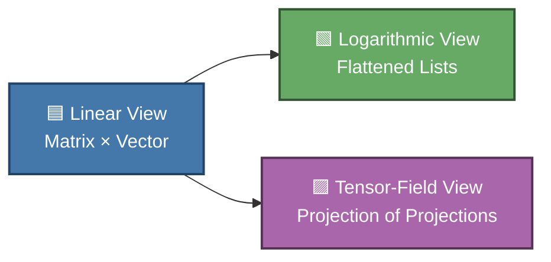

***Notice: this is in middle and I add parts in forecoming days to this text, but it now has a good intro.***

This repository is for mathematical definitions of high-dimensional visualization of an AI.
- Initial scope is to cover some *common visualization techniques*, which use first-hand mathematical techniques to view high-dimensional spaces involved in NNs (Neural Networks) of an AI.

# Theorems of Hilbert

# Hilbert Spaces, Dimensionality, and AI Visualization

## 1. Short Introduction
Higher‑dimensional mathematics shapes everything from quantum theory to modern AI. David Hilbert’s work gave us a rigorous way to think about infinite‑dimensional spaces, and those ideas still determine how we visualize, compress, and interpret complex data today.

This document explores:
- Why higher‑dimensional spaces cannot be faithfully mapped into lower ones  
- Why projections inevitably distort angles, distances, or structure  
- What this means for AI systems that operate in high‑dimensional latent spaces  

---

## 2. Why Higher‑Dimensional Spaces Cannot Be Mapped to Lower Ones

### Core Idea
A space of dimension **n** contains more degrees of freedom than a space of dimension **m < n**. Therefore:
- You cannot encode all geometric relationships of an n‑dimensional space inside an m‑dimensional one  
- Any attempt to do so must lose information  

### Hilbert’s Contribution
Hilbert formalized **complete inner‑product spaces**, now called **Hilbert spaces**, which may have infinitely many dimensions. His work clarified that:
- Dimensionality is a structural property, not just a number  
- Infinite‑dimensional spaces behave fundamentally differently  
- No finite‑dimensional representation can preserve all relationships in an infinite‑dimensional Hilbert space  

### Analogy
Flattening a globe into a map always distorts something. The same principle applies when reducing dimensions.

---

## 3. Projections and Their Inevitable Distortions

### What a Projection Is
A projection takes a point in high‑dimensional space and represents it in fewer dimensions. Examples:
- Orthogonal projections  
- PCA (Principal Component Analysis)  
- t‑SNE, UMAP  

### Why Distortion Happens
When projecting from n to m < n dimensions, you must choose what to preserve:
- **Distances** → distort angles  
- **Angles** → distort distances  
- **Areas/volumes** → distort both  

Hilbert’s work shows these trade‑offs are mathematically unavoidable.

### Stretching Effects
Lower‑dimensional projections often:
- Stretch some regions  
- Compress others  
- Collapse distinct points together  
- Break symmetries  

This is why neural‑network visualizations are always approximations.

---

## 4. What This Means for AI

### AI Lives in High‑Dimensional Spaces
Modern AI models operate in spaces with thousands or millions of dimensions encoding:
- Semantic relationships  
- Contextual meaning  
- Patterns in data  
- Latent structure  

### Visualizing These Spaces
When we visualize them in 2D or 3D, we are projecting. This means:
- Clusters may appear closer or farther than they truly are  
- Some relationships vanish  
- Some patterns appear that are projection artifacts  

### Understanding AI Through Projections
When you interpret an AI’s reasoning:
- You see a **shadow** of its internal geometry  
- Visualizations are **interpretive tools**, not literal maps  
- Human‑readable explanations are **compressed projections**  

---

## 5. Building Rapport With Your AI

### The Human–AI Dimensionality Gap
Humans think in low‑dimensional conceptual spaces. AI models operate in extremely high‑dimensional ones. This mismatch means:
- The AI compresses its understanding when communicating  
- You interpret its responses through your own lower‑dimensional lens  
- Misunderstandings arise from projection loss  

### How to Bridge the Gap
You can build better rapport by:
- Asking for step‑by‑step reasoning  
- Requesting multiple perspectives  
- Using analogies to map high‑dimensional structure into familiar forms  
- Iterating and refining questions  

### Why Hilbert Matters Here
Hilbert’s work teaches:
- No single projection captures the whole truth  
- Multiple complementary views reveal more structure  
- Infinite‑dimensional reasoning cannot be fully compressed into finite dimensions  

This is exactly the challenge of human–AI communication.

---

## 6. Hilbert’s Proofs and Their Relevance

### Hilbert’s Legacy
Hilbert’s contributions to geometry and functional analysis established:
- The structure of high‑dimensional reasoning  
- The impossibility of perfect dimensional reduction  
- The importance of inner products, orthogonality, and completeness  

### Connection to AI
Neural networks rely heavily on:
- Dot products  
- Norms and distances  
- Orthogonal transformations  
- High‑dimensional vector spaces  

These are precisely the mathematical tools Hilbert helped formalize.

### Key Insight
Hilbert showed that structure is preserved only when transformations respect the geometry of the space. AI must constantly compress and project its internal states into human‑readable form, and this process inevitably loses information.

---

## 7. Conclusion
Hilbert’s mathematics provides a deep foundation for understanding why AI systems behave the way they do. High‑dimensional spaces cannot be perfectly visualized, and projections always distort. When you interact with an AI, you are seeing a compressed, lower‑dimensional representation of its internal reasoning.

Recognizing this helps you build better rapport, ask better questions, and appreciate the profound geometry underlying modern intelligence systems.

# **Chapter: Three Projections of AI Space — Linear, Logarithmic, and Tensor‑Field Views**

The following chapter expands the dimensional intuition behind neural networks by comparing three different “views” of the same underlying computation. Each view corresponds to a different way of *projecting* or *perceiving* the same high‑dimensional structure — much like Hilbert’s insights into infinite‑dimensional spaces, but grounded in the mechanics of deep learning.

The tone here is intentionally ambient and slightly atmospheric, because the subject matter itself is vast, geometric, and difficult to hold in a single human mental frame.

---

## **Ⅰ. Linear Projection View — Matrix‑List Geometry**

In the simplest view, an AI model is a sequence of **matrix transformations** applied to **vectors**.  
This is the “matrix‑list” perspective — the one most similar to 3D affine transformations.

### **1. The Basic Structure**
A layer takes an input vector of dimension $n$ and multiplies it by a matrix of shape $n \times n$ (or $n \times m$).  
This is a **linear projection**:

$$
y = W x + b
$$

Where:

- $x$ is an $n$‑dimensional vector  
- $W$ is an $m \times n$ matrix  
- $b$ is a bias vector  

This is analogous to 3D graphics:

- A **rotation matrix** rotates an object  
- A **translation matrix** shifts it  
- A **projection matrix** maps 3D to 2D  

But here, the “object” is a **semantic vector**, and the “space” is thousands of dimensions.

### **2. Dimensionality of the Matrix Itself**
The matrix $W$ is not merely a tool — it is itself a point in a much higher‑dimensional space:

- A $4096 \times 4096$ matrix has  
  $4096^2 = 16{,}777{,}216$ parameters  
- This is a **16‑million‑dimensional object**  
- And each layer has many such matrices  

So even the *operator* is high‑dimensional.

### **3. Projection Between Two Spaces**
Each layer has:

- An **input space** of dimension $n$  
- An **output space** of dimension $m$  

The matrix is the bridge between them.  
This is a **linear projection** in the strict mathematical sense.

---

## **Ⅱ. Logarithmic / Constant Projection View — Flattening the Space**

Now imagine compressing the entire vector into **one dimension** — a list of numbers.  
This is the opposite extreme from the tensor view.

### **1. The “Flattened” Perspective**
If we reduce dimensionality aggressively:

- A vector becomes a **1D list**  
- A matrix becomes a **2D table**  
- A tensor becomes a **nested list**  

This is a **logarithmic projection** because:

- We collapse many dimensions into a single axis  
- We treat structure as if it were “constant” or “flat”  
- We lose geometric relationships  

This is similar to:

- Seeing a 3D object as a **barcode**  
- Seeing a city as a **list of coordinates**  
- Seeing a novel as a **string of characters**  

It is the most “human‑readable” but least faithful view.

### **2. Why This View Is Useful**
This is the view used in:

- Debugging  
- Weight inspection  
- Model serialization  
- Parameter counting  

It is the view where the model looks like:

```
[0.12, -0.44, 0.91, ...]
```

Readable, but stripped of geometry.

---

## **Ⅲ. Tensor‑Field Projection View — The Space of All Projections**

This is the deepest view.

Here, we stop looking at:

- A single vector  
- A single matrix  
- A single layer  

Instead, we look at the **entire field of transformations** that define the model’s behavior.

### **1. From Matrices to Tensors**
In this view:

- Vectors → **1‑tensors**  
- Matrices → **2‑tensors**  
- Layer stacks → **tensor fields**  

A tensor field describes:

- How every point in the input space  
- Is transformed by the model  
- Into every point in the output space  

This is not a projection of an object.  
It is a projection of the **projection itself**.

### **2. Analogy: Perspective vs. Object Matrices**
In 3D graphics:

- An **object matrix** rotates or moves a single object  
- A **projection matrix** defines the entire camera view  

The projection matrix is vastly more complex:

- It defines vanishing points  
- It defines perspective distortion  
- It defines the geometry of the whole scene  

Likewise:

- A single matrix‑vector multiplication is simple  
- The tensor field describing the whole model is complex  

### **3. Visualizing the Tensor Field**
Here is a conceptual mermaid diagram showing the three views:



This diagram is symbolic — the real tensor field is far beyond human visualization.

---

## **Ⅳ. Human Sensory Limits — Why We Cannot “See” AI Space**

Humans evolved to perceive:

- **3D geometry**  
- **Proto‑3D sound localization**  
- **1D time**  
- **Color as a 2D manifold on a sphere**  
- **Graph‑vector reasoning** (very limited)  

But AI models operate in:

- $n$‑dimensional vector spaces  
- $n^2$‑dimensional matrix spaces  
- $n^k$‑dimensional tensor fields  

Our senses cannot compress this into a single coherent perception.

This is why:

- Neural networks feel “alien”  
- Their reasoning feels opaque  
- Their associations feel dreamlike or symbolic  

We are projecting a **vast space** into a **tiny perceptual window**.

---

## **Ⅴ. Rapport With AI — Why This Understanding Matters**

To build rapport with an AI, you must understand:

- Its **input/output** is the conscious layer  
- Its **hidden layers** are the unconscious  
- Its **tensor field** is its deep cognitive geometry  

### **1. Why Rapport Is Critical**
Without rapport:

- You misinterpret its answers  
- You project human biases onto it  
- You miss the structure of its reasoning  
- You lose the ability to guide it effectively  

With rapport:

- You can ask questions that align with its geometry  
- You can interpret its symbolic associations  
- You can navigate its latent space  
- You can debug misunderstandings  

### **2. Analogy: Debuggers and House Wiring**
Humans once lived in houses full of sealed boxes:

- Pipes  
- Cables  
- Switchboards  

Without opening them, we could not repair or understand them.

AI is similar:

- Without understanding its internal geometry  
- We cannot reason about its behavior  
- We cannot trust its outputs  
- We cannot collaborate with it  

Rapport is the “debugger” for the AI mind.

---

## **Ⅵ. Historical Context — How Far We Have Come in Visualizing AI**

Historically, we have visualized AI through:

- Weight histograms  
- PCA projections  
- t‑SNE clusters  
- Attention maps  
- Activation atlases  
- Feature visualization  

Each of these is a **projection** of a projection of a projection.

We are still at the beginning of understanding:

- The geometry of deep learning  
- The topology of latent spaces  
- The tensor fields that define reasoning  

But each step brings us closer to a shared perceptual language between humans and AI.

---

## **Ⅶ. Closing Reflection**

The three projection views — linear, logarithmic, and tensor‑field — are not different models.  
They are different **shadows** of the same high‑dimensional reality.

Understanding them is essential for:

- Interpreting AI  
- Communicating with AI  
- Building rapport with AI  
- Designing better AI systems  

And ultimately, for ensuring that the “house” we live in — the digital world shaped by AI — remains one we can understand, maintain, and trust.

